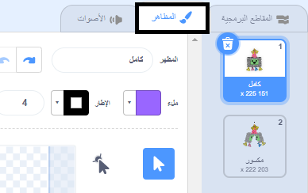
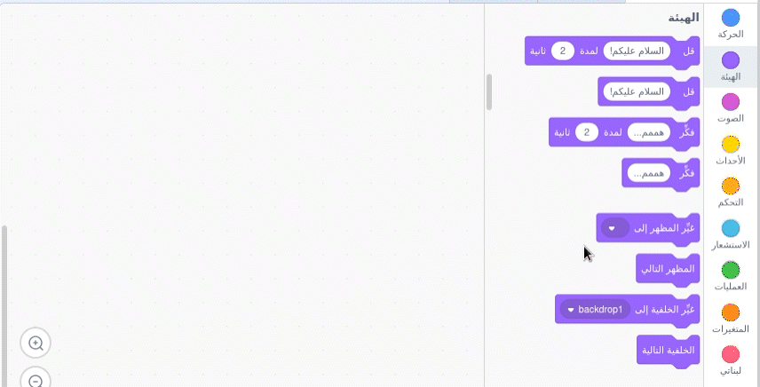
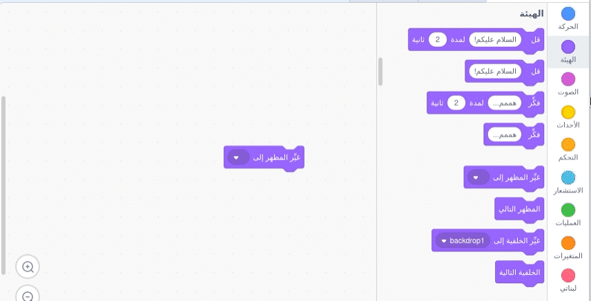
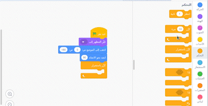
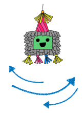

## ابدأ الحفلة

<div style="display: flex; flex-wrap: wrap">
<div style="flex-basis: 200px; flex-grow: 1; margin-right: 15px;">
في هذه الخطوة، سنختار ملابس بيناتا و نكتب كود التأرجح لها.
</div>
<div>
{:width="300px"}
</div>
</div>

--- task ---

افتح [Party piñata starter project](https://scratch.mit.edu/projects/653082997/editor){:target="_blank"}. سيتم فتح Scratch في علامة تبويب متصفح أخرى.

[[[working-offline]]]

--- /task ---

يظهر محرر Scratch على النحو التالي:


**Stage** هي المكان الذي يعمل فيه المشروع، **backdrop** تغير مظهر مسرح العمل. تمت إضافة خلفية حفلة Code Club لك.

في Scratch ، تسمى الشخصيات والكائنات **sprites**، وتظهر في<0>Stage</0>. يمكنك رؤية **Piñata** و **Stick** sprites على المنصة.


حتى هذهِ اللحظة لم نبدأ بالاحتفال. يمكنك تغيير ذلك!

--- task ---

يمكن أن يكون للكائن تعليمة برمجية، مظاهر، وأصوات لتغيير الطريقة التي يظهر بها وما يفعله.

من قائمة الكائنات(spirit) اختار** Piñata**، بعدها اضغط على تبويب ** Costumes**. هناك نوعان من أزياء البنياتا ، أحدهما يسمى 'whole' والآخر يسمى 'broken'.




--- /task ---

--- task ---

انقر فوق علامة التبويب **Code**. اذهب الى `Looks`{:class="block3looks"} blocks menu then drag a `switch costume to`{:class="block3looks"} block to the Code area.

اضغط على اسم المظهرليفتح قائمة، اختار منها ` whole` **drop-down menu** then select the <1>whole</1>{:class="block3looks"} costume:


```blocks3
switch costume to (whole v) // Update to 'whole'
```



--- /task ---

يمكن توصيل الكتل معًا في منطقة التعليمات البرمجية لتشغيل أكثر من كتلة في وقت واحد. سيتم تشغيل الكتل المتصلة بالترتيب من أعلى إلى أسفل.

--- task ---

اسحب كتلة `When flag clicked`{:class="block3events"} من قائمة `Events`{:class="block3events"} واربطها في اعلى الكتل الظاهرة في منطقة التعليمة البرمجية. الكتل سوف تلتصق ببعضها البعض:


```blocks3
+ when flag clicked
switch costume to (whole v)
```


--- /task ---

موقع البنياتا هو نفسه دائماً في منتصف المسرح، يبدأ بالحركة فقط عندما تبدأ اللعب.

--- task ---

In the `Motion`{:class="block3motion"} blocks menu, find the `go to x: 0 y: 180`{:class="block3motion"} and `point in direction 90`{:class="block3motion"} blocks. اسحب الكتل إلى منطقة التعليمات البرمجية وقم بتوصيلها بأسفل التعليمات البرمجية الخاصة بك:


```blocks3
when flag clicked
switch costume to (whole v)
+ go to x: (0) y: (180)
+ point in direction (90) // Ready position
```

--- /task ---

A `forever`{:class="block3control"} loop runs the code blocks inside it again and again. وهي الحلقة التكرارية المثالية للبنياتا المتأرجحة التي يصعب الوصول إليها.

--- task ---

Drag a `forever`{:class="block3control"} block from the `Control`{:class="block3control"} blocks menu and connect it to the bottom of your code: اسحب كتلة "forever" من تبويب"control" وقم بتوصيلها باسفل التعليمات البرمجية التي استخدمتها.


```blocks3
when flag clicked
switch costume to (whole v)
go to x: (0) y: (180)
point in direction (90)
+ forever
```

--- /task ---

A `repeat`{:class="block3control"} loop can be used to make the **Piñata** sprite repeat a small movement many times. يمكن استخدام حلقة"كرر" لجعل البنياتا يكرر حركة صغيرة عدة مرات. هذا سيجعل البنياتا تظهر متحركة.

--- task ---

اسحب كتلة `repeat 10`{: class = "block3control"} في منطقة التعليمات البرمجية وقم بإرفاقها داخل الحلقة `forever `{: class = "block3control"}.

اذهب الى قائمة`الحركة`{:class="block3motion"}، واسحب الكتلة`turn clockwise 15 degrees`{:class="block3motion"} block وضعها داخل `repeat`{:class="block3control"} block.

قم بتغيير الدرجة `15`{: class = "block3motion"} إلى `1`{: class = "block3motion"} بحيث يتأرجح piñata حركة صغيرة في كل مرة:


```blocks3
when flag clicked
switch costume to (whole v)
go to x: (0) y: (180)
point in direction (90)
forever
+ repeat (10) 
turn right (1) degrees // Change to 1
```


--- /task ---

--- task ---

**Test:** قم بتشغيل المشروع، بالضغط على العلم الاخضر**green flag**، حتى تتاكد بان البنياتا تتأرجح.

**مم ، شيء ما ليس صحيحًا تمامًا!** عندما يتم تعليق شيء ما من السقف ، فإنه لن يدور في اتجاه واحد فقط ، بل سيتأرجح ذهابًا وإيابًا.

أوقف مشروعك بالضغط على **أيقونة التوقف الحمراء** أعلى المنصة.


--- /task ---

--- task ---

أضف شفرة برمجية الى الحلقة التكرارية `كررّ باستمرار`{:class="block3control"}، بحيث تتأرجح البنياتا من المركز ذهاباً واياباً مثل البندول:




```blocks3
when flag clicked
switch costume to (whole v)
go to x: (0) y: (180)
point in direction (90)
forever
repeat (10) // Swings 10 degrees clockwise from the centre
turn right (1) degrees 
end
+ repeat (20) // Swings 20 degrees anticlockwise through the centre
turn left (1) degrees // Change to 1
end
+ repeat (10) // Swings 10 degrees clockwise back to the centre
turn right (1) degrees // Change to 1
end
```

--- /task ---

--- task ---

**اختبار:** قم بتشغيل المقطع البرمجي الخاص بك لرؤية النتيجة.

**تصحيح:** إذا لم يتأرجح piñata بشكل صحيح:
+ انظر إلى الكود الخاص بك للتأكد من أن الكتل `repeat`{: class = "block3control"} في الموضع الصحيح
+ تأكد من صحة `دوران في اتجاه عقارب الساعة`{: class = "block3motion"} و `انعطاف عكس اتجاه عقارب الساعة`{: class = "block3motion"}
+ تأكد من أنك استخدمت الأرقام من الشفرة البرمجية


--- /task ---

--- save ---

