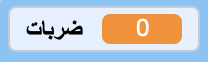

## اضرب البنياتا

<div style="display: flex; flex-wrap: wrap">
<div style="flex-basis: 200px; flex-grow: 1; margin-right: 15px;">
في هذه الخطوة ، سنقوم باضافة شفرة برمجية لبنياتا لتشغيل الصوت ونحسب ضربة واحدة في كل مرة يتم فيها النقر فوق البنياتا.
</div>
<div>
[صورة متحركة تظهر النقر على piñata عشر مرات. بعد المرة العاشرة ، يتغير المظهر إلى مكسور.] (images / break-pinata.gif) {: width = "300px"}
</div>
</div>

--- task ---

انقر فوق علامة التبويب **الصوت** لـ**بنياتا** وستجد صوت **Boing**. انقر فوق زر **تشغيل** حتى تتمكن من سماع الصوت.


--- /task ---

مجموعة الكتل المتصلة في سكراتش تسمى **نص**. يمكن أن تحتوي الكائنات على أكثر من نص.

--- task ---

انقر على تبويب **المقاطع البرمجية**. من `الأحداث`{: class = "block3events"} ، اسحب كتلة `عند النقر على هذا الكائن`{: class = "block3events"} الى منطقة كتابة الشفرة البرمجية.

في قائمة كتل `الصوت`{:class="block3sound"} جد كتلة `ابدأ الصوت`{:class="block3sound"}. أضِف المقطع البرمجي `عند نقر هذا الكائن`{:class="block3events"}:


```blocks3
when this sprite clicked
start sound [Boing v]
```

--- /task ---

--- task ---

**Test:** قم بتشغيل المشروع، بالضغط على العلم الاخضر**green flag**، حتى تتاكد بان البنياتا تتأرجح. انقر على بنياتا وهو يتأرجح لسماع صوت boing.

--- /task ---

`المتغير`{:class="block3variables"} هو وسيلة لتخزين الأرقام و/أو النصوص. سيتم تخزين عدد مرات النقر على بنياتا في متغير يسمى `الضربات`{: class = "block3variables"} بحيث يمكن استخدامه في أي وقت.

--- task ---

انقر على `متغيرات`{: class = "block3variables"} و ثم انقر على زر**انشاء متغير**.


سمي المتغير الجديد الذي انشاته **الضربات**:


**ملاحظة:** يظهر متغير "الضربات" الجديد على المنصة ويمكن استخدامه الآن في قائمة `المتغيرات`{: class = "block3variables"}.




--- /task ---

--- task ---

في كل مرة يبدأ فيها المشروع ، يجب إعادة تعيين عدد `الضربات`{: class = "block3variables"} إلى `0`{: class = "block3variables"}.

اسحب كتلة`اجعل متغير"ضربات" مساوياً 0`{:class="block3variables"} الى النص البرمجي الاول، بين كتلة `غير المظهر الى`{:class="block3looks"} وكتلة `اذهب الى س: (0) ص: (180)`.

يجب أن تبدو التعليمات البرمجية خاصتك بالشكل التالي:


```blocks3
when flag clicked
switch costume to (whole v)
+ set [hits v] to (0)
go to x: (0) y: (180)
point in direction (90)
forever
repeat (10)
turn right (1) degrees
end
repeat (20)
turn left (1) degrees
end
repeat (10)
turn right (1) degrees
end
```

--- /task ---

--- task ---

في كل مرة يتم النقر على **بنياتا** ،يجب زيادة عدد `ضربات`{: class = "block3variables"}.

أضف كتلة لتغيير عدد `ضربات`{: class = "block3variables"} بمقدار `1`{: class = "block3variables"} عند النقر على كائن **بنياتا**:


```blocks3
when this sprite clicked
start sound [Boing v]
+ change [hits v] by (1)
```

--- /task ---

--- task ---

**اختبار:** اختبر مشروعك عدة مرات. تأكد من أن عدد `ضربات`{: class = "block3variables"} يبدأ دائمًا عند `0`{: class = "block3variables"} ويزيد بمقدار `1`{: class = "block3variables"} في كل مرة تنقر فيها على **بنياتا**.


--- /task ---

من الصعب كسر بنياتا لكنها لا تبقى إلى الأبد. ستصمد بنياتا لمدة `10 ضربات`{: class = "block3variables"} قبل ان تنكسر.

يمكن استخدام كتلة `إذا`{: class = "block3control"} لاتخاذ قرار بناءً على شرط ****.

<p style="border-left: solid; border-width:10px; border-color: #0faeb0; background-color: aliceblue; padding: 10px;">
نحن نستخدم <span style="color: #0faeb0">**الشروط**</span> طوال الوقت لاتخاذ القرارات. يمكننا أن نقول "إذا كان قلم الرَّصاص غير حاد، فقم بشحذه". `وبالمثل ، تتيح لنا شروط `إذا` كتابة رمز يقوم بشيء مختلف اعتمادًا على ما إذا كان الشرط صحيحًا أم خطأ.
</p>

--- task ---

افتح قائمة الكتل البرمجية `التحكم` {:class="block3looks"}. Drag an `if`{:class="block3control"} block into the Code area and insert it around the blocks in your `when this sprite clicked`{:class="block3events"} script:


```blocks3
when this sprite clicked
+ if <> then
start sound [Boing v]
change [hits v] by (1)

```

--- /task ---

The `if`{:class="block3control"} block has a hexagon-shaped input where you can build a condition.

--- task ---

The **Piñata** sprite should play a sound and increase the count of `hits`{:class="block3variables"} **`if`{:class="block3control"}** the number of `hits`{:class="block3variables"} is `less than`{:class="block3operators"} `10`{:class="block3variables"}.

First add a `<`{:class="block3operators"} operator into the hexagon-shaped input:


```blocks3
when this sprite clicked
+ if <() < ()> then
start sound [Boing v]
change [hits v] by (1)

```

--- /task ---

--- task ---

Finish building the `if`{:class="block3control"} condition by dragging in the `hits`{:class="block3variables"} variable to the left of the `<`{:class="block3operators"} operator and typing the value '10' on the right:


```blocks3
when this sprite clicked
+ if <(hits) < (10)> then
start sound [Boing v]
change [hits v] by (1)

```

--- /task ---

--- task ---

**Test:** Run your project again. Hit the piñata 10 times to hear the sound and see the `hits`{:class="block3variables"} variable increase.

Hit the piñata a few more times. The `hits`{:class="block3variables"} variable will not go above 10 because that condition is no longer 'true' so the code inside the `if`{:class="block3control"} block won't run.

--- /task ---

--- task ---

Add a second `if`{:class="block3control"} block inside the first. This time the condition will check if `hits`{:class="block3variables"} `=`{:class="block3operators"} 10 and if 'true' the costume will change to `broken`{:class="block3looks"}:


```blocks3
when this sprite clicked
if <(hits) < (10)> then
start sound [Boing v]
change [hits v] by (1)
+ if <(hits)=(10)> then
switch costume to (broken v)

```

--- /task ---

--- task ---

**Test:** Run your project a couple of times. Check that the **Piñata** sprite starts with the 'whole' costume then changes to the 'broken' costume after `10 hits`{:class="block3variables"}.


--- /task ---

When the **Piñata** sprite has broken, all the other sprites need to know that the party has started.

In Scratch, the `broadcast`{:class="block3events"} block can be used to **send** a message that all sprites can **receive**.

--- task ---

Add a `broadcast message`{:class="block3events"} block from the `Events`{:class="block3events"} blocks menu:


```blocks3
when this sprite clicked
if <(hits) < (10)> then
start sound [Boing v]
change [hits v] by (1)
if <(hits)=(10)> then
switch costume to (broken v)
+ broadcast (message1 v)
```

Click on `message1`{:class="block3events"} and choose **New message**. Name the new message `party`{:class="block3events"}.


Your `broadcast`{:class="block3events"} block will look like this:

```blocks3
broadcast (party v)
```

--- /task ---

--- save ---
