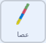
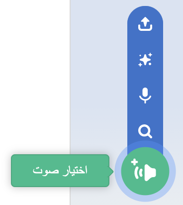
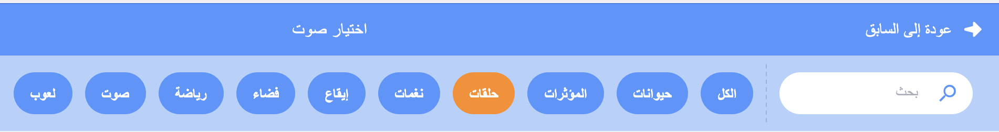
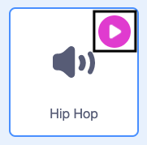
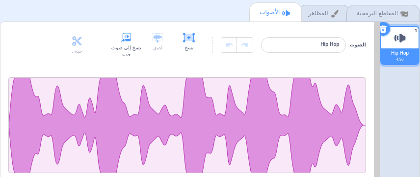

## استخدم عصا

<div style="display: flex; flex-wrap: wrap">
<div style="flex-basis: 200px; flex-grow: 1; margin-right: 15px;">
عادة ما يتم ضرب Piñatas بعصا مصنوعة من الخشب أو ورق مقوى مغطاة بشرائط ملونة من الورق. في هذه الخطوة ، ستضيف شفرة برمجية 
للتحكم في عصا piñata وتشغيل الموسيقى عندما تنكسر البنياتا. 
</div>
<div>
! [صورة متحركة gif تُظهر كائن العصا يتتبع مؤشر الماوس حول المسرح.] (images / follow-stick.gif) {: width = "300px"}
</div>
</div>

--- task ---

انقر فوق ايقونة **عصا** في قائمة الكائنات. أضف شفرة برمجية بحيث تظل العصا دائمًا أمام الكائنات المتحركة الأخرى وتتبع مؤشر الماوس (أو إصبعك على الكمبيوتر اللوحي).

استخدم كتلة `اذهب إلى موضع العشوائي`{: class = "block3motion"} ، ولكن حدد `مؤشر الماوس`{: class = "block3motion"} من القائمة المنسدلة:



```blocks3
when flag clicked
forever
go to [front v] layer
go to (mouse-pointer v) // Change to mouse-pointer
```

--- /task ---

--- task ---

**اختبار:** قم بتشغيل مشروعك وتحقق من أن **العصا** تتبع المؤشر أو إصبعك حول المسرح.

![! [صورة متحركة gif تُظهر كائن العصا يتتبع مؤشر الماوس حول المسرح.] (images /) {: width = "300px"}.](images/follow-stick.gif)

--- /task ---

هناك العديد من أنواع الأصوات المختلفة في Scratch بدءًا من الأصوات وضوضاء الحيوانات إلى أكثر من 100 مؤثر صوتي آخر.

Scratch also has **looping sounds** that can be used in `forever`{:class="block3control"} or `repeat`{:class="block3control"} loops to sound like they are playing continuously.

--- task ---

انتقل إلى علامة التبويب **الأصوات** وانقر على أيقونة **اختيار الصوت**.



--- /task ---

--- task ---

اذهب إلى **اختيار صوت** وحدد خيار **تسجيل**.



--- /task ---

--- task ---

**Choose:** Hover over the **play** icons to hear the looping sounds. أضف الصوت الذي تفضله بالضغط عليه.



سيظهر الصوت بعد ذلك في قائمة الأصوات:



--- /task ---

--- task ---

انقر فوق علامة التبويب **شفرة برمجية** وأنشئ نصًا برمجيًا جديدًا لتكرار الصوت `للأبد`{: class = "block3control"} عندما يتم استلام رسالة `احتفال`{: class = "block3events"}:


```blocks3
when I receive [party v]
forever
play sound [Hip Hop v] until done // Choose your sound
```

--- /task ---

--- task ---

**اختبار:** قم بتشغيل مشروعك ، وانقر فوق عشر مرات لسماع موسيقى الحفلة المتتالية.

--- /task ---

--- save ---
