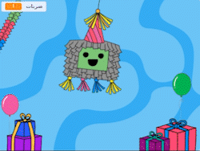
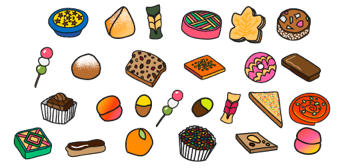
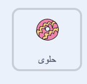
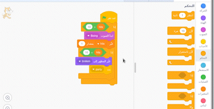

## أضف بعض الحلويات

<div style="display: flex; flex-wrap: wrap">
<div style="flex-basis: 200px; flex-grow: 1; margin-right: 15px;">
العاب البنياتا مليئة بالحوليات وعندما تبدأ بالتكسر تسقط منها الحلوى. في هذه الخطوة، ستقوم بتحريك الأطعمة العالمية لتسقط من البينياتا في كل مرة يتم ضربها. هل تعرف أي من هذه الحلويات؟
</div>
<div>
{:width="300px"}
</div>
</div>

<p style="border-left: solid; border-width:10px; border-color: #0faeb0; background-color: aliceblue; padding: 10px;">
<span style="color: #0faeb0">** المظهر **</span> في برنامج in Scratch هي صورة تغير شكل الكائن. طلب ** مصممو الرسوم ** لدينا من قادة Code Club حول العالم إخبارهم بما يحصلون عليه في الحفلة. نأمل أن تكون بعض اشكال الحلوى التي ابتكروها مألوفة بالنسبة لك - والبعض الآخر جديد تمامًا.      
</p>

--- task ---

انقر فوق الكائن **حلوى** في قائمة الكائنات وحدد علامة التبويب **المظاهر**.

هناك 26 مظهر - وستستخدمها جميعًا!



--- /task ---

--- task ---

انقر فوق علامة التبويب **المقاطع البرمجية** ثم قم بإنشاء نص برمجي `يخفي`{:class="block3looks"} الحلوى في البنياتا عند بدء مشروعك:



```blocks3
when flag clicked
hide
go to x: (0) y: (100)
```

--- /task ---

ستهرب أربع قطع حلوى من البنياتا في كل مرة يتم ضربها. من خلال **استنساخ** كائن **حلوى**، يمكنك إنشاء العديد من المكافآت.

<p style="border-left: solid; border-width:10px; border-color: #0faeb0; background-color: aliceblue; padding: 10px;">
<span style="color: #0faeb0">** الاستنساخ **</span> في برنامج Scratch هو نسخة من كائن. يحتوي على نفس الكود والمظاهر وأصوات الكائن الأصلي.      
</p>

--- task ---

انقر على الكائن ** Piñata **.

أدخل حلقة `كرر`{: class = "block3control"} في الكود الموجودة. غيّر القيمة إلى `4`{: class = "block3control"} ثم أضف `إنشاء نسخة من نفسي`{: class = "block3control"} block. استخدم سهم القائمة المنسدلة لاختيار كائن `حلوى`{: class = "block3control"}:


```blocks3
when this sprite clicked
if <(hits) < (10)> then
start sound [Boing v]
change [hits v] by (1)
+ repeat (4) // Change to 4
create clone of (Treats v) // Select Treats
end
if <(hits)=(10)> then
switch costume to (broken v)
broadcast (party v)
```

**نصيحة:** استخدم المساحة الاحتياطية في منطقة الكود لإنشاء كودك الجديد ثم اسحبه إلى البرنامج النصي الحالي:

 --- /task ---

--- task ---

انقر على كائن **حلوى**.

Create a new script using the `when I start as a clone`{:class="block3control"} block.

Add blocks from the `Looks`{:class="block3looks"} blocks menu to control the appearance of each new clone:


```blocks3
when I start as a clone
show
go to [back v] layer // Change to back
switch costume to (Knafeh v)
```

--- /task ---

--- task ---

You can pick random treats to be released when the piñata is hit. Use a `pick random`{:class="block3operators"} operator to select a random costume from `1`{:class="block3operators"} to `26`{:class="block3operators"} each time a clone is created:


```blocks3
when I start as a clone
show
go to [back v] layer 
+ switch costume to (pick random (1) to (26)) // Change to 26
```

--- /task ---

--- task ---

At the moment, the **Treats** clones will appear behind the **Piñata** sprite, but treats should fall from the piñata to a random position.

Add code to make the cloned **Treats** sprites `glide`{:class="block3motion"} to a random position:


```blocks3
when I start as a clone
show
go to [back v] layer
switch costume to (pick random (1) to (26))
+ glide (1) secs to (random position v) 
```

--- /task ---

--- task ---

**Test:** Run your project and hit the piñata to see four clones of the **Treats** sprite after each hit. The costumes will be selected at random and the treats will each glide to a random position.


--- /task ---

--- task ---

Add animation to make the **Treats** sprite clones `turn`{:class="block3motion"} `forever`{:class="block3control"} when they reach their random position. Remember animations work best when small movements are used, so change the number of degrees to `1`{:class="block3motion"}:


```blocks3
when I start as a clone
show
go to [back v] layer
switch costume to (pick random (1) to (26)
glide (1) secs to (random position v) 
+ forever
turn right (1) degrees
```

--- /task ---

--- task ---

**Test:** Run your project again to see the **Treats** sprite clones spin.


--- /task ---

--- save ---
