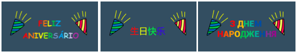

## قم بإنشاء رسالة

<div style="display: flex; flex-wrap: wrap">
<div style="flex-basis: 200px; flex-grow: 1; margin-right: 15px;">
في هذه الخطوة، ستكتب رسالة وتحركها باستخدام تأثيرات الحركة واللون. 
</div>
<div>
{:width="300px"}
</div>
</div>

ماذا ستكتب في بطاقة عيد ميلاد لإرسالها إلى Code Club؟ من الممكن أن تكون:
+ الشيء المفضل لديك في Code Club
+ رسالة عن قائد Code Club الرائع الخاص بك
+ تفاصيل عن ما تريد القيام به لاحقا مع مهارات البرمجة الخاصة بك

<p style="border-left: solid; border-width:10px; border-color: #0faeb0; background-color: aliceblue; padding: 10px;">
تمت كتابة اول مشاريع Code Club باللغة الإنجليزية، ولكن في غضون عام تمت ترجمتها إلى البرتغالية البرازيلية والهولندية والألمانية والنرويجية والأوكرانية. سرعان ما تم اتباعها بترجمات للغة الفرنسية واليونانية والإسبانية، والآن تمت ترجمة بعض مشاريع Code Club إلى <span style="color: #0faeb0">** 28 لغة أصلية **</span>. شكرا لمجتمع الترجمة الرائع لدينا!


</p>

--- task ---

انقر فوق الكائن **رسالة** في قائمة الكائنات وحدد علامة التبويب **مظاهر**.

يحتوي الزي على نص يقول "عيد سعيد Code Club". انقر نقرًا مزدوجًا (أو اضغط باستمرار على جهاز لوحي) على النص لتحديد أداة تحرير النص.


--- /task ---

--- task ---

يمكنك الآن كتابة رسالة عيد ميلاد Code Club الجديدة الخاصة بك. اضغط على **Enter** في لوحة المفاتيح الخاصة بك لبدء سطر جديد.

**نصيحة:** لا تقلق إذا كانت رسالتك كبيرة جدًا بالنسبة للمربع يمكنك تغيير حجمها لاحقًا.


--- /task ---

--- task ---

**Choose:** Click on the **Fill** icon to open the colour drop-down menu. Move the fill sliders to the left or right to select your favourite colour.


--- /task ---

--- task ---

**Choose:** Click on the **Font** tool and a drop-down list of fonts will appear. The 'Pixel' font is selected in the starter project, but you can use any of the fonts available.


--- /task ---

--- task ---

Click on the **Select** tool and eight circles will appear around your message. Use these circles to resize your message by clicking on them and dragging them within the white box.


--- /task ---

Your message is ready, now you can add code to hide your message inside the piñata and make your message fall from the piñata after the tenth hit.

--- task ---

Click on the **Code** tab then create a script to `hide`{:class="block3looks"} the message in the piñata when your project starts:


```blocks3
when flag clicked
hide
set size to (10) % // Change to 10 to start small
go to x: (0) y: (100) // Inside the piñata
```

--- /task ---

--- task ---

Create a new script to start when the `party`{:class="block3events"} message has been received.

Add a `repeat`{:class="block3control"} loop to animate the message. The message will `change size`{:class="block3looks"} to grow and `change y`{:class="block3motion"} position to fall as it animates:


```blocks3
when I receive [party v]
show
repeat (20) // Change to 20
change size by (5) // Change to 5
change y by (-10) // Change to -10
```

--- /task ---

--- task ---

**Test:** Run your project. Hit the piñata ten times to see the message fall.


--- /task ---

--- save ---
