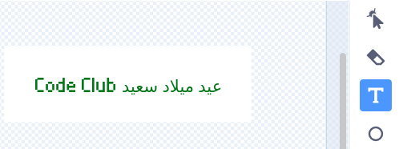

## قم بإنشاء رسالة

<div style="display: flex; flex-wrap: wrap">
<div style="flex-basis: 200px; flex-grow: 1; margin-right: 15px;">
في هذه الخطوة، ستكتب رسالة وتحركها باستخدام تأثيرات الحركة واللون. 
</div>
<div>
{:width="300px"}
</div>
</div>

ماذا ستكتب في بطاقة عيد ميلاد لإرسالها إلى Code Club؟ من الممكن أن تكون:
+ الشيء المفضل لديك في Code Club
+ رسالة عن قائد Code Club الرائع الخاص بك
+ تفاصيل عن ما تريد القيام به لاحقا مع مهارات البرمجة الخاصة بك

<p style="border-left: solid; border-width:10px; border-color: #0faeb0; background-color: aliceblue; padding: 10px;">
تمت كتابة اول مشاريع Code Club باللغة الإنجليزية، ولكن في غضون عام تمت ترجمتها إلى البرتغالية البرازيلية والهولندية والألمانية والنرويجية والأوكرانية. سرعان ما تم اتباعها بترجمات للغة الفرنسية واليونانية والإسبانية، والآن تمت ترجمة بعض مشاريع Code Club إلى <span style="color: #0faeb0">**28 لغة أصلية**</span>. شكرا لمجتمع الترجمة الرائع لدينا!


</p>

--- task ---

انقر فوق الكائن **رسالة** في قائمة الكائنات وحدد علامة التبويب **مظاهر**.

يحتوي الزي على نص يقول "عيد سعيد Code Club". انقر نقرًا مزدوجًا (أو اضغط باستمرار على جهاز لوحي) على النص لتحديد أداة تحرير النص.



--- /task ---

--- task ---

يمكنك الآن كتابة رسالة عيد ميلاد Code Club الجديدة الخاصة بك. اضغط على **Enter** في لوحة المفاتيح الخاصة بك لبدء سطر جديد.

**نصيحة:** لا تقلق إذا كانت رسالتك كبيرة جدًا بالنسبة للمربع يمكنك تغيير حجمها لاحقًا.


--- /task ---

--- task ---

**اختر:** انقر على أيقونة **ملء** لفتح القائمة المنسدلة للألوان. حرك شريط التمرير للملء يسارا ويمينا لتحديد اللون المفضل لديك.


--- /task ---

--- task ---

**اختر:** انقر فوق أداة **الخط** وستظهر قائمة منسدلة بالخطوط. يتم تحديد نوع الخط "Pixel" في مشروع البداية، ولكن يمكنك استخدام أي من الخطوط المتاحة.


--- /task ---

--- task ---

انقر فوق الاداة **تحديد** وستظهر ثماني دوائر حول رسالتك. استخدم هذه الدوائر لتغيير حجم رسالتك بالنقر عليها وسحبها داخل المربع الأبيض.


--- /task ---

رسالتك جاهزة، الآن يمكنك إضافة كود لإخفاء رسالتك داخل piñata وجعل رسالتك تسقط من الـ piñata بعد الضربة العاشرة.

--- task ---

انقر فوق علامة التبويب **المقاطع البرمجية** ثم قم بإنشاء نص برمجي `يخفي`{:class="block3looks"} الرسالة في piñata عند بدء مشروعك:


```blocks3
when flag clicked
hide
set size to (10) % // غيّر إلى 10 لتبدأ صغيرة
go to x: (0) y: (100) // داخل البنياتا
```

--- /task ---

--- task ---

قم بإنشاء نص برمجي جديد للبدء عندما يتم استلام رسالة `حفلة`{:class="block3events"}.

أضف حلقة `كرر`:class="block3control"} لتحريك الرسالة. سوف `يتغير حجم`{:class="block3looks"} الرسالة لتنمو و `ياغير الموضع ص`{:class="block3looks"} كي تسقط مع الحركة:


```blocks3
when I receive [حفل v]
show
repeat (20) // غيّر الى 20
change size by (5) // غيّر الى 5
change y by (-10) // غيّر الى -10
```

--- /task ---

--- task ---

**اختبار:** قم بتشغيل مشروعك. اضرب piñata عشر مرات لترى سقوط الرسالة.


--- /task ---

--- save ---
