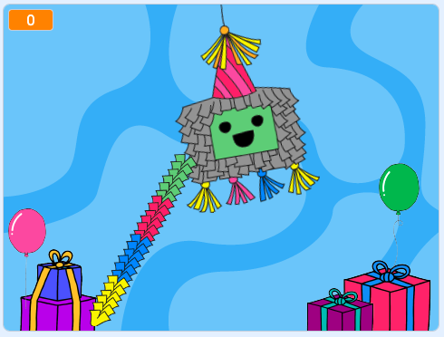

## Εισαγωγή

Σε αυτό το έργο, θα δημιουργήσεις μια αιωρούμενη πινιάτα που βγάζει λιχουδιές όταν χτυπηθεί και τελικά σπάει για να αποκαλύψει ένα μήνυμα γενεθλίων.

Η **piñata** χρησιμοποιείται συχνά για τον εορτασμό γενεθλίων, νέου έτους ή φεστιβάλ. Το σχήμα και η διακόσμηση μιας πινιάτας έχει σχεδιαστεί για να ταιριάζει με το θέμα της περίστασης. Είναι επίσης γεμάτη λιχουδιές. Ο στόχος είναι να χτυπήσεις την πινιάτα με ένα ραβδί για να σπάσει η πινιάτα και να απελευθερωθούν οι λιχουδιές.    

--- no-print --- --- task ---
### Δοκίμασέ το

  
Χρησιμοποίησε το ραβδί για να χτυπήσεις την πινιάτα. 

Τι συμβαίνει κάθε φορά που χτυπάς την πινιάτα; 

Πόσες φορές πρέπει να χτυπήσεις την πινιάτα για να σπάσει;  

  <iframe allowtransparency="true" width="485" height="402" src="https://scratch.mit.edu/projects/embed/649873783/?autostart=false" frameborder="0"></iframe>

--- /task --- --- /no-print ---

--- print-only ---

--- /print-only ---

Το **Code Club** γιορτάζει φέτος τα 10α γενέθλιά του. Γνώριζες ότι υπάρχουν Code Clubs σε **έξι από τις επτά ηπείρους** σε όλο τον κόσμο; Είναι πολλοί προγραμματιστές που κάνουν πράγματα με κώδικα! Πιστεύεις ότι άλλα clubs θα κάνουν αυτό το έργο αυτή τη στιγμή;   

