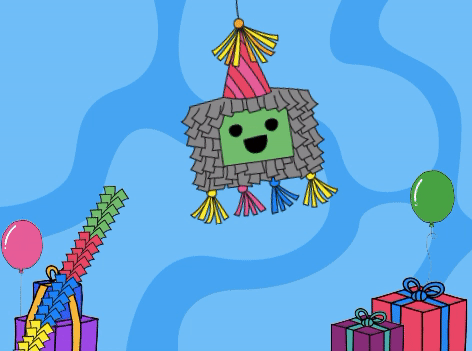
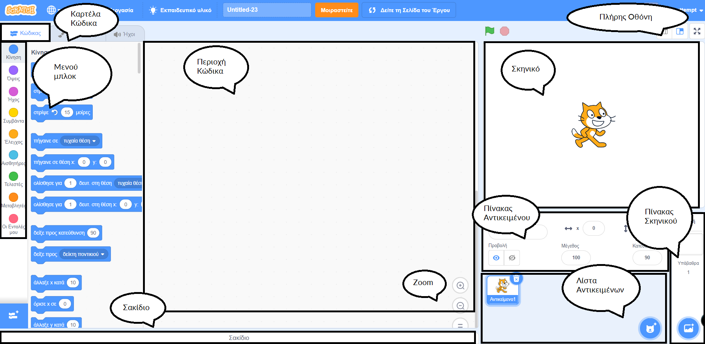
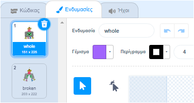
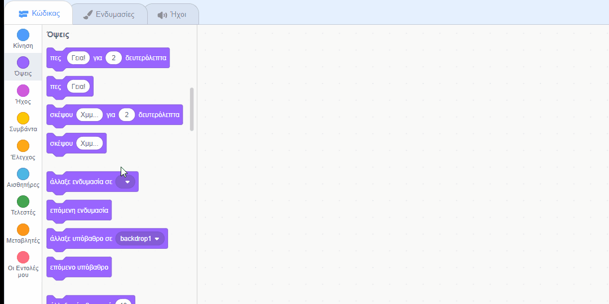
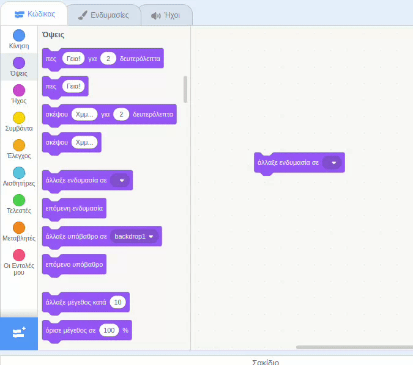
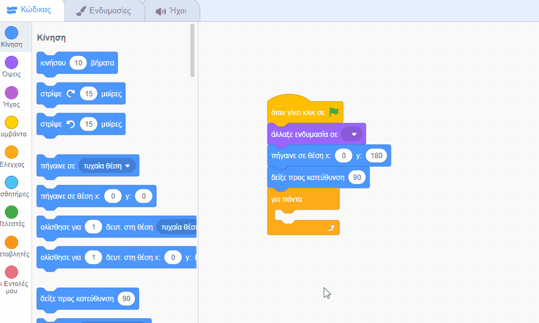
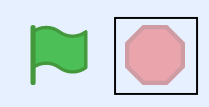

## Εκκίνηση του πάρτι

<div style="display: flex; flex-wrap: wrap">
<div style="flex-basis: 200px; flex-grow: 1; margin-right: 15px;">
Σε αυτό το βήμα, θα επιλέξεις μια ενδυμασία πινιάτα και θα γράψεις κώδικα ώστε η πινιάτα να αιωρείται.
</div>
<div>
{:width="300px"}
</div>
</div>

--- task ---

Άνοιξε το [αρχικό έργο Πάρτι πινιάτα](https://scratch.mit.edu/projects/653082997/editor){:target="_blank"}. Το Scratch θα ανοίξει σε νέα καρτέλα του φυλλομετρητή.

[[[working-offline]]]

--- /task ---

Ο επεξεργαστής Scratch μοιάζει έτσι:



Η **Σκηνή** είναι εκεί όπου εκτελείται το έργο σου και ένα **υπόβαθρο** αλλάζει τον τρόπο εμφάνισης της Σκηνής. Προστέθηκε ένα υπόβαθρο πάρτι Code Club για εσένα.

Στο Scratch, οι χαρακτήρες και τα αντικείμενα ονομάζονται **αντικείμενα**, και εμφανίζονται στη Σκηνή. Μπορείς να δεις τα αντικείμενα **Πινιάτα** και **Ραβδί** στη Σκηνή.


Αυτή τη στιγμή δεν γίνονται πολλά σε αυτό το πάρτι. Μπορείς να το αλλάξεις αυτό!

--- task ---

Ένα αντικείμενο μπορεί να έχει κώδικα, ενδυμασίες και ήχους για να αλλάξει την εμφάνιση και το τι κάνει.

Κάνε κλικ στο αντικείμενο **Πινιάτα** στη λίστα Αντικειμένων και επιλέξτε την καρτέλα **Ενδυμασίες**. Υπάρχουν δύο ενδυμασίες πινιάτα, η μία ονομάζεται «ολόκληρη» και η άλλη με το όνομα «σπασμένη».




--- /task ---

--- task ---

Κάνε κλικ στην καρτέλα **Κώδικας**. Μετακινήσου στο μενού μπλοκ `Όψεις`{:class="block3looks"} και στη συνέχεια, σύρε ένα μπλοκ `αλλαγή ενδυμασίας σε`{:class="block3looks"} στην περιοχή Κώδικα.

Κάνε κλικ στο όνομα της ενδυμασίας για να ανοίξεις ένα **αναπτυσσόμενο μενού** και στη συνέχεια επίλεξε την ενδυμασία `ολοκληρωμένη`{:class="block3looks"}:


```blocks3
switch costume to (whole v) // Update to 'whole'
```



--- /task ---

Τα μπλοκ μπορούν να συνδεθούν μαζί στην περιοχή Κώδικας για να εκτελούνται περισσότερα από ένα κάθε φορά. Τα συνδεδεμένα μπλοκ θα εκτελούνται με τη σειρά από πάνω προς τα κάτω.

--- task ---

Σύρε ένα μπλοκ `όταν γίνει κλικ στην πράσινη σημαία`{:class="block3events"} από το μενού `Συμβάντα`{:class="block3events"} και συνέδεσέ το στην κορυφή των μπλοκ Όψεις στην περιοχή Κώδικα. Τα μπλοκ θα κουμπώσουν μεταξύ τους:


```blocks3
+ when flag clicked
switch costume to (whole v)
```


--- /task ---

Η αρχική θέση μιας πινιάτα είναι πάντα η ίδια, αρχίζει να κινείται μόνο όταν το παιχνίδι πινιάτα είναι έτοιμο για να παίξεις.

--- task ---

Στο μενού μπλοκ `Κίνηση`{:class="block3motion"}, θα βρεις τα `πήγαινε σε θέση x: 0 y: 180`{:class="block3motion"} και άλλαξε σε μπλοκ `δείξε προς την κατεύθυνση 90`{:class="block3motion"}. Σύρε τα μπλοκ στην περιοχή Κώδικα και συνέδεσέ τα στο κάτω μέρος του κώδικά σου:


```blocks3
when flag clicked
switch costume to (whole v)
+ go to x: (0) y: (180)
+ point in direction (90) // Ready position
```

--- /task ---

Ένας βρόχος `για πάντα`{:class="block3control"} εκτελεί τα μπλοκ κώδικα μέσα στον βρόχο ξανά και ξανά. Είναι ο τέλειος βρόγχος για μια αιωρούμενη πινιάτα που είναι δύσκολο να χτυπηθεί.

--- task ---

Σύρε ένα μπλοκ `για πάντα`{:class="block3control"} από το μενού μπλοκ `Έλεγχος`{:class="block3control"} και συνέδεσέ το στο κάτω μέρος του κώδικά σου:


```blocks3
when flag clicked
switch costume to (whole v)
go to x: (0) y: (180)
point in direction (90)
+ forever
```

--- /task ---

Ένας βρόχος `επανάληψης`{:class="block3control"} μπορεί να χρησιμοποιηθεί για να κάνει το αντικείμενο **Πινιάτα** να επαναλάβει μια μικρή κίνηση πολλές φορές. Αυτό θα κάνει την πινιάτα να φαίνεται σαν να κινείται.

--- task ---

Σύρε ένα μπλοκ `επανέλαβε 10`{:class="block3control"} στην περιοχή Κώδικα και προσάρτησέ το μέσα στον βρόχο `για πάντα`{:class="block3control"}.

Μετακινήσου στο μενού μπλοκ `Κίνηση`{:class="block3motion"} και σύρε ένα μπλοκ `στρίψε δεξιόστροφα 15 μοίρες`{:class="block3motion"} στο μπλοκ `επανάληψης`{:class="block3control"}.

Άλλαξε τις μοίρες `15`{:class="block3motion"} σε `1`{:class="block3motion"} μοίρα, έτσι ώστε η πινιάτα να ταλαντεύεται μόνο για μικρή ποσότητα κάθε φορά:


```blocks3
when flag clicked
switch costume to (whole v)
go to x: (0) y: (180)
point in direction (90)
forever
+ repeat (10) 
turn right (1) degrees // Αλλαγή σε 1
```


--- /task ---

--- task ---

**Δοκιμή:** Εκτέλεσε το έργο σου κάνοντας κλικ στην **πράσινη σημαία** πάνω από τη Σκηνή, για να δεις να αιωρείται η πινιάτα.

**Μμμ, κάτι δεν πάει καλά!** Όταν ένα αντικείμενο είναι κρεμασμένο από την οροφή, δεν θα περιστρέφεται απλώς προς μία κατεύθυνση, αλλά θα ταλαντεύεται μπρος-πίσω.

Σταμάτησε το έργο σου κάνοντας κλικ στο **κόκκινο εικονίδιο παύσης** πάνω από τη Σκηνή.



--- /task ---

--- task ---

Πρόσθεσε τον κώδικά σου στον βρόχο `για πάντα`{:class="block3control"}, έτσι ώστε η πινιάτα να ταλαντεύεται από το κέντρο μπρος-πίσω συνέχεια σαν εκκρεμές:


```blocks3
when flag clicked
switch costume to (whole v)
go to x: (0) y: (180)
point in direction (90)
forever
repeat (10) // Swings 10 degrees clockwise from the centre
turn right (1) degrees 
end
+ repeat (20) // Swings 20 degrees anticlockwise through the centre
turn left (1) degrees // Change to 1
end
+ repeat (10) // Swings 10 degrees clockwise back to the centre
turn right (1) degrees // Change to 1
end
```

--- /task ---

--- task ---

**Δοκιμή:** Εκτέλεσε τον κωδικά σου για να δεις την πινιάτα να ταλαντεύεται.

**Εντοπισμός σφαλμάτων:** Εάν η πινιάτα δεν ταλαντεύεται σωστά:
+ Κοίταξε τον κώδικά σου για να βεβαιωθείς ότι τα μπλοκ `επανάληψης`{:class="block3control"} βρίσκονται στη σωστή θέση
+ Βεβαιώσου ότι τα βέλη `στροφή δεξιόστροφα`{:class="block3motion"} και `στροφή αριστερόστροφα`{:class="block3motion"} είναι σωστά
+ Βεβαιώσου ότι έχεις χρησιμοποιήσει τους αριθμούς από τον παραπάνω κώδικα


--- /task ---

--- save ---

