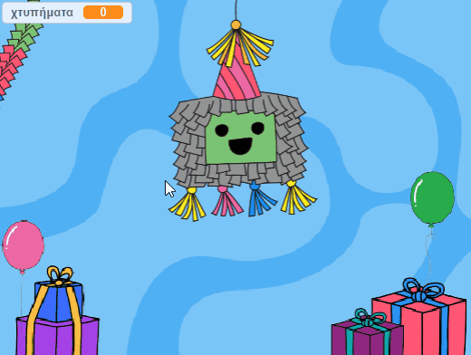
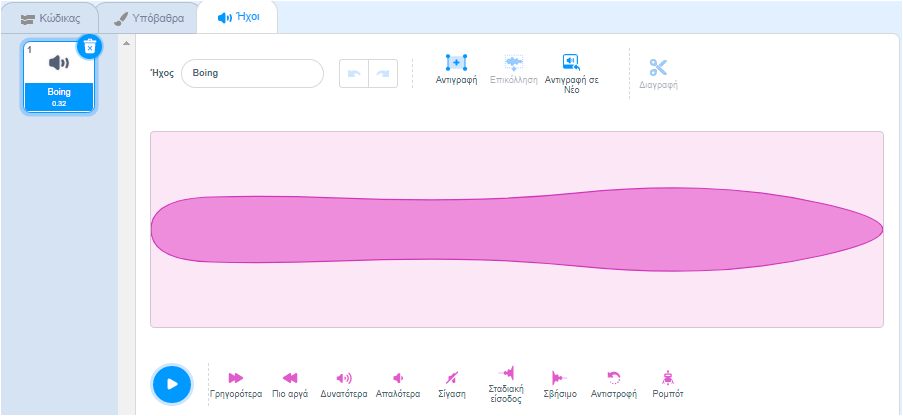
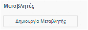
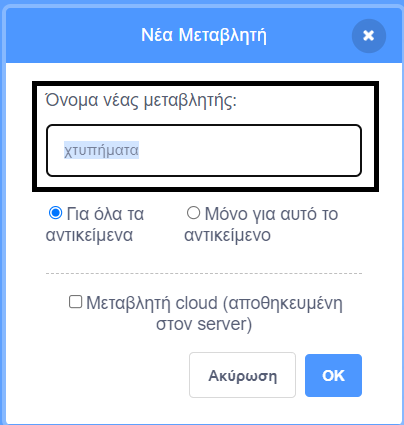
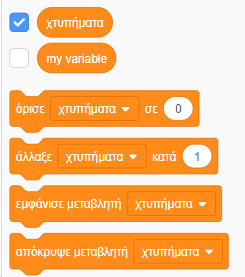
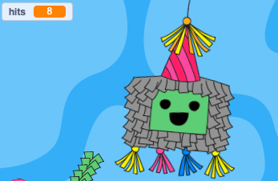
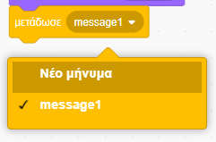
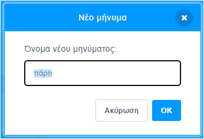

## Χτύπησε την πινιάτα

<div style="display: flex; flex-wrap: wrap">
<div style="flex-basis: 200px; flex-grow: 1; margin-right: 15px;">
Σε αυτό το βήμα, θα φτιάξεις κώδικα για την πινιάτα για να παίζει έναν ήχο και να μετράει ένα χτύπημα κάθε φορά που γίνεται κλικ πάνω στην πινιάτα.
</div>
<div>
{:width="300px"}
</div>
</div>

--- task ---

Κάνε κλικ στην καρτέλα **Ήχοι** για το αντικείμενο **Piñata** και θα βρεις έναν ήχο **Boing**. Κάνε κλικ στο εικονίδιο **Αναπαραγωγή** για να μπορείς να ακούσεις τον ήχο.



--- /task ---

Μια ομάδα συνδεδεμένων μπλοκ στο Scratch ονομάζεται **script**. Τα Αντικείμενα μπορούν να έχουν περισσότερα από ένα scripts.

--- task ---

Κάνε κλικ στην καρτέλα **Κώδικας**. Από τα `Συμβάντα`{:class="block3events"}, σύρε ένα μπλοκ `όταν γίνει κλικ σε αυτό το αντικείμενο`{:class="block3events"} στην περιοχή Κώδικας για να ξεκινήσεις ένα νέο script.

Στο μενού μπλοκ `Ήχος`{:class="block3sound"}, βρες το μπλοκ `παίξε τον ήχο`{:class="block3sound"}. Σύρε το κάτω από το μπλοκ `όταν γίνει κλικ σε αυτό το αντικείμενο`{:class="block3events"}:


```blocks3
when this sprite clicked
start sound [Boing v]
```

--- /task ---

--- task ---

**Δοκιμή:** Εκτέλεσε το έργο σου κάνοντας κλικ στην **πράσινη σημαία** πάνω από τη Σκηνή. Κάνε κλικ στην πινιάτα καθώς αιωρείται για να ακούσεις τον ήχο boing.

--- /task ---

Μια `μεταβλητή `{:class="block3variables"} είναι ένας τρόπος αποθήκευσης αριθμών ή/και κειμένου. Ο αριθμός των φορών που θα γίνει κλικ στην πινιάτα θα αποθηκευτεί σε μια μεταβλητή που ονομάζεται `χτυπήματα`{:class="block3variables"} ώστε να μπορεί να χρησιμοποιηθεί ανά πάσα στιγμή.

--- task ---

Από το μενού μπλοκ `Μεταβλητές`{:class="block3variables"} κάνε κλικ στο κουμπί **Δημιουργία μεταβλητής**.



Κάλεσε τη νέα σου μεταβλητή **χτυπήματα**:



**Σημείωση:** Η νέα μεταβλητή "χτυπήματα" εμφανίζεται στη Σκηνή και μπορεί πλέον να χρησιμοποιηθεί στα μπλοκ `Μεταβλητές`{:class="block3variables"}.




--- /task ---

--- task ---

Κάθε φορά που ξεκινά το έργο, ο αριθμός των `χτυπήματα`{:class="block3variables"} θα πρέπει να επαναφέρεται στο `0`{:class="block3variables"}.

Σύρε το μπλοκ`όρισε χτυπήματα σε 0`{:class="block3variables"} στο πρώτο script στην περιοχή Κώδικα μεταξύ του μπλοκ`άλλαξε ενδυμασία σε`{:class="block3looks"} και του μπλοκ`πήγαινε σε θέση x: ( 0) y: (180)`{:class="block3motion"}.

Ο κώδικας θα πρέπει να μοιάζει κάπως έτσι:


```blocks3
όταν γίνει κλικ στη σημαία
άλλαξε ενδυμασία σε (ολόκληρο v)
+ όρισε [χτυπήματα v] σε (0)
πήγαινε σε θέση x: (0) y: (180)
δείξε σε κατεύθυνση (90)
για πάντα
επανάληψη (10)
στρίψε δεξιά (1) μοίρες
τέλος
επανάληψη (20)
στρίψε αριστερά (1) μοίρες
τέλος
επανάληψη (10)
στρίψε δεξιά (1) μοίρες
τέλος
```

--- /task ---

--- task ---

Every time the **Piñata** sprite is clicked, the number of `hits`{:class="block3variables"} should increase.

Add a block to change `hits`{:class="block3variables"} by `1`{:class="block3variables"} when the **Piñata** sprite is clicked:


```blocks3
when this sprite clicked
start sound [Boing v]
+ change [hits v] by (1)
```

--- /task ---

--- task ---

**Test:** Run your project a couple of times. Check that `hits`{:class="block3variables"} always starts at `0`{:class="block3variables"} and increases by `1`{:class="block3variables"} each time you click on the **Piñata** sprite.



--- /task ---

A piñata is hard to break but it does not last forever. Your piñata will last for `10 hits`{:class="block3variables"} before breaking open.

An `if`{:class="block3control"} block can be used to make a decision based on a **condition**.

<p style="border-left: solid; border-width:10px; border-color: #0faeb0; background-color: aliceblue; padding: 10px;">
We use <span style="color: #0faeb0">**conditions**</span> all the time to make decisions. We could say “if the pencil is blunt, then sharpen it”. `If` blocks and conditions let us write code that does something different depending on whether a condition is true or false.
</p>

--- task ---

Go to the `Control`{:class="block3control"} blocks menu. Drag an `if`{:class="block3control"} block into the Code area and insert it around the blocks in your `when this sprite clicked`{:class="block3events"} script:


```blocks3
when this sprite clicked
+ if <> then
start sound [Boing v]
change [hits v] by (1)

```

--- /task ---

The `if`{:class="block3control"} block has a hexagon-shaped input where you can build a condition.

--- task ---

The **Piñata** sprite should play a sound and increase the count of `hits`{:class="block3variables"} **`if`{:class="block3control"}** the number of `hits`{:class="block3variables"} is `less than`{:class="block3operators"} `10`{:class="block3variables"}.

First add a `<`{:class="block3operators"} operator into the hexagon-shaped input:


```blocks3
when this sprite clicked
+ if <() < ()> then
start sound [Boing v]
change [hits v] by (1)

```

--- /task ---

--- task ---

Finish building the `if`{:class="block3control"} condition by dragging in the `hits`{:class="block3variables"} variable to the left of the `<`{:class="block3operators"} operator and typing the value '10' on the right:


```blocks3
when this sprite clicked
+ if <(hits) < (10)> then
start sound [Boing v]
change [hits v] by (1)

```

--- /task ---

--- task ---

**Test:** Run your project again. Hit the piñata 10 times to hear the sound and see the `hits`{:class="block3variables"} variable increase.

Hit the piñata a few more times. The `hits`{:class="block3variables"} variable will not go above 10 because that condition is no longer 'true' so the code inside the `if`{:class="block3control"} block won't run.

--- /task ---

--- task ---

Add a second `if`{:class="block3control"} block inside the first. This time the condition will check if `hits`{:class="block3variables"} `=`{:class="block3operators"} 10 and if 'true' the costume will change to `broken`{:class="block3looks"}:


```blocks3
when this sprite clicked
if <(hits) < (10)> then
start sound [Boing v]
change [hits v] by (1)
+ if <(hits)=(10)> then
switch costume to (broken v)

```

--- /task ---

--- task ---

**Test:** Run your project a couple of times. Check that the **Piñata** sprite starts with the 'whole' costume then changes to the 'broken' costume after `10 hits`{:class="block3variables"}.


--- /task ---

When the **Piñata** sprite has broken, all the other sprites need to know that the party has started.

In Scratch, the `broadcast`{:class="block3events"} block can be used to **send** a message that all sprites can **receive**.

--- task ---

Add a `broadcast message`{:class="block3events"} block from the `Events`{:class="block3events"} blocks menu:


```blocks3
when this sprite clicked
if <(hits) < (10)> then
start sound [Boing v]
change [hits v] by (1)
if <(hits)=(10)> then
switch costume to (broken v)
+ broadcast (message1 v)
```

Click on `message1`{:class="block3events"} and choose **New message**. Name the new message `party`{:class="block3events"}.





Your `broadcast`{:class="block3events"} block will look like this:

```blocks3
broadcast (party v)
```

--- /task ---

--- save ---
