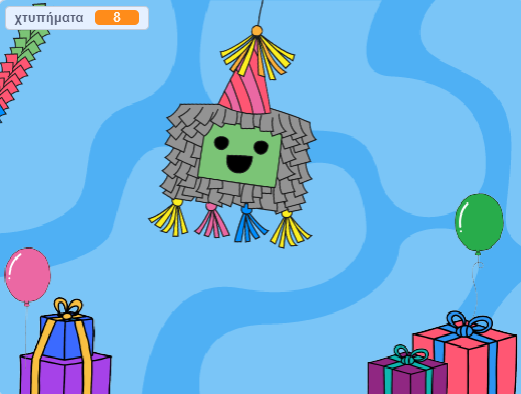

## Χτύπησε την πινιάτα

<div style="display: flex; flex-wrap: wrap">
<div style="flex-basis: 200px; flex-grow: 1; margin-right: 15px;">
Σε αυτό το βήμα, θα φτιάξεις κώδικα για την πινιάτα για να παίζει έναν ήχο και να μετράει ένα χτύπημα κάθε φορά που γίνεται κλικ πάνω στην πινιάτα.
</div>
<div>
{:width="300px"}
</div>
</div>

--- task ---

Κάνε κλικ στην καρτέλα **Ήχοι** για το αντικείμενο **Piñata** και θα βρεις έναν ήχο **Boing**. Κάνε κλικ στο εικονίδιο **Αναπαραγωγή** για να μπορείς να ακούσεις τον ήχο.


--- /task ---

Μια ομάδα συνδεδεμένων μπλοκ στο Scratch ονομάζεται **script**. Τα αντικείμενα μπορούν να έχουν περισσότερα από ένα scripts.

--- task ---

Κάνε κλικ στην καρτέλα **Κώδικας**. Από τα `Συμβάντα`{:class="block3events"}, σύρε ένα μπλοκ `όταν γίνει κλικ σε αυτό το αντικείμενο`{:class="block3events"} στην περιοχή Κώδικας για να ξεκινήσεις ένα νέο script.

Στο μενού μπλοκ `Ήχος`{:class="block3sound"}, βρες το μπλοκ `παίξε τον ήχο`{:class="block3sound"}. Σύρε το κάτω από το μπλοκ `όταν γίνει κλικ σε αυτό το αντικείμενο`{:class="block3events"}:


```blocks3
when this sprite clicked
start sound [Boing v]
```

--- /task ---

--- task ---

**Δοκιμή:** Εκτέλεσε το έργο σου κάνοντας κλικ στην **πράσινη σημαία** πάνω από τη Σκηνή. Κάνε κλικ στην πινιάτα καθώς αιωρείται για να ακούσεις τον ήχο boing.

--- /task ---

Μια `μεταβλητή `{:class="block3variables"} είναι ένας τρόπος αποθήκευσης αριθμών ή/και κειμένου. Ο αριθμός των φορών που θα γίνει κλικ στην πινιάτα θα αποθηκευτεί σε μια μεταβλητή που ονομάζεται `χτυπήματα`{:class="block3variables"} ώστε να μπορεί να χρησιμοποιηθεί ανά πάσα στιγμή.

--- task ---

Από το μενού μπλοκ `Μεταβλητές`{:class="block3variables"} κάνε κλικ στο κουμπί **Δημιουργία μεταβλητής**.


Κάλεσε τη νέα σου μεταβλητή **χτυπήματα**:


**Σημείωση:** Η νέα μεταβλητή "χτυπήματα" εμφανίζεται στη Σκηνή και μπορεί πλέον να χρησιμοποιηθεί στα μπλοκ `Μεταβλητές`{:class="block3variables"}.


--- /task ---

--- task ---

Κάθε φορά που ξεκινά το έργο, ο πλήθος των `χτυπημάτων`{:class="block3variables"} θα πρέπει να επαναφέρεται στο `0`{:class="block3variables"}.

Σύρε το μπλοκ `όρισε χτυπήματα σε 0`{:class="block3variables"} στο πρώτο script στην περιοχή Κώδικα μεταξύ του μπλοκ `άλλαξε ενδυμασία σε`{:class="block3looks"} και του μπλοκ `πήγαινε σε θέση x: ( 0) y: (180)`{:class="block3motion"}.

Ο κώδικας θα πρέπει να μοιάζει κάπως έτσι:


```blocks3
όταν γίνει κλικ στη σημαία
άλλαξε ενδυμασία σε (ολόκληρο v)
+ όρισε [χτυπήματα v] σε (0)
πήγαινε σε θέση x: (0) y: (180)
δείξε σε κατεύθυνση (90)
για πάντα
επανάληψη (10)
στρίψε δεξιά (1) μοίρες
τέλος
επανάληψη (20)
στρίψε αριστερά (1) μοίρες
τέλος
επανάληψη (10)
στρίψε δεξιά (1) μοίρες
τέλος
```

--- /task ---

--- task ---

Κάθε φορά που γίνεται κλικ στο αντικείμενο **Piñata**, ο αριθμός των `χτυπημάτων`{:class="block3variables"} θα πρέπει να αυξάνεται.

Πρόσθεσε ένα μπλοκ για να αυξήσεις τα `χτυπήματα`{:class="block3variables"} κατά `1`{:class="block3variables"} όταν κάνεις κλικ στο αντικείμενο **Piñata**:


```blocks3
όταν γίνει κλικ σε αυτό το αντικείμενο
παίξε τον ήχο [Boing v]
+ άλλαξε [χτυπήματα v] κατά (1)
```

--- /task ---

--- task ---

**Δοκιμή:** Δοκίμασε το έργο σου μερικές φορές. Βεβαιώσου ότι η μεταβλητή `χτυπήματα`{:class="block3variables"} ξεκινά πάντα από το `0`{:class="block3variables"} και αυξάνεται κατά `1`{:class="block3variables"} κάθε φορά που κάνεις κλικ στο αντικείμενο **Piñata**.



--- /task ---

Μια πινιάτα είναι δύσκολο να σπάσει, αλλά δεν διαρκεί για πάντα. Η πινιάτα σου θα κρατήσει για `10 χτυπήματα`{:class="block3variables"} μέχρι να ανοίξει.

Ένα μπλοκ `εάν`{:class="block3control"} μπορεί να χρησιμοποιηθεί για τη λήψη μιας απόφασης με βάση μια **συνθήκη **.

<p style="border-left: solid; border-width:10px; border-color: #0faeb0; background-color: aliceblue; padding: 10px;">
Χρησιμοποιούμε <span style="color: #0faeb0">**συνθήκες**</span> όλη την ώρα για να λαμβάνουμε αποφάσεις. Θα μπορούσαμε να πούμε «εάν το μολύβι δεν είναι μυτερό, τότε πρέπει να το ξύσεις». Τα μπλοκ και οι συνθήκες "εάν" μας επιτρέπουν να γράψουμε κώδικα που κάνει κάτι διαφορετικό ανάλογα με το αν μια συνθήκη είναι αληθής ή ψευδής.
</p>

--- task ---

Πήγαινε στο μενού μπλοκ `Έλεγχος`{:class="block3looks"}. Σύρε ένα μπλοκ `εάν`{:class="block3control"} στην περιοχή Κώδικας και τοποθέτησέ το γύρω από τα μπλοκ στο script `όταν γίνει κλικ σε αυτό το αντικείμενο`{:class="block3events"}:


```blocks3
όταν γίνει κλικ σε αυτό το αντικείμενο
+ εάν <> τότε
παίξε τον ήχο [Boing v]
+ άλλαξε [χτυπήματα v] κατά (1)

```

--- /task ---

Το μπλοκ `εάν`{:class="block3control"} έχει μια είσοδο σε σχήμα εξαγώνου όπου μπορείς να δημιουργήσεις μια συνθήκη.

--- task ---

Το αντικείμενο **Piñata** θα πρέπει να παίζει έναν ήχο και να αυξάνει τον αριθμό των `χτυπημάτων`{:class="block3variables"} **`εάν`{:class="block3control"}** ο αριθμός των `χτυπημάτων`{:class="block3variables Το "} είναι `μικρότερος από`{:class="block3operators"} `10`{:class="block3variables"}.

Αρχικά, πρόσθεσε έναν τελεστή `<`{:class="block3operators"} στην είσοδο σε σχήμα εξαγώνου:


```blocks3
όταν γίνει κλικ σε αυτό το αντικείμενο
+ εάν <() < ()> τότε
παίξε τον ήχο [Boing v]
+ άλλαξε [χτυπήματα v] κατά (1)

```

--- /task ---

--- task ---

Ολοκλήρωσε τη δημιουργία της συνθήκης `εάν`{:class="block3control"} σύροντας τη μεταβλητή `χτυπήματα`{:class="block3variables"} στα αριστερά του τελεστή `<`{:class="block3operators"} και πληκτρολογώντας η τιμή '10' στα δεξιά:


```blocks3
όταν γίνει κλικ σε αυτό το αντικείμενο
+ εάν <(hits) < (10)> τότε
παίξε τον ήχο [Boing v]
+ άλλαξε [χτυπήματα v] κατά (1)

```

--- /task ---

--- task ---

**Δοκιμή:** Τρέξε το έργο σου. Χτύπησε την πινιάτα 10 φορές για να ακούσεις τον ήχο και δες την αύξηση της μεταβλητής `χτυπήματα`{:class="block3variables"}.

Χτύπησε την πινιάτα μερικές ακόμη φορές. Η μεταβλητή `χτυπήματα`{:class="block3variables"} δεν θα υπερβαίνει το 10, επειδή αυτή η συνθήκη δεν θα είναι πλέον "αληθής" επομένως ο κώδικας μέσα στο μπλοκ `if`{:class="block3control"} δεν θα εκτελείται.

--- /task ---

--- task ---

Πρόσθεσε ένα δεύτερο `εάν`{:class="block3control"} μπλοκ μέσα στο πρώτο. Αυτή τη φορά η συνθήκη θα ελέγξει αν τα `χτυπήματα`{:class="block3variables"} `=`{:class="block3operators"} 10 και αν "αληθεύει" η ενδυμασία` θα αλλάξει σε <0>σπασμένη`{:class="block3looks"}:


```blocks3
όταν γίνει κλικ σε αυτό το αντικείμενο
εάν <(χτυπήματα) < (10)> τότε
παίξε τον ήχο [Boing v]
άλλαξε [χτυπήματα v] κατά (1)
+ εάν <(χτυπήματα)=(10)> τότε
άλλαξε ενδυμασία σε (σπασμένη v)

```

--- /task ---

--- task ---

**Δοκιμή:** Δοκίμασε το έργο σου μερικές φορές. Βεβαιώσου ότι το αντικείμενο **Piñata** ξεκινά με την ενδυμασία "ολόκληρη" και στη συνέχεια αλλάζει στην ενδυμασία "σπασμένη" μετά από `10 χτυπήματα`{:class="block3variables"}.


--- /task ---

Όταν το αντικείμενο **Piñata** σπάσει, όλα τα άλλα αντικείμενα πρέπει να γνωρίζουν ότι το πάρτι ξεκίνησε.

Στο Scratch, το μπλοκ `μετάδωσε`{:class="</strong>"} μπορεί να χρησιμοποιηθεί για την **αποστολή** ενός μηνύματος που όλα τα αντικείμενα μπορούν να **λάβουν</1>.</p>

--- task ---

Πρόσθεσε το μπλοκ `μετάδωσε` από το μενού μπλοκ `Συμβάντα`:


```blocks3
όταν γίνει κλικ σε αυτό το αντικείμενο
εάν <(χτυπήματα) < (10)> τότε
παίξε τον ήχο [Boing v]
άλλαξε [χτυπήματα v] κατά (1)
εάν <(χτυπήματα)=(10)> τότε
άλλαξε ενδυμασία σε (σπασμένη v)
+ μετάδωσε (μήνυμα1 ν)
```

Κάνε κλικ στο `μήνυμα1`{:class="block3events"} και επίλεξε **Νέο μήνυμα**. Μπορείς να ονομάσεις το μήνυμα `πάρτι`{:class="block3events"}.


Το μπλοκ `μετάδωσε`{:class="block3events"} θα μοιάζει με αυτό:

```blocks3
μετάδωσε (πάρτι v)
```

--- /task ---

--- save ---
