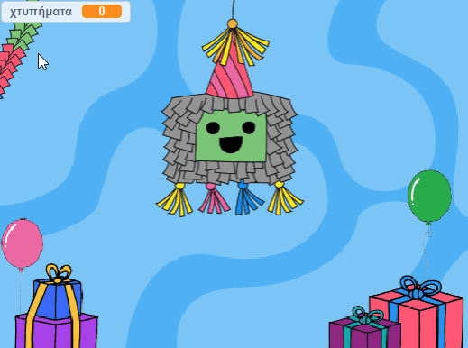
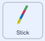
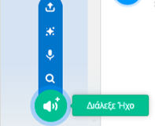
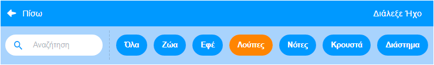
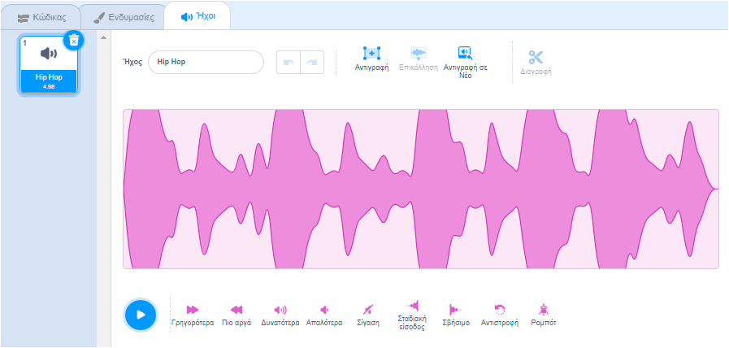

## Χρησιμοποίησε ένα ραβδί

<div style="display: flex; flex-wrap: wrap">
<div style="flex-basis: 200px; flex-grow: 1; margin-right: 15px;">
Η πινιάτα συνήθως χτυπιέται με ένα ραβδί από ξύλο ή από χοντρή κάρτα που καλύπτεται με πολύχρωμες λωρίδες χαρτιού. Σε αυτό το βήμα, θα προσθέσεις κώδικα για να ελέγχεις το ραβδί πινιάτα και για την αναπαραγωγή μουσικής σε βρόχο όταν σπάσει η πινιάτα. 
</div>
<div>
{:width="300px"}
</div>
</div>

--- task ---

Κάνε κλικ στο αντικείμενο **Stick** στη λίστα αντικειμένων. Πρόσθεσε κώδικα έτσι ώστε το ραβδί να μένει πάντα μπροστά από τα άλλα αντικείμενα και να ακολουθεί τον δείκτη του ποντικιού (ή το δάχτυλό σου σε ένα tablet).

Χρησιμοποίησε το μπλοκ `πήγαινε σε τυχαία θέση`{:class="block3motion"}, αλλά επίλεξε `δείκτη ποντικιού`{:class="block3motion"} από το αναπτυσσόμενο μενού:



```blocks3
when flag clicked
forever
go to [front v] layer
go to (mouse-pointer v) // Change to mouse-pointer
```

--- /task ---

--- task ---

**Δοκιμή:** Εκτέλεσε το έργο σου και έλεγξε ότι το αντικείμενο **Stick** ακολουθεί τον δείκτη ή το δάχτυλό σου γύρω από τη Σκηνή.


--- /task ---

Υπάρχουν πολλοί διαφορετικοί τύποι ήχων στο Scratch, από θορύβους φωνής και ζώων μέχρι πάνω από 100 άλλα ηχητικά εφέ.

Το Scratch έχει επίσης **ήχους σε λούπες** που μπορούν να χρησιμοποιηθούν σε βρόχους `για πάντα`{:class="block3control"} ή `επανάλαβε`{:class="block3control"} για να ακούγονται σαν να παίζουν συνεχώς.

--- task ---

Πήγαινε στην καρτέλα **Ήχοι** και κάνε κλικ στο εικονίδιο **Διάλεξε Ήχο**.



--- /task ---

--- task ---

Από τη συλλογή **Διάλεξε Ήχο**, επίλεξε την κατηγορία **Λούπες**.



--- /task ---

--- task ---

**Επίλεξε:** Τοποθέτησε το δείκτη του ποντικιού πάνω από τα εικονίδια **αναπαραγωγής** για να ακούσεις τους ήχους σε λούπα. Πρόσθεσε τον αγαπημένο σου κάνοντας κλικ σ' αυτόν.


Στη συνέχεια, ο ήχος θα εμφανιστεί στη λίστα Ήχοι:



--- /task ---

--- task ---

Κάνε κλικ στην καρτέλα **Κώδικας** και δημιούργησε ένα νέο script για να λουπάρεις τον ήχο `για πάντα`{:class="block3control"} όταν ληφθεί το μήνυμα `πάρτι`{:class="block3events"}:


```blocks3
when I receive [party v]
forever
play sound [Hip Hop v] until done // Choose your sound
```

--- /task ---

--- task ---

**Δοκιμή:** Εκτέλεσε το έργο σου και κάνε κλικ στην πινιάτα δέκα φορές για να ακούσεις τη μουσική σε λούπα του πάρτι.

--- /task ---

--- save ---
