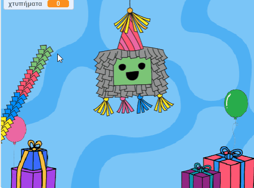
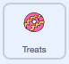
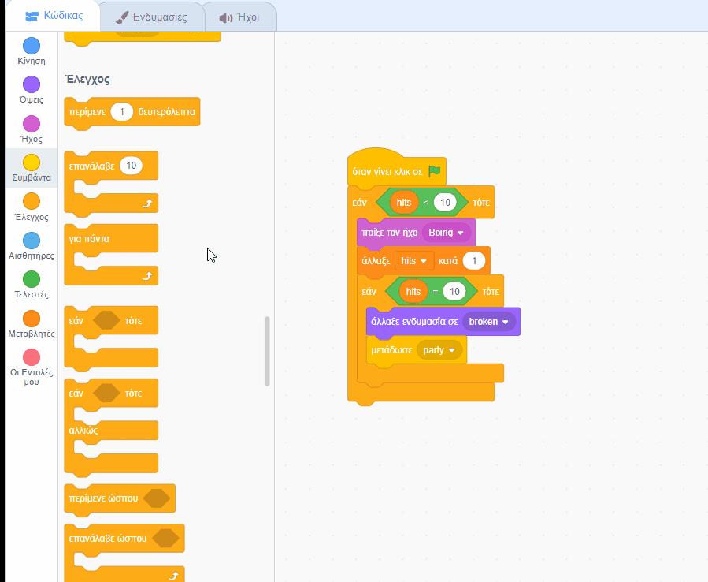
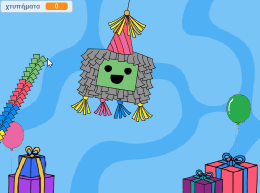

## Πρόσθεσε μερικές λιχουδιές

<div style="display: flex; flex-wrap: wrap">
<div style="flex-basis: 200px; flex-grow: 1; margin-right: 15px;">
Οι πινιάτες είναι γεμάτες λιχουδιές και όταν αρχίζουν να σπάνε, οι λιχουδιές πέφτουν έξω. Σε αυτό το βήμα, θα ζωντανέψεις διεθνείς λιχουδιές φαγητού ώστε να πέφτουν έξω από την πινιάτα κάθε φορά που την χτυπάς. Αναγνωρίζεις κάποιες από τις λιχουδιές;
</div>
<div>
{:width="300px"}
</div>
</div>

<p style="border-left: solid; border-width:10px; border-color: #0faeb0; background-color: aliceblue; padding: 10px;">
Μια <span style="color: #0faeb0">**ενδυμασία**</span> στο Scratch είναι μια εικόνα που αλλάζει την εμφάνιση ενός αντικειμένου. Οι δικοί μας **σχεδιαστές γραφικών** ζήτησαν από τους ηγέτες των Code Club από όλο τον κόσμο να τους πουν τι λιχουδιές θα είχαν σε ένα πάρτυ. Ας ελπίσουμε ότι κάποια από τις ενδυμασίες που δημιούργησαν για τις λιχουδιές θα σου είναι οικείες— και άλλες εντελώς νέες.      
</p>

--- task --

Κάνε κλικ στο αντικείμενο **Treats** στη λίστα Αντικειμένων και επίλεξε την καρτέλα **Ενδυμασίες**.

Υπάρχουν 26 ενδυμασίες για τις λιχουδιές— και θα τις χρησιμοποιήσεις όλες!


--- /task ---

--- task ---

Κάνε κλικ στην καρτέλα **Κώδικας** και στη συνέχεια, δημιούργησε ένα script για να `εξαφανίσεις`{class="block3looks"} τις λιχουδιές στην πινιάτα όταν ξεκινά το έργο σου:



```blocks3
όταν γίνει κλικ στην πράσινη σημαία
εξαφανίσου
πήγαινε σε θέση x: (0) y: (100)
```

--- /task ---

Τέσσερις λιχουδιές θα ξεφεύγουν από την πινιάτα κάθε φορά που χτυπιέται η πινιάτα. Με **κλωνοποίηση** των αντικειμένων **Treats** μπορείς να δημιουργήσεις πολλές λιχουδιές.

<p style="border-left: solid; border-width:10px; border-color: #0faeb0; background-color: aliceblue; padding: 10px;">
Ένας <span style="color: #0faeb0">**κλώνος**</span> στο Scratch είναι ένα αντίγραφο ενός αντικειμένου. Έχει τον ίδιο κώδικα, ενδυμασίες και ήχους του αρχικού αντικειμένου.      
</p>

--- task ---

Κάνε κλικ στην ενδυμασία **Piñata**.

Τοποθέτησε το βρόχο `επανάλαβε`{:class="block3control"} στον υπάρχοντα κώδικά σου. Άλλαξε την τιμή σε `4`{:class="block3control"} και στη συνέχεια, πρόσθεσε ένα μπλοκ `δημιούργησε κλώνο του εαυτού μου`{:class="block3control"}. Χρησιμοποίησε το βελάκι στο αναπτυσσόμενο μενού για να επιλέξεις το αντικείμενο`Treats`{:class="block3control"}:


```blocks3
όταν γίνει κλικ σε αυτό το αντικείμενο
εάν <(χτυπήματα) < (10)> τότε
παίξε τον ήχο [Boing v]
άλλαξε [χτυπήματα v] κατά (1)
+ επανάλαβε (4) // αλλαγή σε 4
δημιούργησε κλώνο του (Treats v) // Επίλεξε λιχουδιά
τέλος
εάν <(χτυπήματα)=(10)> τότε
άλλαξε ενδυμασία σε (broken v)
μετάδωσε (party v)
```

**Συμβουλή:** Χρησιμοποίησε τον ελεύθερο χώρο στην περιοχή Κώδικας για να δημιουργήσεις το νέο σου κώδικα και στη συνέχεια, σύρε τον στο υπάρχον script:

 --- /task ---

--- task ---

Κάνε κλικ στο αντικείμενο **Treats**.

Δημιούργησε ένα νέο script χρησιμοποιώντας το `όταν ξεκινήσω ως κλώνος`{:class="block3control"}.

Πρόσθεσε μπλοκ από το μενού μπλοκ `Ενδυμασίες`{:class="block3looks"} για να ελέγξεις την εμφάνιση κάθε νέου κλώνου:


```blocks3
όταν ξεκινήσω ως κλώνος
εμφανίσου
πήγαινε [πίσω v] επίπεδα// Άλλαξε σε πίσω επίπεδο
άλλαξε ενδυμασία σε (Knafeh v)
```

--- /task ---

--- task ---

Μπορείς να επιλέξεις τυχαίες λιχουδιές που θα απελευθερωθούν όταν χτυπηθεί η πινιάτα. Χρησιμοποίησε έναν τελεστή `επίλεξε τυχαίο`{:class="block3operators"} για να επιλέξεις μια τυχαία ενδυμασία από `1`{:class="block3operators"} έως `26`{:class="block3operators"} κάθε φορά που δημιουργείται ένας κλώνος:


```blocks3
όταν ξεκινήσω ως κλώνος
εμφανίσου
πήγαινε [πίσω v] επίπεδα
+ άλλαξε ενδυμασία σε (επίλεξε τυχαίο (1) έως (26)) // Αλλαγή σε 26
```

--- /task ---

--- task ---

Προς το παρόν, οι κλώνοι **Treats** θα εμφανιστούν πίσω από το αντικείμενο **Piñata**, αλλά οι λιχουδιές θα πρέπει να πέφτουν από την πινιάτα σε μια τυχαία θέση.

Πρόσθεσε κώδικα για να κάνεις τα κλωνοποιημένα αντικείμενα **Treats** να `ολισθήσουν`{:class="block3motion"} σε μια τυχαία θέση:


```blocks3
όταν ξεκινήσω ως κλώνος 
εμφανίσου 
πήγαινε σε [πίσω v] επίπεδα
άλλαξε ενδυμασία σε (επίλεξε τυχαίο (1) έως (26))
+ ολίσθησε (1) δευτ. στη θέση (τυχαία θέση v) 
```

--- /task ---

--- task ---

**Δοκιμή:** Εκτέλεσε το έργο σου και χτύπησε την πινιάτα για να δεις τέσσερις κλώνους του αντικειμένου **Treats** μετά από κάθε χτύπημα. Οι ενδυμασίες θα επιλεγούν τυχαία και οι λιχουδιές θα ολισθήσουν η καθεμία σε μια τυχαία θέση.



--- /task ---

--- task ---

Πρόσθεσε κινούμενα σχέδια για να κάνεις τα αντικείμενα **Treats** να `στρίβουν`{:class="block3motion"} 
 `για πάντα`{:class="block3control"} όταν φτάσουν στην τυχαία θέση τους. Να θυμάσαι ότι τα κινούμενα σχέδια λειτουργούν καλύτερα όταν χρησιμοποιούνται με μικρές κινήσεις, επομένως άλλαξε τον αριθμό των μοιρών σε `1`{:class="block3motion"}:


```blocks3
όταν ξεκινήσω ως κλώνος 
εμφανίσου 
πήγαινε σε [πίσω v] επίπεδα
άλλαξε ενδυμασία σε (επίλεξε τυχαίο (1) έως (26))
+ ολίσθησε (1) δευτ. στη θέση (τυχαία θέση v)
+ για πάντα
στρίψε δεξιά (1) μοίρες
```

--- /task ---

--- task ---

**Δοκιμή:** Εκτέλεσε το έργο σου πάλι για να δεις τους κλώνους του αντικειμένου **Treats** να στροβιλίζονται.


--- /task ---

--- save ---
