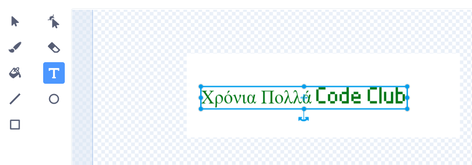
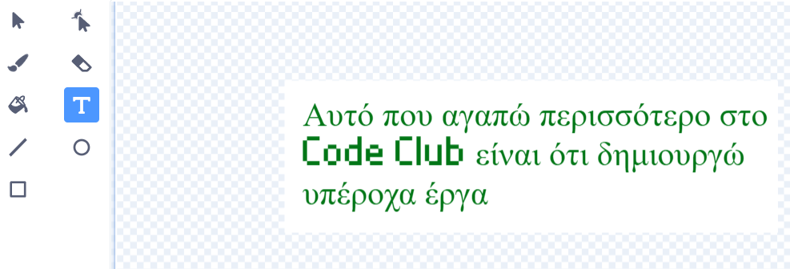
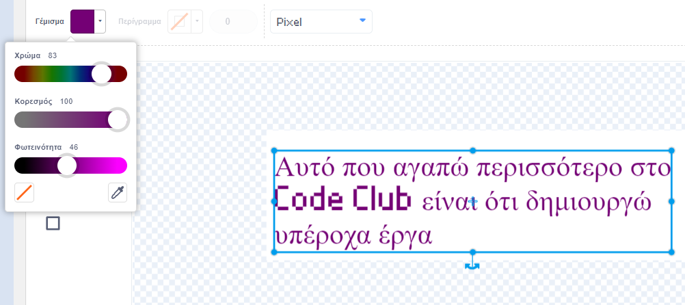
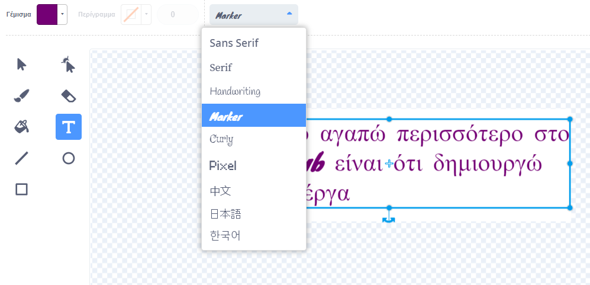
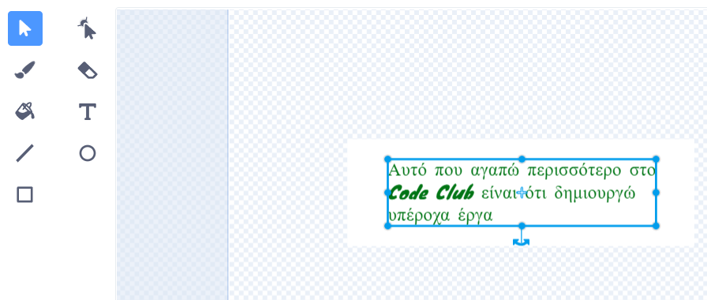

## Δημιούργησε ένα μήνυμα

<div style="display: flex; flex-wrap: wrap">
<div style="flex-basis: 200px; flex-grow: 1; margin-right: 15px;">
Σε αυτό το βήμα, θα γράψεις ένα μήνυμα και θα προσθέσεις κίνηση χρησιμοποιώντας εφέ κίνησης και χρώματος. 
</div>
<div>
{:width="300px"}
</div>
</div>

Τι θα έγραφες σε μια κάρτα γενεθλίων για να στείλεις στο Code Club; Θα μπορούσε να είναι:
+ Το αγαπημένο σου πράγμα για το Code Club
+ Ένα μήνυμα για τον υπέροχο αρχηγό του Code Club
+ Λεπτομέρειες για το τι θέλεις να κάνεις στη συνέχεια με τις δεξιότητές συγγραφής κώδικα

<p style="border-left: solid; border-width:10px; border-color: #0faeb0; background-color: aliceblue; padding: 10px;">
Τα πρώτα έργα του Code Club γράφτηκαν στα αγγλικά, αλλά μέσα σε ένα χρόνο είχαν μεταφραστεί στα Πορτογαλικά Βραζιλίας, Ολλανδικά, Γερμανικά, Νορβηγικά και Ουκρανικά. Γρήγορα ακολούθησαν μεταφράσεις στα Γαλλικά, Ελληνικά και Ισπανικά και τώρα ορισμένα από τα έργα του Code Club έχουν μεταφραστεί σε <span style="color: #0faeb0">**28 μητρικές γλώσσες**</span>. Ευχαριστούμε την καταπληκτική μεταφραστική μας κοινότητα!


</p>

--- task ---

Κάνε κλικ στο αντικείμενο **Μήνυμα** στη λίστα Αντικειμένων και επέλεξε την καρτέλα **Ενδυμασίες**.

Η ενδυμασία έχει κάποιο κείμενο που λέει «Χαρούμενα Γενέθλια Code Club». Κάνε διπλό κλικ (ή πάτησε παρατεταμένα σε ένα tablet) στο κείμενο για να επίλεξε το εργαλείο επεξεργασίας κειμένου.



--- /task ---

--- task ---

Μπορείς τώρα να πληκτρολογήσεις το νέο σου μήνυμα γενεθλίων για το Code Club. Πάτησε **Enter** στο πληκτρολόγιό σου για να ξεκινήσεις μια νέα γραμμή.

**Συμβουλή:** Μην ανησυχείς εάν το μήνυμά σου είναι πολύ μεγάλο για το πλαίσιο, καθώς μπορείς να αλλάξεις το μέγεθός του αργότερα.



--- /task ---

--- task ---

**Επίλεξε:** Κάνε κλικ στο εικονίδιο **Γέμισμα** για να ανοίξεις το αναδυόμενο μενού χρώματος. Μετακίνησε τις μπάρες ολίσθησης πλήρωσης προς τα αριστερά ή τα δεξιά για να επιλέξεις το αγαπημένο σου χρώμα.



--- /task ---

--- task ---

**Επίλεξε:** Κάνε κλικ στο εργαλείο **Γραμματοσειρά** και θα εμφανιστεί μια αναδυόμενο μενού γραμματοσειρών. Η γραμματοσειρά "Pixel" επιλέγεται στο αρχικό έργο, αλλά μπορείς να χρησιμοποιήσεις οποιαδήποτε από τις διαθέσιμες γραμματοσειρές.



--- /task ---

--- task ---

Κάνε κλικ στο εργαλείο **Επιλέξτε** και οκτώ κύκλοι θα εμφανιστούν γύρω από το μήνυμά σου. Χρησιμοποίησε αυτούς τους κύκλους για να αλλάξεις το μέγεθος του μηνύματός σου κάνοντας κλικ πάνω τους και σύροντάς τους μέσα στο λευκό πλαίσιο.



--- /task ---

Το μήνυμά σου είναι έτοιμο, τώρα μπορείτε να προσθέσεις κώδικα για να κρύψεις το μήνυμά σου μέσα στην πινιάτα και να κάνεις το μήνυμά σου να πέσει από την πινιάτα μετά το δέκατο χτύπημα.

--- task ---

Κάνε κλικ στην καρτέλα **Κώδικας** και στη συνέχεια, δημιούργησε ένα script για να `αποκρύψεις`{class="block3looks"} το μήνυμα στην πινιάτα όταν ξεκινά το έργο σου:


```blocks3
when flag clicked
hide
set size to (10) % // Change to 10 to start small
go to x: (0) y: (100) // Inside the piñata
```

--- /task ---

--- task ---

Δημιούργησε ένα νέο script για να ξεκινήσει όταν ληφθεί το μήνυμα `πάρτυ`{:class="block3events"}.

Πρόσθεσε έναν βρόχο `επανάληψη`{:class="block3control"} για να κινηθεί το μήνυμα. Το μήνυμα θα `αλλάξει μέγεθος`{:class="block3looks"} για να μεγαλώσει και `αλλάξει y`{:class="block3motion"} θέση για να πέσει καθώς κινείται:


```blocks3
when I receive [party v]
show
repeat (20) // Change to 20
change size by (5) // Change to 5
change y by (-10) // Change to -10
```

--- /task ---

--- task ---

**Δοκιμή:** Εκτέλεσε το έργο σου. Χτύπα την πινιάτα δέκα φορές για να δεις το μήνυμα να πέφτει.


--- /task ---

--- save ---
