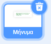

## Δημιούργησε ένα μήνυμα

<div style="display: flex; flex-wrap: wrap">
<div style="flex-basis: 200px; flex-grow: 1; margin-right: 15px;">
Σε αυτό το βήμα, θα γράψεις ένα μήνυμα και θα προσθέσεις κίνηση χρησιμοποιώντας εφέ κίνησης και χρώματος. 
</div>
<div>
{:width="300px"}
</div>
</div>

Τι θα έγραφες σε μια κάρτα γενεθλίων για να στείλεις στο Code Club; Θα μπορούσε να είναι:
+ Το αγαπημένο σου πράγμα για το Code Club
+ Ένα μήνυμα για τον υπέροχο αρχηγό του Code Club
+ Λεπτομέρειες για το τι θέλεις να κάνεις στη συνέχεια με τις δεξιότητές συγγραφής κώδικα

<p style="border-left: solid; border-width:10px; border-color: #0faeb0; background-color: aliceblue; padding: 10px;">
Τα πρώτα έργα του Code Club γράφτηκαν στα αγγλικά, αλλά μέσα σε ένα χρόνο είχαν μεταφραστεί στα Πορτογαλικά Βραζιλίας, Ολλανδικά, Γερμανικά, Νορβηγικά και Ουκρανικά. Γρήγορα ακολούθησαν μεταφράσεις στα Γαλλικά, Ελληνικά και Ισπανικά και τώρα ορισμένα από τα έργα του Code Club έχουν μεταφραστεί σε <span style="color: #0faeb0">**28 μητρικές γλώσσες**</span>. Ευχαριστούμε την καταπληκτική μεταφραστική μας κοινότητα!


</p>

--- task ---

Κάνε κλικ στο αντικείμενο **Μήνυμα** στη λίστα Αντικειμένων και επέλεξε την καρτέλα **Ενδυμασίες**.

Η ενδυμασία έχει κάποιο κείμενο που λέει «Χαρούμενα Γενέθλια Code Club». Κάνε διπλό κλικ (ή πάτησε παρατεταμένα σε ένα tablet) στο κείμενο για να επίλεξε το εργαλείο επεξεργασίας κειμένου.


--- /task ---

--- task ---

Μπορείς τώρα να πληκτρολογήσεις το νέο σου μήνυμα γενεθλίων για το Code Club. Πάτησε **Enter** στο πληκτρολόγιό σου για να ξεκινήσεις μια νέα γραμμή.

**Συμβουλή:** Μην ανησυχείς εάν το μήνυμά σου είναι πολύ μεγάλο για το πλαίσιο, καθώς μπορείς να αλλάξεις το μέγεθός του αργότερα.


--- /task ---

--- task ---

**Επίλεξε:** Κάνε κλικ στο εικονίδιο **Γέμισμα** για να ανοίξεις το αναδυόμενο μενού χρώματος. Μετακίνησε τις μπάρες ολίσθησης πλήρωσης προς τα αριστερά ή τα δεξιά για να επιλέξεις το αγαπημένο σου χρώμα.


--- /task ---

--- task ---

**Επίλεξε:** Κάνε κλικ στο εργαλείο **Γραμματοσειρά** και θα εμφανιστεί μια αναδυόμενο μενού γραμματοσειρών. Η γραμματοσειρά "Pixel" επιλέγεται στο αρχικό έργο, αλλά μπορείς να χρησιμοποιήσεις οποιαδήποτε από τις διαθέσιμες γραμματοσειρές.


--- /task ---

--- task ---

Click on the **Select** tool and eight circles will appear around your message. Use these circles to resize your message by clicking on them and dragging them within the white box.


--- /task ---

Your message is ready, now you can add code to hide your message inside the piñata and make your message fall from the piñata after the tenth hit.

--- task ---

Click on the **Code** tab then create a script to `hide`{:class="block3looks"} the message in the piñata when your project starts:



```blocks3
when flag clicked
hide
set size to (10) % // Change to 10 to start small
go to x: (0) y: (100) // Inside the piñata
```

--- /task ---

--- task ---

Create a new script to start when the `party`{:class="block3events"} message has been received.

Add a `repeat`{:class="block3control"} loop to animate the message. The message will `change size`{:class="block3looks"} to grow and `change y`{:class="block3motion"} position to fall as it animates:


```blocks3
when I receive [party v]
show
repeat (20) // Change to 20
change size by (5) // Change to 5
change y by (-10) // Change to -10
```

--- /task ---

--- task ---

**Test:** Run your project. Hit the piñata ten times to see the message fall.


--- /task ---

--- save ---
