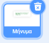

## Αναβάθμισε το έργο σου

Εάν έχεις χρόνο, μπορείς να αναβαθμίσεις το έργο σου. Μπορεί να έχεις ήδη ιδέες για το τι να προσθέσεις!

Θα μπορούσες να:

+ Χρησιμοποιήσεις επιπλέον όψεις, ήχους ή μπλοκ κίνησης για να ζωντανέψεις το μήνυμά σου και περαιτέρω λιχουδιές
+ Βρες εικόνες από τις αγαπημένες σου λιχουδιές και πρόσθεσέ τις στις ενδυμασίες για το αντικείμενο **Treats**
+ Αύξησε τον αριθμό από τις λιχουδιές που πέφτουν από την πινιάτα σε κάθε χτύπημα
+ Κάνε το έργο σου ευκολότερο ή δυσκολότερο αλλάζοντας τον αριθμό των φορών που χρειάζεται να χτυπήσεις την πινιάτα πριν σπάσει

--- task ---
### Δοκίμασέ το
<div style="display: flex; flex-wrap: wrap">
<div style="flex-basis: 175px; flex-grow: 1">  
Γνώριζες ότι μπορείς να προσθέσεις κώδικα και στο υπόβαθρο;

Τι συμβαίνει στο υπόβαθρο όταν σπάει η πινιάτα; Ποια μπλοκ θα δημιουργούσαν αυτό το εφέ; 

[Δείτε τον κώδικα](https://scratch.mit.edu/projects/653771814/){:target="_blank"}

</div>
<div class="scratch-preview" style="margin-left: 15px;">
  <iframe allowtransparency="true" width="485" height="402" src="https://scratch.mit.edu/projects/embed/653771814/?autostart=false" frameborder="0"></iframe>
</div>
</div>
--- /task ---

--- task ---

Θα μπορούσες να προσθέσεις κώδικα για να κάνεις το μήνυμα να κινείται `για πάντα`{:class="block3control"} όταν είναι στη θέση του. Χρησιμοποίησε τα μπλοκ `άλλαξε μέγεθος`{:class="block3looks"} και `άλλαξε εφέ χρώματος`{:class="block3looks"} έτσι ώστε να φαίνεται ότι το μήνυμα κινείται με τον ρυθμό του πάρτι:



```blocks3
when I receive [party v]
show
repeat (20)
change size by (5)
change y by (-10)
end
+ forever
change size by (20) // Positive number to grow
change [color v] effect by (25) // Change colour
wait (0.5) seconds // Try different numbers to match your music
change size by (-20) // Negative number to shrink
```

[Δες τον κώδικα](https://scratch.mit.edu/projects/656332454/){:target="_blank"}

<div class="scratch-preview" style="margin-left: 15px;">
  <iframe allowtransparency="true" width="485" height="402" src="https://scratch.mit.edu/projects/embed/656332454/?autostart=false" frameborder="0"></iframe>
</div>

--- /task ---

--- collapse ---

---
title: Ολοκληρωμένο έργο
---

Μπορείς να δεις το [ολοκληρωμένο έργο εδώ](https://scratch.mit.edu/projects/649873783/){:target="_blank"}.

--- /collapse ---

--- task ---

### Κάνε υποβολή του έργου σου

Εάν έχεις ήδη μοιραστεί το έργο σου μαζί μας, απλώς αποθήκευσε τις αλλαγές σου και θα δούμε τις εντυπωσιακές αναβαθμίσεις σου.

Εάν δεν έχεις διαμοιραστεί το έργο σου αλλά θέλεις να το υποβάλλεις στο δικό μας Scratch studio ['Party piñata — Community'](https://scratch.mit.edu/studios/31111242){:target="_blank"} για να το δουν κι άλλα άτομα, συμπλήρωσε [αυτήν τη φόρμα](https://form.raspberrypi.org/f/community-project-submissions){:target="_blank"}.

--- /task ---
