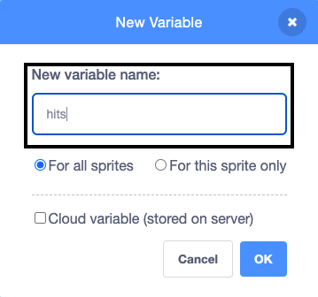
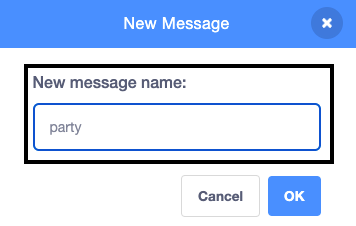

## Hit the piñata

<div style="display: flex; flex-wrap: wrap">
<div style="flex-basis: 200px; flex-grow: 1; margin-right: 15px;">
In this step, you will code the piñata to play a sound and count one hit every time the piñata is clicked.
</div>
<div>
{:width="300px"}
</div>
</div>

--- task ---

Click on the **Sounds** tab for the **Piñata** sprite and you will find a **Boing** sound. Click on the **Play** icon to hear the sound.


--- /task ---

A group of connected blocks in Scratch is called a **script**. Sprites can have more than one script.

--- task ---

Click on the **Code** tab. From `Events`{:class="block3events"}, drag a `when this sprite clicked`{:class="block3events"} block into the Code area to start a new script. 

In the `Sound`{:class="block3sound"} blocks menu, find the `start sound`{:class="block3sound"} block. Drag it underneath the `when this sprite clicked`{:class="block3events"} block:


```blocks3
when this sprite clicked
start sound [Boing v]
```

--- /task ---

--- task ---

**Test:** Run your project by clicking on the **green flag** above the stage. Click on the piñata as it swings to hear the boing sound. 

--- /task ---

A `variable`{:class="block3variables"} is a way of storing numbers and/or text. The number of times the piñata is clicked will be stored in a variable called `hits`{:class="block3variables"} so it can be used at any time.

--- task ---

From the `Variables`{:class="block3variables"} blocks menu, click the **Make a Variable** button.


Call your new variable **hits**:



**Notice:** The new 'hits' variable appears on the Stage and can now be used in the `Variable`{:class="block3variables"} blocks.


--- /task ---

--- task ---

Each time the project starts, the number of `hits`{:class="block3variables"} should be reset to `0`{:class="block3variables"}.

Drag the `set hits to 0`{:class="block3variables"} block into the first script in the Code area, between the `switch costume to`{:class="block3looks"} block and the `go to x: (0) y: (180)`{:class="block3motion"} block.

Your code should look like this:


```blocks3
when flag clicked
switch costume to (whole v)
+ set [hits v] to (0)
go to x: (0) y: (180)
point in direction (90)
forever
repeat (10)
turn right (1) degrees
end
repeat (20)
turn left (1) degrees
end
repeat (10)
turn right (1) degrees
end
```

--- /task ---

--- task ---

Every time the **Piñata** sprite is clicked, the number of `hits`{:class="block3variables"} should increase.

Add a block to change `hits`{:class="block3variables"} by `1`{:class="block3variables"} when the **Piñata** sprite is clicked:


```blocks3
when this sprite clicked
start sound [Boing v]
+ change [hits v] by (1)
```

--- /task ---

--- task ---

**Test:** Run your project a couple of times. Check that `hits`{:class="block3variables"} always starts at `0`{:class="block3variables"} and increases by `1`{:class="block3variables"} each time you click on the **Piñata** sprite.


--- /task ---

A piñata is hard to break but it does not last forever. Your piñata will last for `10 hits`{:class="block3variables"} before breaking open.

An `if`{:class="block3control"} block can be used to make a decision based on a **condition**. 

<p style="border-left: solid; border-width:10px; border-color: #0faeb0; background-color: aliceblue; padding: 10px;">
We use <span style="color: #0faeb0">**conditions**</span> all the time to make decisions. We could say “if the pencil is blunt, then sharpen it”. `If` blocks and conditions let us write code that does something different depending on whether a condition is true or false.
</p>

--- task ---

Go to the `Control`{:class="block3control"} blocks menu. Drag an `if`{:class="block3control"} block into the Code area and insert it around the blocks in your `when this sprite clicked`{:class="block3events"} script:


```blocks3
when this sprite clicked
+ if <> then
start sound [Boing v]
change [hits v] by (1)

```

--- /task ---

The `if`{:class="block3control"} block has a hexagon-shaped input where you can build a condition.  

--- task ---

The **Piñata** sprite should play a sound and increase the count of `hits`{:class="block3variables"} **`if`{:class="block3control"}** the number of `hits`{:class="block3variables"} is `less than`{:class="block3operators"} `10`{:class="block3variables"}.

First add a `<`{:class="block3operators"} operator into the hexagon-shaped input:


```blocks3
when this sprite clicked
+ if <() < ()> then
start sound [Boing v]
change [hits v] by (1)

```

--- /task ---

--- task ---

Finish building the `if`{:class="block3control"} condition by dragging in the `hits`{:class="block3variables"} variable to the left of the `<`{:class="block3operators"} operator and typing the value '10' on the right:


```blocks3
when this sprite clicked
+ if <(hits) < (10)> then
start sound [Boing v]
change [hits v] by (1)

```

--- /task ---

--- task ---

**Test:** Run your project again. Hit the piñata 10 times to hear the sound and see the `hits`{:class="block3variables"} variable increase.

Hit the piñata a few more times. The `hits`{:class="block3variables"} variable will not go above 10 because that condition is no longer 'true' so the code inside the `if`{:class="block3control"} block won't run. 

--- /task ---

--- task ---

Add a second `if`{:class="block3control"} block inside the first. This time the condition will check if `hits`{:class="block3variables"} `=`{:class="block3operators"} 10 and if 'true' the costume will change to `broken`{:class="block3looks"}: 


```blocks3
when this sprite clicked
if <(hits) < (10)> then
start sound [Boing v]
change [hits v] by (1)
+ if <(hits)=(10)> then
switch costume to (broken v)

```

--- /task ---

--- task ---

**Test:** Run your project a couple of times. Check that the **Piñata** sprite starts with the 'whole' costume then changes to the 'broken' costume after `10 hits`{:class="block3variables"}.  


--- /task ---

When the **Piñata** sprite has broken, all the other sprites need to know that the party has started.

In Scratch, the `broadcast`{:class="block3events"} block can be used to **send** a message that all sprites can **receive**.

--- task ---

Add a `broadcast message`{:class="block3events"} block:


```blocks3
when this sprite clicked
if <(hits) < (10)> then
start sound [Boing v]
change [hits v] by (1)
if <(hits)=(10)> then
switch costume to (broken v)
+ broadcast (message1 v)
```

Click on `message1`{:class="block3events"} and choose **New message**. Name the new message `party`{:class="block3events"}.




Your `broadcast`{:class="block3events"} block will look like this:

```blocks3
broadcast (party v)
```

--- /task ---

--- save ---
