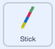

## Use a stick

<div style="display: flex; flex-wrap: wrap">
<div style="flex-basis: 200px; flex-grow: 1; margin-right: 15px;">
 In this step, add code to control the piñata stick and play looping music when the party starts. 
</div>
<div>
{:width="300px"}
</div>
</div>

Piñatas are usually hit with a stick made from wood or thick card that is covered in colourful strips of paper.

--- task ---

Click on the **Stick** sprite in the Sprite list. Add code so that the stick always stays in front of the other sprites and follows the mouse-pointer (or finger on a tablet):



```blocks3
when flag clicked
forever
go to [front v] layer
go to (mouse-pointer v)
```

--- /task ---

--- task ---

**Test:** Run your project and check the **Stick** sprite follows you round the Stage.

--- /task ---

There are many different types of sound in Scratch from voice and animal noises to over 100 other sound effects. 

Scratch also has **looping sounds** that can be used in `forever`{:class="block3control"} or `repeat`{:class="block3control"} loops to sound like they are playing continuously. 

--- task ---

Click on the **Sounds** tab and goto the **Choose a sound** icon:


--- /task ---

--- task ---

From the **Choose a sound** gallery, select the 'Loops' category:


--- /task ---

--- task ---

**Choose:** hover over the 'play' icons to hear the looping sounds. Add your favourite by clicking on it:


The sound will then appear in your Sounds list:


--- /task ---

--- task ---

Click on the **Code** tab and create a new script to loop the sound `forever`{:class="block3control"} when the `party`{:class="block3events"} message has been received:


```blocks3
when I receive [party v]
forever
play sounds [Hip Hop v] until done // Choose your sound
```

--- /task ---

--- save ---