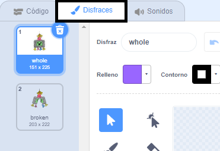
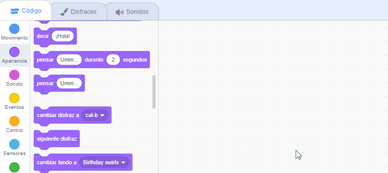
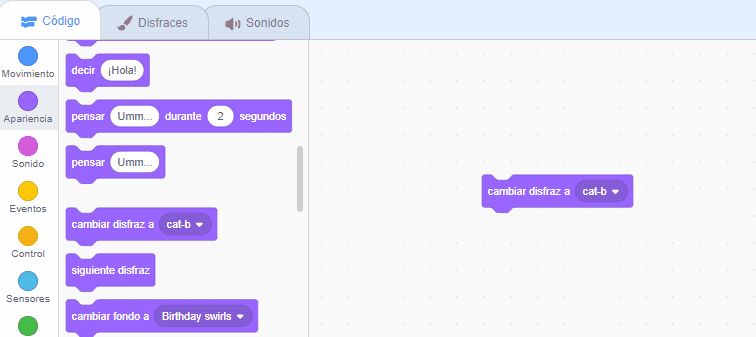
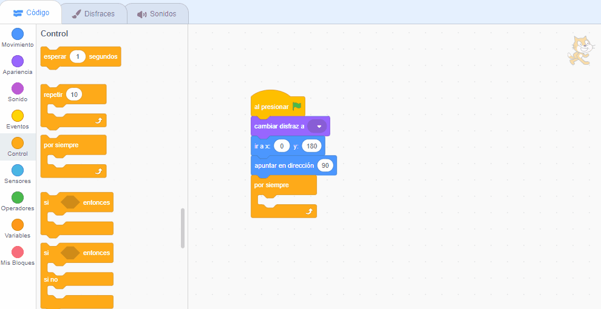
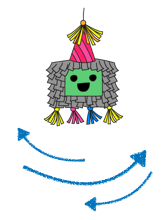

## Empieza la fiesta

<div style="display: flex; flex-wrap: wrap">
<div style="flex-basis: 200px; flex-grow: 1; margin-right: 15px;">
En este paso, elegirás un disfraz para la piñata y programarás la piñata para que oscile.
</div>
<div>
{:width="300px"}
</div>
</div>

--- task ---

Abre el [proyecto inicial Piñata de fiesta](https://scratch.mit.edu/projects/653082997/editor){:target="_blank"}. Scratch se abrirá en otra pestaña del navegador.

[[[working-offline]]]

--- /task ---

El editor de Scratch se ve así:


El **escenario** es donde se ejecuta tu proyecto y un **fondo** cambia la forma en que se ve el escenario. Hemos agregado un fondo de fiesta de Code Club por ti.

En Scratch, los personajes y las cosas se denominan **objetos** y aparecen en el escenario. Puedes ver los objetos **Piñata** y **Palo** en el escenario.


Por el momento no hya mucha acción en esta fiesta. ¡Puedes remediarlo!

--- task ---

Un objeto puede tener código, disfraces y sonidos para cambiar su aspecto y sus acciones.

Haz clic en el objeto **Piñata** en la lista de objetos y selecciona la pestaña **Disfraces**. Hay dos disfraces para la piñata, uno se llama 'whole' (entera) y el otro se llama 'broken' (rota).




--- /task ---

--- task ---

Haz clic en la pestaña **Código**. Ve al menú de bloques `Apariencia`{:class="block3looks"} y arrastra un disfraz de `cambiar disfraz a`{:class="block3looks"} al área de código.

Haz clic en el nombre del disfraz para abrir un **menú desplegable** y luego selecciona el disfraz `whole (entera)`{:class="block3looks"}:


```blocks3
cambia el disfraz a (whole v) // Actualiza a 'whole' (entera)
```



--- /task ---

Los bloques se pueden conectar entre sí en el área de código para ejecutar más de uno a la vez. Los bloques conectados se ejecutarán en orden de arriba a abajo.

--- task ---

Arrastra un bloque `Al presionar bandera`{:class="block3events"} desde el menú de bloques `Eventos`{:class="block3events"} y conéctalo a la parte superior de tu bloque Apariencia en el área de codigo. Los bloques se unirán:


```blocks3
+ when flag clicked
switch costume to (whole v)
```


--- /task ---

La posición inicial de una piñata es siempre la misma, sólo comienza a moverse cuando el juego de la piñata inicia.

--- task ---

En el menú de bloques `Movimiento`{:class="block3motion"}, busca los bloques `ir a x: 0 y: 180`{:class="block3motion"} y `apuntar en dirección 90`{:class="block3motion"}. Arrastra los bloques al área de Código y conéctalos a la parte inferior de tu código:


```blocks3
when flag clicked
switch costume to (whole v)
+ go to x: (0) y: (180)
+ point in direction (90) // Ready position
```

--- /task ---

Un bucle `Por siempre`{:class="block3control"} ejecuta los bloques de código dentro de él una y otra vez. Es el bucle perfecto para una piñata oscilante que es difícil de golpear.

--- task ---

Arrastra un bloque `Por siempre`{:class="block3control"} desde el menú de bloques `Control`{:class="block3control"} y conéctalo a la parte inferior de tu código:


```blocks3
when flag clicked
switch costume to (whole v)
go to x: (0) y: (180)
point in direction (90)
+ forever
```

--- /task ---

Se puede usar un bucle `repetir`{:class="block3control"} para hacer que el objeto **Piñata** repita un pequeño movimiento muchas veces. Esto hará que la piñata parezca animada.

--- task ---

Arrastra un bloque `repetir 10`{:class="block3control"} al área Código y conéctalo dentro de tu bucle `por siempre`{:class="block3control"}.

Ve al menú de bloques `Movimiento`{:class="block3motion"} y arrastra un bloque de `girar 15 grados hacia la derecha`{:class="block3motion"} adentro del bloque `repetir`{:class="block3control"}.

Cambia los `15`{:class="block3motion"} grados a `1`{:class="block3motion"} grado para que la piñata sólo se balancee un poco cada vez:


```blocks3
when flag clicked
switch costume to (whole v)
go to x: (0) y: (180)
point in direction (90)
forever
+ repeat (10) 
turn right (1) degrees // Change to 1
```


--- /task ---

--- task ---

**Prueba:** Ejecuta tu proyecto haciendo clic en la **bandera verde** sobre el escenario para ver cómo se balancea la piñata.

**Mmm, ¡algo no anda bien!** Cuando se cuelga un objeto del techo, no sólo rotará en una dirección, sino que se balanceará hacia un lado y hacia el otro.

Detén tu proyecto haciendo clic en el **ícono rojo Detener** sobre el escenario.


--- /task ---

--- task ---

Agrega código a tu bucle `por siempre`{:class="block3control"} para que la piñata se balancee desde el centro de un lado a otro continuamente como un péndulo:




```blocks3
when flag clicked
switch costume to (whole v)
go to x: (0) y: (180)
point in direction (90)
forever
repeat (10) // Swings 10 degrees clockwise from the centre
turn right (1) degrees 
end
+ repeat (20) // Swings 20 degrees anticlockwise through the centre
turn left (1) degrees // Change to 1
end
+ repeat (10) // Swings 10 degrees clockwise back to the centre
turn right (1) degrees // Change to 1
end
```

--- /task ---

--- task ---

**Prueba:** Ejecuta tu proyecto para ver cómo se balancea la piñata.

**Depuración:** Si la piñata no se balancea correctamente:
+ Mira tu código para asegurarte de que los bloques `repetir`{:class="block3control"} estén en la posición correcta
+ Comprueba que las flechas `girar en el sentido de las agujas del reloj`{:class="block3motion"} y `girar en el sentido contrario a las agujas del reloj`{:class="block3motion"} son correctas
+ Asegúrate de haber usado los números indicados en el código anterior


--- /task ---

--- save ---

