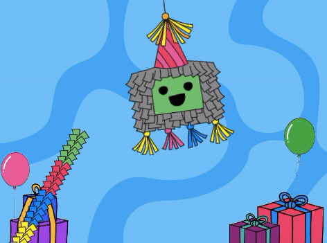

## Empieza la fiesta

<div style="display: flex; flex-wrap: wrap">
<div style="flex-basis: 200px; flex-grow: 1; margin-right: 15px;">
En este paso, elegirás un disfraz de piñata y programarás la piñata para balancearse.
</div>
<div>
{:width="300px"}
</div>
</div>

--- task ---

Abre el [proyecto inicial Piñata de fiesta](https://scratch.mit.edu/projects/653082997/editor){:target="_blank"}. Trinket se abrirá en otra pestaña del navegador.

[[[working-offline]]]

--- /task ---

El editor de Scratch se ve así:


El **escenario** es donde se ejecuta tu proyecto y un **fondo** cambia la forma en que se ve el escenario. Hemos agregado un fondo de fiesta de Code Club por ti.

En Scratch, los personajes y cosas se denominan **objetos**y aparecen en el escenario. You can see the **Piñata** and **Stick** sprites on the Stage.


At the moment there is not much happening at this party. You can change that!

--- task ---

A sprite can have code, costumes, and sounds to change the way that it looks and what it does.

Click on the **Piñata** sprite in the Sprite list and select the **Costumes** tab. There are two piñata costumes, one named 'whole' and the other named 'broken'.


--- /task ---

--- task ---

Click on the **Code** tab. Go to the `Looks`{:class="block3looks"} blocks menu then drag a `switch costume to`{:class="block3looks"} block to the Code area.

Click on the costume name to open a **drop-down menu** then select the `whole`{:class="block3looks"} costume:


```blocks3
switch costume to (whole v) // Update to 'whole'
```


--- /task ---

Blocks can be connected together in the Code area to run more than one at a time. Connected blocks will run in order from top to bottom.

--- task ---

Drag a `When flag clicked`{:class="block3events"} block from the `Events`{:class="block3events"} blocks menu and connect it to the top of your looks block in the Code area. The blocks will snap together:


```blocks3
+ when flag clicked
switch costume to (whole v)
```


--- /task ---

The starting position of a piñata is always the same, it only starts moving when the piñata game is ready to play.

--- task ---

In the `Motion`{:class="block3motion"} blocks menu, find the `go to x: 0 y: 180`{:class="block3motion"} and `point in direction 90`{:class="block3motion"} blocks. Drag the blocks to the Code area and connect them to the bottom of your code:


```blocks3
when flag clicked
switch costume to (whole v)
+ go to x: (0) y: (180)
+ point in direction (90) // Ready position
```

--- /task ---

A `forever`{:class="block3control"} loop runs the code blocks inside it again and again. It is the perfect loop for a swinging piñata that is hard to hit.

--- task ---

Drag a `forever`{:class="block3control"} block from the `Control`{:class="block3control"} blocks menu and connect it to the bottom of your code:


```blocks3
when flag clicked
switch costume to (whole v)
go to x: (0) y: (180)
point in direction (90)
+ forever
```

--- /task ---

A `repeat`{:class="block3control"} loop can be used to make the **Piñata** sprite repeat a small movement many times. This will make the piñata appear animated.

--- task ---

Drag a `repeat 10`{:class="block3control"} block into the Code area and attach it inside your `forever`{:class="block3control"} loop.

Go to the `Motion`{:class="block3motion"} blocks menu and drag a `turn clockwise 15 degrees`{:class="block3motion"} block into the `repeat`{:class="block3control"} block.

Change the `15`{:class="block3motion"} degrees to `1`{:class="block3motion"} degree so that the piñata only swings a small amount each time:


```blocks3
when flag clicked
switch costume to (whole v)
go to x: (0) y: (180)
point in direction (90)
forever
+ repeat (10) 
turn right (1) degrees // Change to 1
```


--- /task ---

--- task ---

**Test:** Run your project, by clicking on the **green flag** above the Stage, to see the piñata swing.

**Mmm, something is not quite right!** When an object is hung from the ceiling, it won't just rotate in one direction, it will swing back and forth.

Stop your project by clicking on the **red stop icon** above the Stage.


--- /task ---

--- task ---

Add code to your `forever`{:class="block3control"} loop so that the piñata swings from the centre back and forth continuously like a pendulum:


```blocks3
when flag clicked
switch costume to (whole v)
go to x: (0) y: (180)
point in direction (90)
forever
repeat (10) // Swings 10 degrees clockwise from the centre
turn right (1) degrees 
end
+ repeat (20) // Swings 20 degrees anticlockwise through the centre
turn left (1) degrees // Change to 1
end
+ repeat (10) // Swings 10 degrees clockwise back to the centre
turn right (1) degrees // Change to 1
end
```

--- /task ---

--- task ---

**Test:** Run your project to see the piñata swing.

**Debug:** If the piñata does not swing correctly:
+ Look at your code to make sure the `repeat`{:class="block3control"} blocks are in the correct position
+ Check that the `turn clockwise`{:class="block3motion"}  and `turn anticlockwise`{:class="block3motion"} arrows are correct
+ Make sure that you have used the numbers from the code above


--- /task ---

--- save ---

