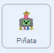

## Golpea la piñata

<div style="display: flex; flex-wrap: wrap">
<div style="flex-basis: 200px; flex-grow: 1; margin-right: 15px;">
En este paso, programarás la piñata para reproducir un sonido y contarás un golpe cada vez que se haga clic en la piñata.
</div>
<div>
{:width="300px"}
</div>
</div>

--- task ---

Haz clic en la pestaña **Sonidos** para el objeto **Piñata** y encontrarás un sonido llamado **Boing**. Haz clic en el botón **Reproducir** para escuchar el sonido.


--- /task ---

Un grupo de bloques conectados en Scratch se llama **script**. Los objetos pueden tener más de un script.

--- task ---

Haz clic en la pestaña **Código**. Arrastra un bloque `al hacer clic en este objeto`{:class="block3events"} desde `Eventos`{:class="block3events"} al área de Código para iniciar un nuevo script.

En el menú de bloques `Sonido`{:class="block3sound"}, busca el bloque `iniciar sonido`{:class="block3sound"}. Arrástralo debajo del bloque `al hacer clic en este objeto`{:class="block3events"}:



```blocks3
when this sprite clicked
start sound [Boing v]
```

--- /task ---

--- task ---

**Prueba:** Ejecuta tu proyecto haciendo clic en la **bandera verde** sobre el escenario. Haz clic en la piñata mientras se balancea para escuchar el sonido boing.

--- /task ---

Una `variable`{:class="block3variables"} es una forma de almacenar números y/o texto. La cantidad de veces que se hace clic en la piñata se almacenará en una variable llamada `golpes`{:class="block3variables"} para que pueda usarse en cualquier momento.

--- task ---

En el menú de bloques `Variables`{:class="block3variables"}, haz clic en el botón **Crear una variable**.


Llama **golpes** a tu nueva variable:


**Aviso:** La nueva variable 'golpes' aparece en el escenario y ahora se puede usar en los bloques `Variable`{:class="block3variables"}.


--- /task ---

--- task ---

Cada vez que se inicia el proyecto, el número de `golpes`{:class="block3variables"} debe restablecerse a `0`{:class="block3variables"}.

Arrastra el bloque `fijar golpes a 0`{:class="block3variables"} al primer script en el área de código, entre el bloque `cambiar disfraz a`{:class="block3looks"} y el bloque`ir a x: (0) y: (180)`{:class="block3motion"}.

Tu código debe parecerse a esto:


```blocks3
when flag clicked
switch costume to (whole v)
+ set [hits v] to (0)
go to x: (0) y: (180)
point in direction (90)
forever
repeat (10)
turn right (1) degrees
end
repeat (20)
turn left (1) degrees
end
repeat (10)
turn right (1) degrees
end
```

--- /task ---

--- task ---

Cada vez que se hace clic en el objeto **Piñata**, el número de `golpes`{:class="block3variables"} debe aumentar.

Agrega un bloque para cambiar `golpes`{:class="block3variables"} en `1`{:class="block3variables"} cuando se hace clic en el objeto **Piñata**:


```blocks3
when this sprite clicked
start sound [Boing v]
+ change [hits v] by (1)
```

--- /task ---

--- task ---

**Prueba:** Ejecuta tu proyecto un par de veces. Comprueba que `golpes`{:class="block3variables"} siempre comience en `0`{:class="block3variables"} y que aumente en `1`{:class="block3variables"} cada vez que haces clic en el objeto **Piñata**.


--- /task ---

Una piñata es difícil de romper pero no dura para siempre. Tu piñata resistirá `10 golpes`{:class="block3variables"} antes de romperse.

Se puede usar un bloque `si`{:class="block3control"} para tomar una decisión basada en una **condición**.

<p style="border-left: solid; border-width:10px; border-color: #0faeb0; background-color: aliceblue; padding: 10px;">
Usamos <span style="color: #0faeb0">**condiciones**</span> todo el tiempo para tomar decisiones. Podríamos decir “si el lápiz no tiene punta, entonces sácale punta”. Los bloques y las condiciones `Si`{: class="block3control"} nos permiten escribir código que hace algo diferente dependiendo de si una condición es verdadera o falsa.
</p>

--- task ---

Ve al menú de bloques `Control`{:class="block3control"}. Arrastra un bloque `si`{:class="block3control"} al área de Código e insértalo alrededor de los bloques en tu secuencia de comandos `al hacer clic en este objeto`{:class="block3events"}:


```blocks3
when this sprite clicked
+ if <> then
start sound [Boing v]
change [hits v] by (1)

```

--- /task ---

El bloque `si`{:class="block3control"} tiene una entrada en forma de hexágono, en donde puedes crear una condición.

--- task ---

El objeto **Piñata** debe reproducir un sonido y aumentar el conteo de `golpes`{:class="block3variables"} **`si`{:class="block3control"}** el número de `golpes`{:class="block3variables" "} es `menor que`{:class="block3operators"} `10`{:class="block3variables"}.

Primero, agrega un operador `<`{:class="block3operators"} en la entrada en forma de hexágono:


```blocks3
when this sprite clicked
+ if <() < ()> then
start sound [Boing v]
change [hits v] by (1)

```

--- /task ---

--- task ---

Termina de crear la condición `si`{:class="block3control"} arrastrando la variable `golpes`{:class="block3variables"} a la izquierda del operador `<`{:class="block3operators"} y escribiendo el valor '10' a la derecha:


```blocks3
when this sprite clicked
+ if <(hits) < (10)> then
start sound [Boing v]
change [hits v] by (1)

```

--- /task ---

--- task ---

**Prueba:** Ejecuta tu proyecto de nuevo. Golpea la piñata 10 veces para escuchar el sonido y ver cómo aumenta la variable `golpes`{:class="block3variables"}.

Golpea la piñata unas cuantas veces más. La variable `golpes`{:class="block3variables"} no superará 10 porque esa condición ya no es "verdadera", por lo que el código dentro del bloque `si`{:class="block3control"} no se ejecutará.

--- /task ---

--- task ---

Agrega un segundo bloque `si`{:class="block3control"} dentro del primero. Esta vez la condición comprobará si `golpes`{:class="block3variables"} `=`{:class="block3operators"} 10 y si es 'verdadero' el disfraz cambiará a `rota`{:class="block3looks"}:


```blocks3
when this sprite clicked
if <(hits) < (10)> then
start sound [Boing v]
change [hits v] by (1)
+ if <(hits)=(10)> then
switch costume to (broken v)

```

--- /task ---

--- task ---

**Prueba:** Ejecuta tu proyecto un par de veces. Comprueba que el objeto **Piñata** comienza con el disfraz 'entera' y luego cambia al disfraz 'rota' después de `10 golpes`{:class="block3variables"}.


--- /task ---

Cuando el objeto **Piñata** se ha roto, todos los demás objetos deben saber que la fiesta ha comenzado.

En Scratch, el bloque `enviar`{:class="block3events"} se puede usar para **enviar** un mensaje que todos los objetos pueden **recibir**.

--- task ---

Agrega un bloque `Enviar`{:class="block3events"} del menú de bloques `Eventos`{:class="block3events"}:


```blocks3
when this sprite clicked
if <(hits) < (10)> then
start sound [Boing v]
change [hits v] by (1)
if <(hits)=(10)> then
switch costume to (broken v)
+ broadcast (message1 v)
```

Haz clic en `mensaje1`{:class="block3events"} y elije **Nuevo mensaje**. Llama al mensaje `fiesta`{:class="block3events"}.


Tu bloque `enviar`{:class="block3events"} se verá así:

```blocks3
broadcast (party v)
```

--- /task ---

--- save ---
