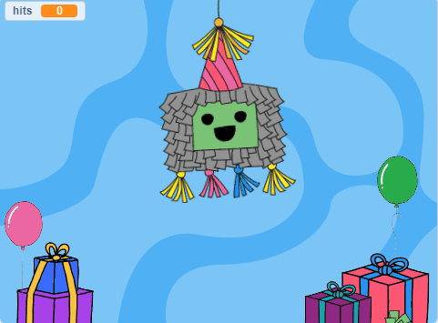
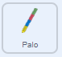
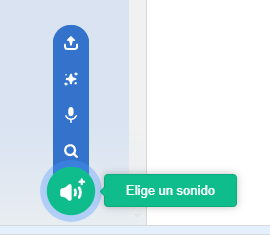
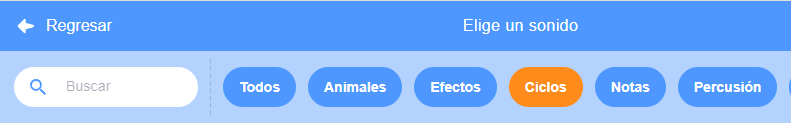
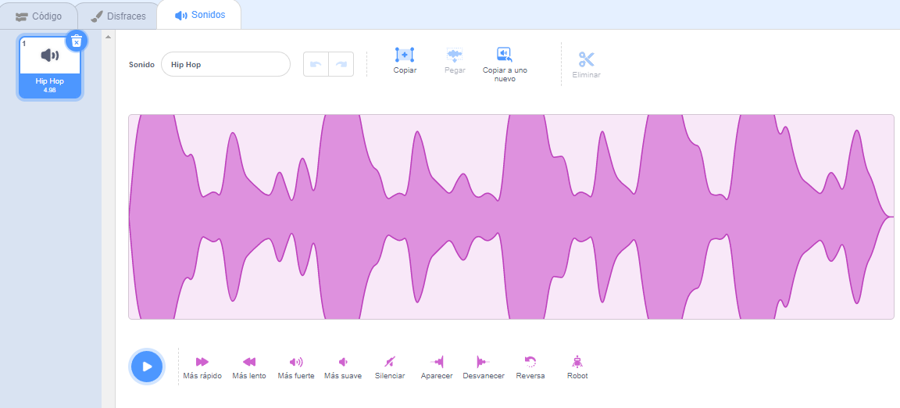

## Usa un palo

<div style="display: flex; flex-wrap: wrap">
<div style="flex-basis: 200px; flex-grow: 1; margin-right: 15px;">
Las piñatas se suelen golpear con un palo de madera o cartulina gruesa que se cubre con tiras de papel de colores. En este paso, agregarás código para controlar el palo de la piñata y reproducir música en bucle cuando la piñata se rompa. 
</div>
<div>
{:width="300px"}
</div>
</div>

--- task ---

Haz clic en el objeto **Palo** en la lista de objetos. Agrega código para que el palo permanezca siempre frente a los otros objetos y siga el puntero del mouse (o tu dedo en una tableta).

Usa el bloque `ir a posición aleatoria`{:class="block3motion"}, pero selecciona `puntero del ratón`{:class="block3motion"} del menú desplegable:



```blocks3
when flag clicked
forever
go to [front v] layer
go to (mouse-pointer v) // Change to mouse-pointer
```

--- /task ---

--- task ---

**Prueba:** Ejecuta tu proyecto y verifiqca que el objeto **Palo** siga tu cursor o dedo alrededor del escenario.


--- /task ---

Hay muchos tipos diferentes de sonidos en Scratch, desde voces y ruidos de animales hasta más de 100 otros efectos de sonido.

Scratch también tiene **sonidos en bucle** que se pueden usar en bucles `para siempre`{:class="block3control"} o `repetir`{:class="block3control"} para que suenen como si estuvieran reproduciéndose continuamente.

--- task ---

Vw a la pestaña **Sonidos** y haz clic en el icono **Elige un sonido**.



--- /task ---

--- task ---

En la galería **Elige un sonido**, selecciona la categoría **Ciclos**.



--- /task ---

--- task ---

**Elige:** Pasa el cursor sobre los íconos **reproducir** para escuchar los sonidos en bucle. Agrega tu favorito haciendo clic en él.


El sonido aparecerá en tu lista de Sonidos:



--- /task ---

--- task ---

Haz clic en la pestaña **Código** y crea una nueva secuencia de comandos para repetir el sonido `por siempre`{:class="block3control"} cuando se haya recibido el mensaje `fiesta`{:class="block3events"}:


```blocks3
when I receive [party v]
forever
play sound [Hip Hop v] until done // Choose your sound
```

--- /task ---

--- task ---

**Prueba:** Ejecuta tu proyecto y haz clic en la piñata diez veces para escuchar la música de fiesta en bucle.

--- /task ---

--- save ---
