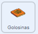
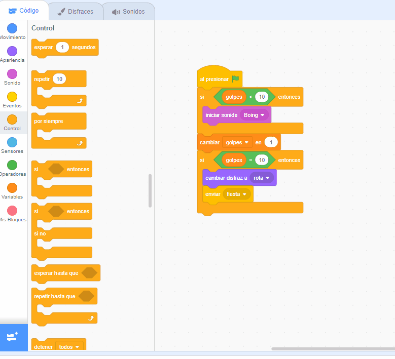
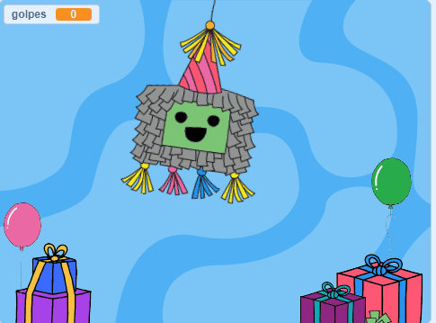

## Agrega algunas golosinas

<div style="display: flex; flex-wrap: wrap">
<div style="flex-basis: 200px; flex-grow: 1; margin-right: 15px;">
Las piñatas están llenas de golosinas y cuando empiezan a romperse, las golosinas se caen. En este paso, animarás las golosinas internacionales para que caigan de la piñata cada vez que se golpee. ¿Reconoces alguna de las golosinas?
</div>
<div>
{:width="300px"}
</div>
</div>

<p style="border-left: solid; border-width:10px; border-color: #0faeb0; background-color: aliceblue; padding: 10px;">
Un <span style="color: #0faeb0">**disfraz**</span> en Scratch es una imagen que cambia la apariencia de un objeto. Nuestros **diseñadores gráficos** les pidieron a los líderes de Code Club de todo el mundo que les dijeran qué golosinas tendrían en una fiesta. Con suerte, algunos de los disfraces que crearon te resultarán familiares, y otros completamente nuevos.      
</p>

--- task ---

Haz clic en el objeto **Golosinas** en la lista de objetos y selecciona la pestaña **Disfraces**.

Hay 26 disfraces de golosinas, ¡y los vas a usar todos!


--- /task ---

--- task ---

Haz clic en la pestaña **Código** y luego crea un script para `esconder`{:class="block3looks"} las golosinas en la piñata cuando comience tu proyecto:



```blocks3
when flag clicked
hide
go to x: (0) y: (100)
```

--- /task ---

Cuatro golosinas escaparán de la piñata cada vez que la golpeen. Al **clonar** el objeto **Golosinas**, puedes crear múltiples golosinas.

<p style="border-left: solid; border-width:10px; border-color: #0faeb0; background-color: aliceblue; padding: 10px;">
Un <span style="color: #0faeb0">**clon**</span> en Scratch es una copia de un objeto. Tiene el mismo código, disfraces y sonidos del objeto original.      
</p>

--- task ---

Haz clic en el objeto **Piñata**.

Inserte un bucle `repetir`{:class="block3control"} en tu código existente. Cambia el valor a `4`{:class="block3control"} y luego agrega un bloque `crar clon de mí mismo`{:class="block3control"}. Usa la flecha desplegable para seleccionar el objeto `Golosinas`{:class="block3control"}:


```blocks3
when this sprite clicked
if <(hits) < (10)> then
start sound [Boing v]
change [hits v] by (1)
+ repeat (4) // Change to 4
create clone of (Treats v) // Select Treats
end
if <(hits)=(10)> then
switch costume to (broken v)
broadcast (party v)
```

**Sugerencia:** Usa el espacio libre en el área Código para crear tu nuevo código y luego arrástralo al script existente:

 --- /task ---

--- task ---

Haz clic en el objeto **Golosinas**.

Crea un nuevo script usando un bloque `al comenzar como clon`{:class="block3control"}.

Agrega bloques desde el menú de bloques `Apariencia`{:class="block3looks"} para controlar la apariencia de cada nuevo clon:


```blocks3
when I start as a clone
show
go to [back v] layer // Change to back
switch costume to (Knafeh v)
```

--- /task ---

--- task ---

Puedes elegir golosinas al azar para que se suelten cuando se golpea la piñata. Use a `pick random`{:class="block3operators"} operator to select a random costume from `1`{:class="block3operators"} to `26`{:class="block3operators"} each time a clone is created:


```blocks3
when I start as a clone
show
go to [back v] layer 
+ switch costume to (pick random (1) to (26)) // Change to 26
```

--- /task ---

--- task ---

At the moment, the **Treats** clones will appear behind the **Piñata** sprite, but treats should fall from the piñata to a random position.

Add code to make the cloned **Treats** sprites `glide`{:class="block3motion"} to a random position:


```blocks3
when I start as a clone
show
go to [back v] layer
switch costume to (pick random (1) to (26))
+ glide (1) secs to (random position v) 
```

--- /task ---

--- task ---

**Test:** Run your project and hit the piñata to see four clones of the **Treats** sprite after each hit. The costumes will be selected at random and the treats will each glide to a random position.



--- /task ---

--- task ---

Add animation to make the **Treats** sprite clones `turn`{:class="block3motion"} `forever`{:class="block3control"} when they reach their random position. Remember animations work best when small movements are used, so change the number of degrees to `1`{:class="block3motion"}:


```blocks3
when I start as a clone
show
go to [back v] layer
switch costume to (pick random (1) to (26)
glide (1) secs to (random position v) 
+ forever
turn right (1) degrees
```

--- /task ---

--- task ---

**Test:** Run your project again to see the **Treats** sprite clones spin.


--- /task ---

--- save ---
