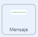

## Mejora tu proyecto

Si tienes tiempo, puedes mejorar tu proyecto. ¡Es posible que ya tengas ideas sobre qué agregar!

Tú podrías:

+ Usar disfraces, sonidos o bloques de movimiento adicionales para animar más tu mensaje y golosinas
+ Encuentra imágenes de tus golosinas favoritas y agrégalas a los disfraces para el objeto**Golosinas**
+ Aumenta la cantidad de golosinas que caen de la piñata en cada golpe
+ Haz que tu proyecto sea más fácil o más difícil cambiando la cantidad de veces que debes golpear la piñata antes de que se rompa

--- task ---
### Inténtalo
<div style="display: flex; flex-wrap: wrap">
<div style="flex-basis: 175px; flex-grow: 1">  
¿Sabías que también puedes agregar código al fondo?

¿Qué sucede con el telón de fondo cuando se rompe la piñata? ¿Qué bloques crearían este efecto? 

[Ver el código](https://scratch.mit.edu/projects/653771814/){:target="_blank"}

</div>
<div class="scratch-preview" style="margin-left: 15px;">
  <iframe allowtransparency="true" width="485" height="402" src="https://scratch.mit.edu/projects/embed/653771814/?autostart=false" frameborder="0"></iframe>
</div>
</div>
--- /task ---

--- task ---

Puedes agregar código para hacer que el mensaje se anime `por siempre`{:class="block3control"} cuando esté en posición. Usa bloques `cambiar tamaño`{:class="block3looks"} y `cambiar el efecto color`{:class="block3looks"} para que parezca que el mensaje se mueve con el ritmo de la fiesta:



```blocks3
when I receive [party v]
show
repeat (20)
change size by (5)
change y by (-10)
end
+ forever
change size by (20) // Positive number to grow
change [color v] effect by (25) // Change colour
wait (0.5) seconds // Try different numbers to match your music
change size by (-20) // Negative number to shrink
```

[Ver el código](https://scratch.mit.edu/projects/656332454/){:target="_blank"}

<div class="scratch-preview" style="margin-left: 15px;">
  <iframe allowtransparency="true" width="485" height="402" src="https://scratch.mit.edu/projects/embed/656332454/?autostart=false" frameborder="0"></iframe>
</div>

--- /task ---

--- collapse ---

---
title: Proyecto terminado
---

Puedes ver el [proyecto terminado aquí](https://scratch.mit.edu/projects/649873783/){:target ="_blank"}.

--- /collapse ---

--- task ---

### Envía tu proyecto

Si ya has compartido tu proyecto con nosotros, simplemente guarda los cambios y veremos tus impresionantes mejoras.

Si aún no has compartido tu proyecto pero deseas enviarlo a nuestra ['Comunidad de estudio Scratch — Party piñata'](https://scratch.mit.edu/studios/31111242){:target="_blank"} para que otras personas lo vean, por favor completa [este formulario](https://form.raspberrypi.org/f/community-project-submissions){:target="_blank"}.

--- /task ---
