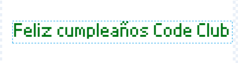
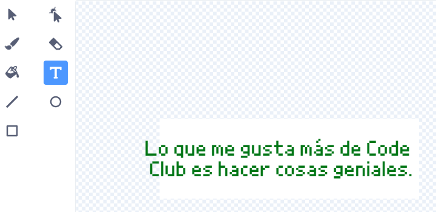
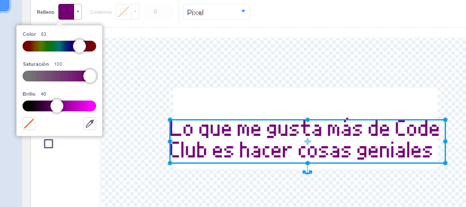
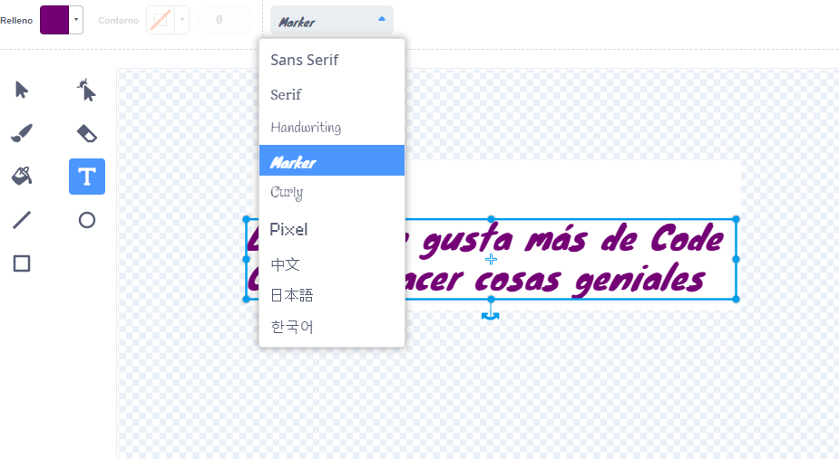
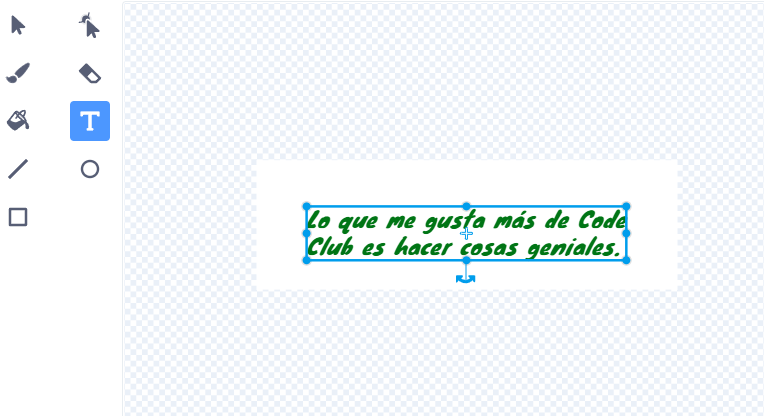
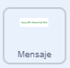

## Crea un mensaje

<div style="display: flex; flex-wrap: wrap">
<div style="flex-basis: 200px; flex-grow: 1; margin-right: 15px;">
En este paso, escribirás un mensaje y lo animarás usando efectos de movimiento y color. 
</div>
<div>
{:width="300px"}
</div>
</div>

¿Qué escribirías en una tarjeta de cumpleaños para enviar a Code Club? Podría ser:
+ Lo que más te gusta de Code Club
+ Un mensaje sobre tu fabuloso líder de Code Club
+ Detalles de lo que quieres hacer a continuación con tus habilidades de programación

<p style="border-left: solid; border-width:10px; border-color: #0faeb0; background-color: aliceblue; padding: 10px;">
Los primeros proyectos de Code Club se escribieron en inglés, pero en un año se tradujeron al portugués de Brasil, holandés, alemán, noruego y ucraniano. Rápidamente siguieron las traducciones al francés, griego y español y ahora algunos de los proyectos de Code Club se han traducido a <span style="color: #0faeb0">**28 idiomas nativos**</span>. ¡Gracias a nuestra increíble comunidad de traductores!


</p>

--- task ---

Haz clic en el objeto **Mensaje** en la lista de objetos y selecciona la pestaña **Disfraces**.

El disfraz tiene un texto que dice "Feliz cumpleaños Code Club". Haz doble clic (o toca y mantén presionado en una tableta) en el texto para seleccionar la herramienta de edición de texto.



--- /task ---

--- task ---

Ahora puedes escribir tu nuevo mensaje de cumpleaños de Code Club. Presiona **Ingresar** en tu teclado para comenzar una nueva línea.

**Sugerencia:** No te preocupes si tu mensaje es demasiado grande para el cuadro, ya que puedes cambiar su tamaño más tarde.



--- /task ---

--- task ---

**Elige:** Haz clic en el ícono **Relleno** para abrir el menú desplegable de colores. Mueve los controles deslizantes de relleno hacia la izquierda o hacia la derecha para seleccionar tu color favorito.



--- /task ---

--- task ---

**Elige:** Haz clic en la herramienta **Fuente** y aparecerá una lista desplegable de tipos de letra. El tipo 'Pixel' está seleccionado en el proyecto de inicio, pero puedes usar cualquiera de las fuentes disponibles.



--- /task ---

--- task ---

Haz clic en la herramienta **Seleccionar** y aparecerán ocho círculos alrededor de tu mensaje. Usa estos círculos para cambiar el tamaño de tu mensaje haciendo clic en ellos y arrastrándolos dentro del cuadro blanco.



--- /task ---

Tu mensaje está listo, ahora puedes agregar código para ocultar tu mensaje dentro de la piñata y hacer que tu mensaje caiga de la piñata después del décimo golpe.

--- task ---

Haz clic en la pestaña **Código** y luego crea un script para `esconder`{:class="block3looks"} las golosinas en la piñata cuando comience tu proyecto:



```blocks3
when flag clicked
hide
set size to (10) % // Cambiar a 10 para empezar poco a poco
go to x: (0) y: (100) // Dentro de la piñata
```

--- /task ---

--- task ---

Crea un nuevo script para comenzar cuando se haya recibido el mensaje `fiesta`{:class="block3events"}.

Agrega un bucle `repetir`{:class="block3control"} para animar el mensaje. El mensaje usará `cambiar el tamaño`{:class="block3looks"} para crecer y `cambiar y`{:class="block3motion"} para modificar la posición para ser animado mientras cae:


```blocks3
when I receive [fiesta v]
show
repeat (20) // Cambiar a 20
change size by (5) // Cambiar a 5
change y by (-10) // Cambiar a -10
```

--- /task ---

--- task ---

**Prueba:** Ejecuta tu proyecto. Golpea la piñata diez veces para ver caer el mensaje.


--- /task ---

--- save ---
