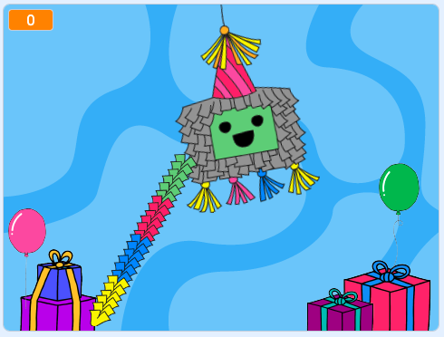

## Introduction

Dans ce projet, tu vas créer une piñata qui se balance et libère des friandises lorsqu'elle est frappée, et finit par se casser pour révéler un message d'anniversaire.

Une **piñata** est souvent utilisée pour célébrer un anniversaire, le nouvel an ou un festival. La forme et les décorations d'une piñata sont conçues pour correspondre au thème de l'occasion. C'est aussi plein de friandises. Le but est de frapper la piñata avec un bâton pour casser la piñata et libérer les friandises.    

--- no-print --- --- task ---
### Essaie-le

  
Utilise le bâton pour frapper la piñata. 

Que se passe-t-il chaque fois que tu frappes la piñata ? 

Combien de fois faut-il frapper la piñata pour qu'elle se casse ?  

  <iframe allowtransparency="true" width="485" height="402" src="https://scratch.mit.edu/projects/embed/649873783/?autostart=false" frameborder="0"></iframe>

--- /task --- --- /no-print ---

--- print-only ---

--- /print-only ---

**Code Club** fête ses 10 ans cette année. Did you know that there are Code Clubs on **six out of seven continents** around the world? That’s a lot of coders making things with code! Do you think any other clubs will be doing this project right now?   

