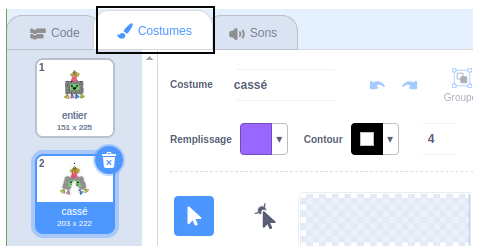
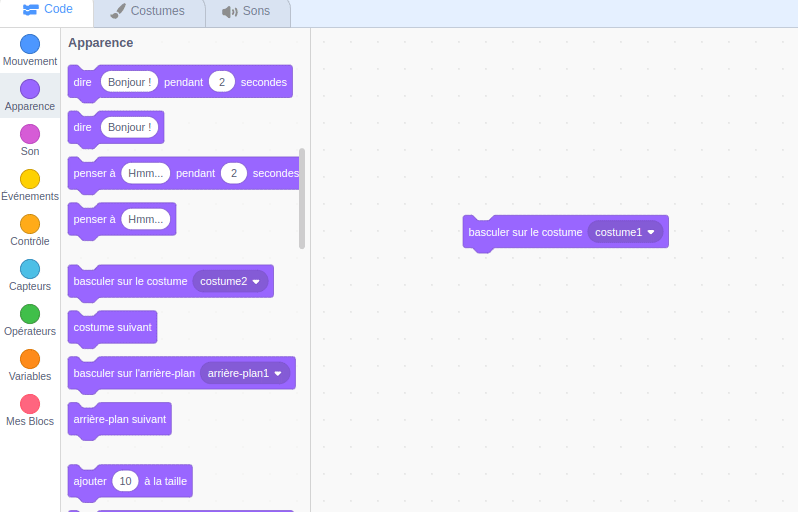

## Commencer la fête

<div style="display: flex; flex-wrap: wrap">
<div style="flex-basis: 200px; flex-grow: 1; margin-right: 15px;">
Dans cette étape, tu choisiras un costume de piñata et coderas la piñata pour qu'elle se balance.
</div>
<div>
{:width="300px"}
</div>
</div>

--- task ---

Ouvre le projet de démarrage [Piñata de fête](https://scratch.mit.edu/projects/653082997/editor){:target="_blank"}. Scratch s'ouvrira dans un autre onglet du navigateur.

[[[working-offline]]]

--- /task ---

L'éditeur Scratch ressemble à ceci:


La **scène** est l'endroit où ton projet s'exécute et un **arrière-plan** modifie l'apparence de la scène. Un arrière-plan de soirée Code Club a été ajouté pour toi.

Dans Scratch, les personnages et les objets sont appelés **sprites**, et ils apparaissent sur la scène. Tu peux voir les sprites **Piñata** et **Baton** sur la scène.


Pour le moment, il ne se passe pas grand-chose à cette fête. Tu peux changer cela !

--- task ---

Un sprite peut avoir un code, des costumes et des sons pour changer son apparence et ce qu'il fait.

Clique sur le sprite **Piñata** dans la liste Sprite et sélectionne l'onglet **Costumes**. Il y a deux costumes de piñata, l'un nommé « entier » et l'autre nommé « cassé ».




--- /task ---

--- task ---

Clique sur l'onglet **Code**. Va dans le menu des blocs `Apparence`{:class="block3looks"} puis fais glisser un bloc `basculer sur le costume/0>{:class="block3looks"} vers la zone Code. </p>

<p spaces-before="0">Clique sur le nom du costume pour ouvrir un <strong x-id="1">menu déroulant</strong> puis sélectionne le costume <code>entier`{:class="block3looks"} :


```blocks3
basculer sur le costume (entier v) // Mise à jour vers 'entier'
```


--- /task ---

Les blocs peuvent être connectés ensemble dans la zone Code pour en exécuter plusieurs à la fois. Les blocs connectés s'exécuteront dans l'ordre de haut en bas.

--- task ---

Fais glisser un bloc `Quand le drapeau est cliqué`{:class="block3events"} depuis le menu des blocs `Évènements`{:class="block3events"} et connecte-le en haut de ton bloc Apparence dans la zone Code. Les blocs vont s'emboîter:


```blocks3
+ quand le drapeau est cliqué
basculer sur le costume (entier v)
```


--- /task ---

La position de départ d'une piñata est toujours la même, elle ne commence à bouger que lorsque le jeu de piñata est prêt à jouer.

--- task ---

Dans le menu des blocs `Mouvement`{:class="block3motion"}, trouve les blocs `aller à x : 0 y : 180`{:class="block3motion"} et `s'orienter à 90`{:class="block3motion" } . Fais glisser les blocs vers la zone Code et connecte-les au bas de ton code :


```blocks3
quand le drapeau est cliqué
basculer sur le costume (entier v)
+ aller à x : (0) y : (180)
+ s'orienter à (90) // Position prête
```

--- /task ---

Une boucle `répéter indéfiniment`{:class="block3control"} exécute les blocs de code à l'intérieur encore et encore. C'est la boucle parfaite pour une piñata qui se balance difficile à frapper.

--- task ---

Fais glisser un bloc `répéter indéfiniment`{:class="block3control"} depuis le menu des blocs `Contrôle`{:class="block3control"} et connecte-le au bas de ton code :


```blocks3
quand le drapeau est cliqué
basculer sur le costume (entier v)
aller à x : (0) y : (180)
s'orienter à (90) 
+ répéter indéfiniment
```

--- /task ---

Une boucle `répéter`{:class="block3control"} peut être utilisée pour que le sprite **Piñata** répète plusieurs fois un petit mouvement. Cela fera apparaître la piñata animée.

--- task ---

Fais glisser un bloc `répéter 10`{:class="block3control"} dans la zone Code et attache-le à l'intérieur de ta boucle `répéter indéfiniment`{:class="block3control"}.

Va au menu des blocs `Mouvement`{:class="block3motion"} et fais glisser un bloc de `tours dans le sens des aiguilles d'une montre de 15 degrés`{:class="block3motion"} dans le bloc `répéter`{:class="block3control"}.

Change les `15`{:class="block3motion"} degrés en `1`{:class="block3motion"} degrés pour que la piñata ne se balance qu'un peu à chaque fois :


```blocks3
quand le drapeau est cliqué
basculer sur le costume (entier v)
aller à x : (0) y : (180)
s'orienter à (90)
répéter indéfiniment
+ répéter (10) fois
tourner à droite (1) degrés // Passer à 1
```


--- /task ---

--- task ---

**Test :** Exécute ton projet, en cliquant sur le **drapeau vert** au-dessus de la scène, pour voir la piñata se balancer.

**Mmm, quelque chose ne va pas !** Lorsqu'un objet est suspendu au plafond, il ne tourne pas seulement dans une direction, il oscille d'avant en arrière.

Arrête ton projet en cliquant sur **l'icône d'arrêt rouge** au-dessus de la scène.


--- /task ---

--- task ---

Ajoute du code à ta boucle `répéter indéfiniment`{:class="block3control"} pour que la piñata oscille du centre d'avant en arrière en continu comme un pendule :


```blocks3
quand le drapeau est cliqué
basculer sur le costume (entier v)
aller à x : (0) y : (180)
s'orienter à (90)
répéter indéfiniment
répéter (10) fois // Se balance de 10 degrés dans le sens des aiguilles d'une montre à partir du centre
tourner à droite (1) degrés 
fin
+ répéter (20) fois // Balance de 20 degrés dans le sens inverse des aiguilles d'une montre à travers le centre
tournez à gauche (1) degrés // Passe à 1
fin
+ répéter (10) fois // Balance de 10 degrés dans le sens des aiguilles d'une montre vers le centre
tourner à droite (1) degrés // Passe à 1
fin
```

--- /task ---

--- task ---

**Test :** Exécute ton projet pour voir la piñata se balancer.

**Debug :** Si la piñata ne se balance pas correctement :
+ Regarde ton code pour t'assurer que les blocs `répéter`{:class="block3control"} sont dans la bonne position
+ Vérifie que les flèches `tournent dans le sens des aiguilles d'une montre`{:class="block3motion"} et `tournent dans le sens inverse des aiguilles d'une montre`{:class="block3motion"} sont correctes
+ Assure-toi que tu as utilisé les chiffres du code ci-dessus


--- /task ---

--- save ---

