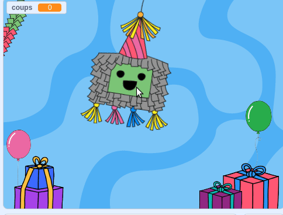
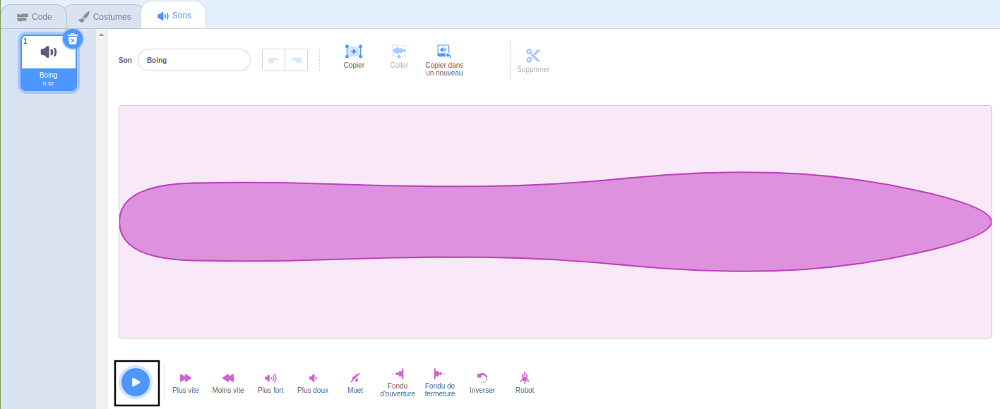
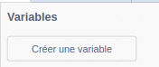
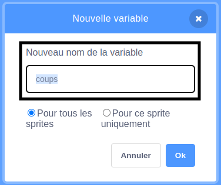
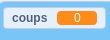
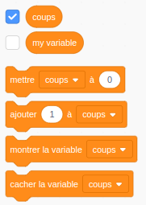
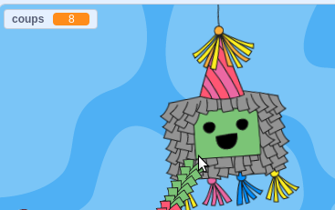
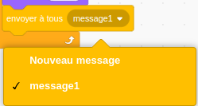
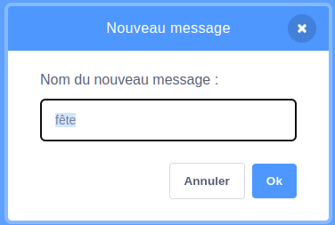

## Frapper la piñata

<div style="display: flex; flex-wrap: wrap">
<div style="flex-basis: 200px; flex-grow: 1; margin-right: 15px;">
Dans cette étape, tu vas coder la piñata pour qu'elle émette un son et compte un coup à chaque fois que la piñata est cliquée.
</div>
<div>
{:width="300px"}
</div>
</div>

--- task ---

Clique sur l'onglet **Son** pour le sprite **Piñata** et tu trouveras un son **Boing**. Clique sur l'icône **Jouer** pour entendre le son.



--- /task ---

Un groupe de blocs connectés dans Scratch est appelé un **script**. Les sprites peuvent avoir plusieurs scripts.

--- task ---

Clique sur l'onglet **Code**. À partir de `Événements`{:class="block3events"}, fais glisser un bloc `quand ce sprite est cliqué`{:class="block3events"} dans la zone Code pour démarrer un nouveau script.

Dans le menu des blocs `Son`{:class="block3sound"}, recherche le bloc `jouer le son`{:class="block3sound"}. Fais-le glisser sous le bloc `quand ce sprite est cliqué`{:class="block3events"} :


```blocks3
quand ce sprite est cliqué
jouer le son [Boing v]
```

--- /task ---

--- task ---

**Test :** Exécute ton projet en cliquant sur le **drapeau vert** au-dessus de la scène. Clique sur la piñata pendant qu'elle se balance pour entendre le son de boing.

--- /task ---

Une `variable`{:class="block3variables"} est un moyen de stocker des nombres et/ou du texte. Le nombre de clics sur la piñata sera stocké dans une variable appelée `coups`{:class="block3variables"} afin qu'elle puisse être utilisée à tout moment.

--- task ---

Dans le menu des blocs `Variables`{:class="block3variables"}, clique sur le bouton **Créer une variable**.



Appelle ta nouvelle variable **coups** :



**Remarque :** La nouvelle variable « coups » apparaît sur la scène et peut désormais être utilisée dans les blocs `Variable`{:class="block3variables"}.





--- /task ---

--- task ---

Chaque fois que le projet démarre, le nombre de `coups`{:class="block3variables"} doit être réinitialisé à `0`{:class="block3variables"}.

Fais glisser le bloc `mettre coups à 0`{:class="block3variables"} dans le premier script de la zone Code, entre le bloc `basculer sur le costume`{:class="block3looks"} et le bloc `aller à x : ( 0) y : (180)`{:class="block3motion"}.

Ton code devrait ressembler à ceci :


```blocks3
when flag clicked
basculer sur le costume (entier v)
+ mettre [coups v] à (0)
go to x: (0) y: (180)
s'orienter à (90)
répéter indéfiniment
repeat (10)
turn right (1) degrees
fin
repeat (20)
turn left (1) degrees
fin
repeat (10)
turn right (1) degrees
fin
```

--- /task ---

--- task ---

Chaque fois que le sprite **Piñata** est cliqué, le nombre de `coups`{:class="block3variables"} devrait augmenter.

Ajoute un bloc pour changer `coups`{:class="block3variables"} par `1`{:class="block3variables"} lorsque le sprite **Piñata** est cliqué :


```blocks3
quand ce sprite est cliqué
jouer le son [Boing v]
+ ajouter (1) à [coups v]
```

--- /task ---

--- task ---

**Test :** Exécute ton projet plusieurs fois. Vérifie que `coups`{:class="block3variables"} commence toujours à `0`{:class="block3variables"} et augmente de `1`{:class="block3variables"} à chaque fois que tu cliques sur le sprite **Piñata** .



--- /task ---

Une piñata est difficile à casser mais elle ne dure pas éternellement. Ta piñata durera `10 coups`{:class="block3variables"} avant de s'ouvrir.

Un bloc `si`{:class="block3control"} peut être utilisé pour prendre une décision basée sur une **condition**.

<p style="border-left: solid; border-width:10px; border-color: #0faeb0; background-color: aliceblue; padding: 10px;">
Nous utilisons <span style="color: #0faeb0">**conditions**</span> tout le temps pour prendre des décisions. On pourrait dire « si le crayon est émoussé, alors taille-le ». Les blocs et conditions "Si" nous permettent d'écrire du code qui fait quelque chose de différent selon qu'une condition est vraie ou fausse.
</p>

--- task ---

Va au menu des blocs `Contrôle`{:class="block3control"}. Fais glisser un bloc `si`{:class="block3control"} dans la zone de code et insére-le autour des blocs dans ton script `quand ce sprite est cliqué`{:class="block3events"} :


```blocks3
quand ce sprite est cliqué
+ si <> alors
jouer le son [Boing v]
ajouter (1) à [coups v]

```

--- /task ---

Le bloc `si`{:class="block3control"} a une entrée en forme d'hexagone où tu peux créer une condition.

--- task ---

Le sprite **Piñata** doit jouer un son et augmenter le nombre de `coups`{:class="block3variables"} **`si`{:class="block3control"}** le nombre de `coups`{:class="block3variables"} est `inférieur à`{:class="block3operators"} `10`{:class="block3variables"}.

Ajoute d'abord un opérateur `<`{:class="block3operators"} dans l'entrée en forme d'hexagone :


```blocks3
quand ce sprite est cliqué
+ si <() < ()> alors
jouer le son [Boing v]
ajouter (1) à [coups v]

```

--- /task ---

--- task ---

Termine la création de la condition `si`{:class="block3control"} en faisant glisser la variable `coups`{:class="block3variables"} à gauche de l'opérateur `<`{:class="block3operators"} et en tapant la valeur "10" à droite :


```blocks3
quand ce sprite est cliqué
+ si <(coups) < (10)> alors
jouer le son [Boing v]
ajouter (1) à [coups v]

```

--- /task ---

--- task ---

**Test :** Exécute à nouveau ton projet. Frappe la piñata 10 fois pour entendre le son et voir la variable `coups`{:class="block3variables"} augmenter.

Frappe la piñata plusieurs fois. La variable `coups`{:class="block3variables"} ne dépassera pas 10, car cette condition n'est plus "vraie", donc le code à l'intérieur du bloc `si`{:class="block3control"} ne s'exécutera pas.

--- /task ---

--- task ---

Ajoute un deuxième bloc `si`{:class="block3control"} à l'intérieur du premier. Cette fois, la condition vérifiera si `coups`{:class="block3variables"} `=`{:class="block3operators"} 10 et si "vrai" le costume changera en `cassé`{:class="block3looks"} :


```blocks3
quand ce sprite est cliqué
si <(coups) < (10)> alors
jouer le son [Boing v]
ajouter (1) à [coups v]
+ si <(coups)=(10)> alors
switch costume to (cassé v)

```

--- /task ---

--- task ---

**Test :** Exécute ton projet plusieurs fois. Vérifie que le sprite **Piñata** commence par le costume « entier » puis passe au costume « cassé » après `10 coups`{:class="block3variables"}.


--- /task ---

Lorsque le sprite **Piñata** est cassé, tous les autres sprites doivent savoir que la fête a commencé.

Dans Scratch, le bloc `envoyé à tous`{:class="block3events"} peut être utilisé pour **envoyer** un message que tous les sprites peuvent **recevoir**.

--- task ---

Ajoute un bloc `envoyer à tous`{:class="block3events"} depuis le menu des blocs `Événements`{:class="block3events"} :


```blocks3
quand ce sprite est cliqué
si <(coups) < (10)> alors
jouer le son [Boing v]
ajouter (1) à [coups v] 
si <(coups)=(10)> alors
basculer sur le costume (cassé v)
+ envoyer à tous (message1 v)
```

Clique sur `message1`{:class="block3events"} et choisis **Nouveau message**. Nomme le nouveau message `fête`{:class="block3events"}.





Ton bloc `envoyer à tous`{:class="block3events"} ressemblera à ceci :

```blocks3
envoyer à tous (fête v)
```

--- /task ---

--- save ---
