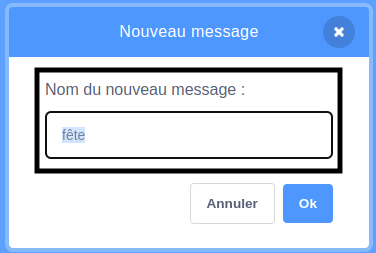

## Frapper la piñata

<div style="display: flex; flex-wrap: wrap">
<div style="flex-basis: 200px; flex-grow: 1; margin-right: 15px;">
Dans cette étape, tu vas coder la piñata pour qu'elle émette un son et compte un coup à chaque fois que la piñata est cliquée.
</div>
<div>
{:width="300px"}
</div>
</div>

--- task ---

Clique sur l'onglet **Son** pour le sprite **Piñata** et tu trouveras un son **Boing**. Clique sur l'icône **Jouer** pour entendre le son.


--- /task ---

Un groupe de blocs connectés dans Scratch est appelé un **script**. Les sprites peuvent avoir plusieurs scripts.

--- task ---

Clique sur l'onglet **Code**. À partir de `Événements`{:class="block3events"}, fais glisser un bloc `quand ce sprite est cliqué`{:class="block3events"} dans la zone Code pour démarrer un nouveau script.

Dans le menu des blocs `Son`{:class="block3sound"}, recherche le bloc `jouer le son`{:class="block3sound"}. Fais-le glisser sous le bloc `quand ce sprite est cliqué`{:class="block3events"} :


```blocks3
quand ce sprite est cliqué
jouer le son [Boing v]
```

--- /task ---

--- task ---

**Test :** Exécute ton projet en cliquant sur le **drapeau vert** au-dessus de la Scène. Clique sur la piñata pendant qu'elle se balance pour entendre le son de boing.

--- /task ---

Une `variable`{:class="block3variables"} est un moyen de stocker des nombres et/ou du texte. Le nombre de clics sur la piñata sera stocké dans une variable appelée `coups`{:class="block3variables"} afin qu'elle puisse être utilisée à tout moment.

--- task ---

Dans le menu des blocs `Variables`{:class="block3variables"}, clique sur le bouton **Créer une Variable**.


Appelle ta nouvelle variable **coups**:


**Remarque :** La nouvelle variable "coups" apparaît sur la scène et peut désormais être utilisée dans les blocs `Variable`{:class="block3variables"}.


--- /task ---

--- task ---

Chaque fois que le projet démarre, le nombre de `coups`{:class="block3variables"} doit être réinitialisé à `0`{:class="block3variables"}.

Fais glisser le bloc `mettre coups à 0`{:class="block3variables"} dans le premier script de la zone Code, entre le bloc `basculer sur le costume`{:class="block3looks"} et le bloc `aller à x : ( 0) y : (180)` {:class="block3motion"}.

Ton code devrait ressembler à ceci:


```blocks3
quand le drapeau est cliqué
basculer sur le costume (entier v)
+ mettre [coups v] à (0)
aller à x : (0) y : (180)
s'orienter à (90)
répéter indéfiniment
répéter (10)
tourner à droite (1) degrés
fin
répéter (20)
tourner à gauche (1) degrés
fin
répéter (10)
tourner à droite (1) degrés
fin
```

--- /task ---

--- task ---

Chaque fois que le sprite **Piñata** est cliqué, le nombre de `coups`{:class="block3variables"} devrait augmenter.

Ajoute un bloc pour changer `coups`{:class="block3variables"} par `1`{:class="block3variables"} lorsque le sprite **Piñata** est cliqué :


```blocks3
quand ce sprite est cliqué
jouer le son [Boing v]
+ ajouter (1) à [hits v]
```

--- /task ---

--- task ---

**Test :** Exécute ton projet plusieurs fois. Vérifie que `coups`{:class="block3variables"} commence toujours à `0`{:class="block3variables"} et augmente de `1`{:class="block3variables"} à chaque fois que tu cliques sur le sprite **Piñata** .


--- /task ---

Une piñata est difficile à casser mais elle ne dure pas éternellement. Ta piñata durera `10 coups`{:class="block3variables"} avant de s'ouvrir.

Un bloc `si`{:class="block3control"} peut être utilisé pour prendre une décision basée sur une **condition**.

<p style="border-left: solid; border-width:10px; border-color: #0faeb0; background-color: aliceblue; padding: 10px;">
Nous utilisons <span style="color: #0faeb0">**conditions**</span> tout le temps pour prendre des décisions. On pourrait dire « si le crayon est émoussé, alors taille-le ». Les blocs et conditions `Si` nous permettent d'écrire du code qui fait quelque chose de différent selon qu'une condition est vraie ou fausse.
</p>

--- task ---

Va au menu des blocs `Contrôle`{:class="block3control"}. Fais glisser un bloc `si`{:class="block3control"} dans la zone de code et insére-le autour des blocs dans ton script `quand ce sprite est cliqué `{:class="block3events"} :


```blocks3
quand ce est cliqué
+ si <> alors
jouer le son [Boing v]
ajouter (1) à [hits v]

```

--- /task ---

Le bloc `si`{:class="block3control"} a une entrée en forme d'hexagone où tu peux créer une condition.

--- task ---

The **Piñata** sprite should play a sound and increase the count of `hits`{:class="block3variables"} **`if`{:class="block3control"}** the number of `hits`{:class="block3variables"} is `less than`{:class="block3operators"} `10`{:class="block3variables"}.

First add a `<`{:class="block3operators"} operator into the hexagon-shaped input:


```blocks3
when this sprite clicked
+ if <() < ()> then
start sound [Boing v]
change [hits v] by (1)

```

--- /task ---

--- task ---

Finish building the `if`{:class="block3control"} condition by dragging in the `hits`{:class="block3variables"} variable to the left of the `<`{:class="block3operators"} operator and typing the value '10' on the right:


```blocks3
when this sprite clicked
+ if <(hits) < (10)> then
start sound [Boing v]
change [hits v] by (1)

```

--- /task ---

--- task ---

**Test:** Run your project again. Hit the piñata 10 times to hear the sound and see the `hits`{:class="block3variables"} variable increase.

Hit the piñata a few more times. The `hits`{:class="block3variables"} variable will not go above 10 because that condition is no longer 'true' so the code inside the `if`{:class="block3control"} block won't run.

--- /task ---

--- task ---

Add a second `if`{:class="block3control"} block inside the first. This time the condition will check if `hits`{:class="block3variables"} `=`{:class="block3operators"} 10 and if 'true' the costume will change to `broken`{:class="block3looks"}:


```blocks3
when this sprite clicked
if <(hits) < (10)> then
start sound [Boing v]
change [hits v] by (1)
+ if <(hits)=(10)> then
switch costume to (broken v)

```

--- /task ---

--- task ---

**Test:** Run your project a couple of times. Check that the **Piñata** sprite starts with the 'whole' costume then changes to the 'broken' costume after `10 hits`{:class="block3variables"}.


--- /task ---

When the **Piñata** sprite has broken, all the other sprites need to know that the party has started.

In Scratch, the `broadcast`{:class="block3events"} block can be used to **send** a message that all sprites can **receive**.

--- task ---

Add a `broadcast message`{:class="block3events"} block from the `Events`{:class="block3events"} blocks menu:


```blocks3
when this sprite clicked
if <(hits) < (10)> then
start sound [Boing v]
change [hits v] by (1)
if <(hits)=(10)> then
switch costume to (broken v)
+ broadcast (message1 v)
```

Click on `message1`{:class="block3events"} and choose **New message**. Name the new message `party`{:class="block3events"}.




Your `broadcast`{:class="block3events"} block will look like this:

```blocks3
broadcast (party v)
```

--- /task ---

--- save ---
