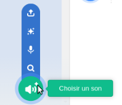

## Utiliser un bâton

<div style="display: flex; flex-wrap: wrap">
<div style="flex-basis: 200px; flex-grow: 1; margin-right: 15px;">
Les piñatas sont généralement frappées avec un bâton en bois ou en carton épais recouvert de bandes de papier colorées. Dans cette étape, tu vas ajouter du code pour contrôler le bâton de piñata et jouer de la musique en boucle lorsque la piñata se casse. 
</div>
<div>
{:width="300px"}
</div>
</div>

--- task ---

Clique sur le sprite **Bâton** dans la liste Sprite. Ajoute du code pour que le bâton reste toujours devant les autres sprites et suive le pointeur de la souris (ou ton doigt sur une tablette).

Utilise le bloc `aller à position aléatoire`{:class="block3motion"}, mais sélectionne `pointeur de souris`{:class="block3motion"} dans le menu déroulant :


```blocks3
when flag clicked
répéter indéfiniment
aller à l'[avant v] plan
aller à (pointeur de souris v) // Changer en pointeur de souris
```

--- /task ---

--- task ---

**Test :** Exécute ton projet et vérifie que le sprite **Bâton** suit ton curseur ou ton doigt autour de la scène.


--- /task ---

Il existe de nombreux types de sons différents dans Scratch, des bruits de voix et d'animaux à plus de 100 autres effets sonores.

Scratch a également des **sons en boucle** qui peuvent être utilisés dans les boucles `répéter indéfiniment`{:class="block3control"} ou `répéter`{:class="block3control"} pour donner l'impression qu'elles jouent en continu.

--- task ---

Va dans l'onglet **Sons** et clique sur l'icône **Choisir un son**.



--- /task ---

--- task ---

Dans la galerie **Choisir un son**, sélectionne la catégorie **Boucles**.


--- /task ---

--- task ---

**Choisir :** Survole les icônes de **lecture** pour entendre les sons en boucle. Ajoute ton préféré en cliquant dessus.


Le son apparaîtra alors dans ta liste Sons :


--- /task ---

--- task ---

Clique sur l'onglet **Code** et crée un nouveau script pour boucler le son `indéfiniment`{:class="block3control"} lorsque le message `fête`{:class="block3events"} a été reçu :


```blocks3
quand je reçois [fête v]
répéter indéfiniment
jouer le son [Hip Hop v] jusqu'au bout // Choisir ton son
```

--- /task ---

--- task ---

**Test :** Exécute ton projet et clique dix fois sur la piñata pour entendre la musique de fête en boucle.

--- /task ---

--- save ---
