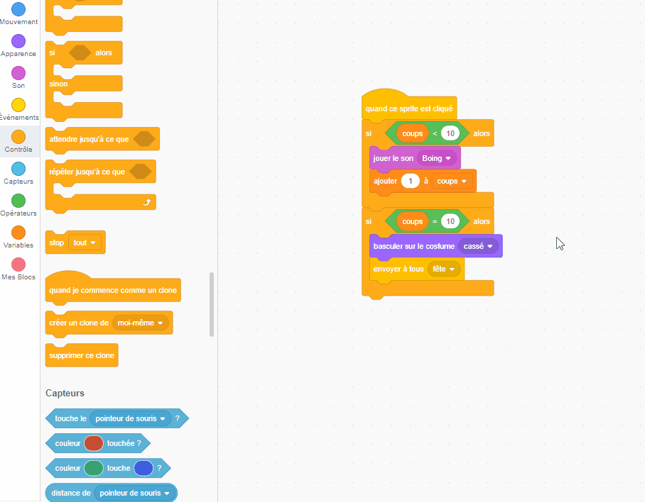

## Ajouter quelques friandises

<div style="display: flex; flex-wrap: wrap">
<div style="flex-basis: 200px; flex-grow: 1; margin-right: 15px;">
Les piñatas sont pleines de friandises et quand elles commencent à se casser, les friandises tombent. Dans cette étape, tu animeras des friandises internationales pour qu'elles tombent de la piñata à chaque fois qu'elle est frappée. Reconnais-tu l'une des friandises?
</div>
<div>
{:width="300px"}
</div>
</div>

<p style="border-left: solid; border-width:10px; border-color: #0faeb0; background-color: aliceblue; padding: 10px;">
Un <span style="color: #0faeb0">**costume**</span> dans Scratch est une image qui change l'apparence d'un sprite. Nos **graphistes** ont demandé aux dirigeants de Code Club du monde entier de leur dire quelles friandises ils auraient lors d'une fête. Espérons que certains des costumes de friandises qu'ils ont créés te seront familiers – et d'autres complètement nouveaux.      
</p>

--- task ---

Clique sur le sprite **Friandises** dans la liste Sprite et sélectionne l'onglet **Costumes**.

Il y a 26 costumes de friandises - et tu vas tous les utiliser !


--- /task ---

--- task ---

Clique sur l'onglet **Code** puis crée un script pour `masquer`{:class="block3looks"} les friandises dans la piñata au démarrage de ton projet :


```blocks3
quand le drapeau est cliqué
masquer
aller à x : (0) y : (100)
```

--- /task ---

Quatre friandises échapperont de la piñata à chaque fois que la piñata est frappée. En **clonant** le sprite **Friandises** , tu peux créer plusieurs friandises.

<p style="border-left: solid; border-width:10px; border-color: #0faeb0; background-color: aliceblue; padding: 10px;">
Un <span style="color: #0faeb0">**clone**</span> dans Scratch est une copie d'un sprite. Il a tous le même code, les mêmes costumes et les mêmes sons que le sprite original.      
</p>

--- task ---

Clique sur le sprite **Piñata**.

Insére une boucle `répéter`{:class="block3control"} dans votre code existant. Change la valeur en `4`{:class="block3control"} puis ajoute un bloc `créer clone de moi-même`{:class="block3control"}. Utilise la flèche déroulante pour sélectionner le sprite `Friandises`{:class="block3control"} :


```blocks3
quand ce sprite a cliqué
si <(coups) < (10)> alors
jouer le son [Boing v]
ajouter (1) à [coups v] 
+ répéter (4) // Changer en 4
créer un clone de (Friandises v) // Sélectionne Friandises
fin
if <(hits)=(10)> alors
basculer sur le costume (cassé v)
envoyer à tous (fête v)
```

**Astuce :** Utilise l'espace disponible dans la zone Code pour créer ton nouveau code, puis fais-le glisser dans le script existant :

 --- /task ---

--- task ---

Clique sur le sprite **Friandises**.

Crée un nouveau script en utilisant le bloc `quand je commence comme un clone`{:class="block3control"}.

Ajoute des blocs depuis le menu des blocs `Apparence`{:class="block3looks"} pour contrôler l'apparence de chaque nouveau clone :


```blocks3
quand je commence comme un clone
montrer
aller à l [arrière v] plan // Passer au dos
basculer sur le costume (Knafeh v)
```

--- /task ---

--- task ---

Tu peux choisir des friandises aléatoires à libérer lorsque la piñata est touchée. Utilise un opérateur `nombre aléatoire`{:class="block3operators"} pour sélectionner un costume au hasard de `1`{:class="block3operators"} à `26`{:class="block3operators"} chaque fois qu'un clone est créé :


```blocks3
quand je commence comme un clone
montrer
aller à l'[arrière v] plan 
+ basculer sur le costume (nombre aléatoire entre (1) et (26)) // Passer à 26
```

--- /task ---

--- task ---

Pour le moment, les clones **Friandises** apparaîtront derrière le sprite **Piñata** , mais les friandises devraient tomber de la piñata à une position aléatoire.

Add code to make the cloned **Treats** sprites `glide`{:class="block3motion"} to a random position:


```blocks3
when I start as a clone
show
go to [back v] layer
switch costume to (pick random (1) to (26))
+ glide (1) secs to (random position v) 
```

--- /task ---

--- task ---

**Test:** Run your project and hit the piñata to see four clones of the **Treats** sprite after each hit. The costumes will be selected at random and the treats will each glide to a random position.


--- /task ---

--- task ---

Add animation to make the **Treats** sprite clones `turn`{:class="block3motion"} `forever`{:class="block3control"} when they reach their random position. Remember animations work best when small movements are used, so change the number of degrees to `1`{:class="block3motion"}:


```blocks3
when I start as a clone
show
go to [back v] layer
switch costume to (pick random (1) to (26)
glide (1) secs to (random position v) 
+ forever
turn right (1) degrees
```

--- /task ---

--- task ---

**Test:** Run your project again to see the **Treats** sprite clones spin.


--- /task ---

--- save ---
