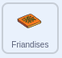

## Ajouter quelques friandises

<div style="display: flex; flex-wrap: wrap">
<div style="flex-basis: 200px; flex-grow: 1; margin-right: 15px;">
Les piñatas sont pleines de friandises et quand elles commencent à se casser, les friandises tombent. Dans cette étape, tu animeras des friandises internationales pour qu'elles tombent de la piñata à chaque fois qu'elle est frappée. Reconnais-tu l'une des friandises ?
</div>
<div>
{:width="300px"}
</div>
</div>

<p style="border-left: solid; border-width:10px; border-color: #0faeb0; background-color: aliceblue; padding: 10px;">
Un <span style="color: #0faeb0">**costume**</span> dans Scratch est une image qui change l'apparence d'un sprite. Nos **graphistes** ont demandé aux responsables du Code Club du monde entier de leur dire quelles friandises ils offriraient lors d'une fête. Espérons que certains des costumes de friandises qu'ils ont créés te seront familiers – et d'autres complètement nouveaux.      
</p>

--- task ---

Clique sur le sprite **Friandises** dans la liste Sprite et sélectionne l'onglet **Costumes**.

Il y a 26 costumes de friandises - et tu vas tous les utiliser !


--- /task ---

--- task ---

Clique sur l'onglet **Code** puis crée un script pour `cacher`{:class="block3looks"} les friandises dans la piñata au démarrage de ton projet :



```blocks3
when flag clicked
cacher
go to x: (0) y: (100)
```

--- /task ---

Quatre friandises s'échapperont de la piñata chaque fois que celle-ci sera frappée. En **clonant** le sprite **Friandises**, tu peux créer plusieurs friandises.

<p style="border-left: solid; border-width:10px; border-color: #0faeb0; background-color: aliceblue; padding: 10px;">
Un <span style="color: #0faeb0">**clone**</span> dans Scratch est une copie d'un sprite. Il possède le même code, les mêmes costumes et les mêmes sons que le sprite original.      
</p>

--- task ---

Clique sur le sprite **Piñata**.

Insére une boucle `répéter`{:class="block3control"} dans ton code existant. Modifie la valeur à `4`{:class="block3control"} puis ajoute un bloc `créer un clone de moi-même`{:class="block3control"}. Utilise la flèche du menu déroulant pour sélectionner le sprite `Friandises`{:class="block3control"} :


```blocks3
when this sprite clicked
si <(coups) < (10)> alors
jouer le son [Boing v]
ajouter (1) à [coups v] 
+ repeat (4) // Modifier à 4
créer un clone de (Friandises v) // Sélectionne Friandises
fin
if <(hits)=(10)> then
basculer sur le costume (cassé v)
envoyer à tous (fête v)
```

**Astuce :** Utilise l'espace disponible dans la zone Code pour créer ton nouveau code, puis fais-le glisser dans le script existant :


--- /task ---

--- task ---

Clique sur le sprite **Friandises**.

Crée un nouveau script en utilisant le bloc `quand je commence comme un clone`{:class="block3control"}.

Ajoute des blocs depuis le menu des blocs `Apparence`{:class="block3looks"} pour contrôler l'apparence de chaque nouveau clone :


```blocks3
quand je commence comme un clone
montrer
aller à l'[arrière v] plan // Changement vers l'arrière
basculer sur le costume (Knafeh v)
```

--- /task ---

--- task ---

Tu peux choisir des friandises aléatoires à libérer lorsque la piñata est frappée. Utilise un opérateur `nombre aléatoire`{:class="block3operators"} pour sélectionner un costume au hasard de `1`{:class="block3operators"} à `26`{:class="block3operators"} chaque fois qu'un clone est créé :


```blocks3
quand je commence comme un clone
montrer
aller à l'[arrière v] plan 
+ basculer sur le costume (nombre aléatoire entre (1) et (26)) // Passer à 26
```

--- /task ---

--- task ---

Pour le moment, les clones **Friandises** apparaîtront derrière le sprite **Piñata**, mais les friandises devraient tomber de la piñata à une position aléatoire.

Ajoute du code pour que les sprites clonés **Friandises** `glisse`{:class="block3motion"} vers une position aléatoire :


```blocks3
quand je commence comme un clone
montrer
aller à l'[arrière v] plan
basculer sur le costume (nombre aléatoire entre (1) et (26))
+ glisser en (1) secondes à (position aléatoire v) 
```

--- /task ---

--- task ---

**Test :** Exécute ton projet et appuie sur la piñata pour voir quatre clones du sprite **Friandises** après chaque coup. Les costumes seront sélectionnés au hasard et les friandises glisseront chacune vers une position aléatoire.


--- /task ---

--- task ---

Ajoute une animation pour que les clones sprite **Friandises** `tournent`{:class="block3motion"} `indéfiniment`{:class="block3control"} lorsqu'ils atteignent leur position aléatoire. N'oublie pas que les animations fonctionnent mieux lorsque de petits mouvements sont utilisés, alors change le nombre de degrés à `1`{:class="block3motion"} :


```blocks3
quand je commence comme un clone
montrer
aller à l'[arrière v] plan
basculer sur le costume (nombre aléatoire entre (1) et (26))
glisser en (1) secondes à (position aléatoire v) 
+ répéter indéfiniment
turn right (1) degrees
```

--- /task ---

--- task ---

**Test :** Exécute à nouveau ton projet pour voir les clones sprite **Friandises** tourner.


--- /task ---

--- save ---
