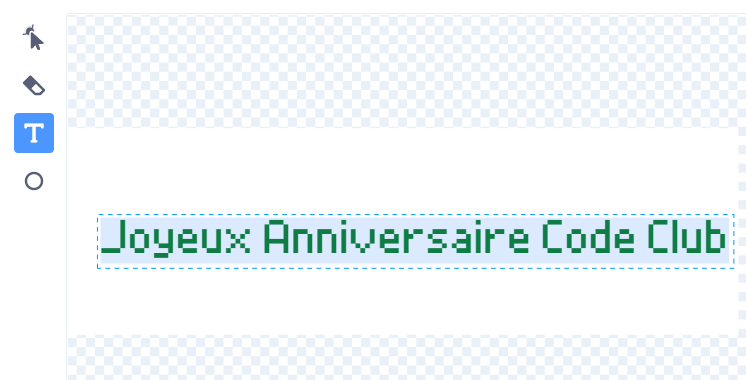

## Créer un message

<div style="display: flex; flex-wrap: wrap">
<div style="flex-basis: 200px; flex-grow: 1; margin-right: 15px;">
Dans cette étape, tu rédigeras un message et l'animeras à l'aide d'effets de mouvement et de couleur. 
</div>
<div>
{:width="300px"}
</div>
</div>

Qu'écrirais-tu sur une carte d'anniversaire à envoyer au Code Club ? Ça pourrait être :
+ Ton truc préféré à propos du Code Club
+ Un message sur ton fabuleux leader du Code Club
+ Des détails de ce que tu veux faire ensuite avec tes compétences en codage

<p style="border-left: solid; border-width:10px; border-color: #0faeb0; background-color: aliceblue; padding: 10px;">
Les premiers projets du Code Club ont été rédigés en anglais, mais en un an, ils ont été traduits en portugais brésilien, néerlandais, allemand, norvégien et ukrainien. Les traductions en français, en grec et en espagnol ont rapidement suivi et maintenant certains des projets du Code Club ont été traduits dans <span style="color: #0faeb0">**28 langues maternelles**</span>. Merci à notre formidable communauté de traducteurs !


</p>

--- task ---

Clique sur le sprite **Message** dans la liste Sprite et sélectionne l'onglet **Costumes**.

Le costume a un texte disant "Happy Birthday Code Club". Double-clique (ou appuie longuement sur une tablette) sur le texte pour sélectionner l'outil d'édition de texte.



--- /task ---

--- task ---

Tu peux maintenant saisir ton nouveau message d'anniversaire Code Club. Appuie sur **Entrez** sur ton clavier pour commencer une nouvelle ligne.

**Astuce :** Ne t'inquiéte pas si ton message est un peu trop gros pour la boîte car tu pourras le redimensionner plus tard.


--- /task ---

--- task ---

**Choisir :** Clique sur l'icône **Remplir** pour ouvrir le menu déroulant des couleurs. Déplace les curseurs de remplissage vers la gauche ou la droite pour sélectionner ta couleur préférée.


--- /task ---

--- task ---

**Choisir :** Clique sur l'outil **Police** et une liste déroulante de polices apparaîtra. La police "Pixel" est sélectionnée dans le projet de démarrage, mais tu peux utiliser n'importe laquelle des polices disponibles.


--- /task ---

--- task ---

Clique sur l'outil **Sélectionner** et huit cercles apparaîtront autour de ton message. Utilise ces cercles pour redimensionner ton message en cliquant dessus et en les faisant glisser dans la zone blanche.


--- /task ---

Ton message est prêt, tu peux maintenant ajouter du code pour cacher ton message à l'intérieur de la piñata et faire tomber ton message de la piñata après le dixième coup.

--- task ---

Clique sur l'onglet **Code** puis crée un script pour `masquer`{:class="block3looks"} le message dans la piñata au démarrage de ton projet :


```blocks3
quand le drapeau est cliqué
masquer
mettre la taille à (10) % de la taille initiale // Passer à 10 pour commencer petit
aller à x : (0) y : (100) // À l'intérieur de la piñata
```

--- /task ---

--- task ---

Crée un nouveau script à démarrer lorsque le message `fête`{:class="block3events"} a été reçu.

Ajoute une boucle `répéter`{:class="block3control"} pour animer le message. Le message `changera de taille`{:class="block3looks"} pour grandir et `changera de position y`{:class="block3motion"} pour tomber au fur et à mesure de son animation :


```blocks3
quand je reçois [fête v]
montrer
répéter (20) // Passer à 20
ajoute (5) à la taille // Passer à 5
ajouter (-10) à y // Passer à -10
```

--- /task ---

--- task ---

**Test :** Exécute ton projet. Frappe dix fois la piñata pour voir tomber le message.


--- /task ---

--- save ---
