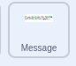

## Améliorer ton projet

Si tu as le temps, tu peux perfectionner ton projet. Tu as peut-être déjà des idées sur ce qu'il faut ajouter !

Tu pourrais :

+ Utiliser des apparences, des sons ou des blocs de mouvement supplémentaires pour animer ton message et davantage de friandises
+ Trouver des images de tes friandises préférées et les ajouter aux costumes pour le sprite **Friandises**
+ Augmenter le nombre de friandises qui tombent de la piñata à chaque coup
+ Rendre ton projet plus facile ou plus difficile en modifiant le nombre de fois où tu dois frapper la piñata avant qu'elle ne se casse

--- task ---
### Essaie-le
<div style="display: flex; flex-wrap: wrap">
<div style="flex-basis: 175px; flex-grow: 1">  
Sais-tu que tu peux également ajouter du code à l'arrière-plan ?

Qu'advient-il de l'arrière-plan lorsque la piñata se brise ? Quels blocs créeraient cet effet ? 

[Voir le code](https://scratch.mit.edu/projects/653771814/){:target="_blank"}

</div>
<div class="scratch-preview" style="margin-left: 15px;">
  <iframe allowtransparency="true" width="485" height="402" src="https://scratch.mit.edu/projects/embed/653771814/?autostart=false" frameborder="0"></iframe>
</div>
</div>
--- /task ---

--- task ---

Tu peux ajouter du code pour que le message s'anime `indéfiniment`{:class="block3control"} lorsqu'il est en position. Utilise les blocs `changement de taille`{:class="block3looks"} et les blocs `changements d'effet de couleur`{:class="block3looks"} pour donner l'impression que le message bouge au rythme de la fête :



```blocks3
quand je reçois [fête v]
montrer
répéter (20)
ajouter (5) à la taille
ajouter (-10) à y
fin
+ répéter indéfiniment
ajouter (20) à la taille // Nombre positif à augmenter
ajouter (25) à l'effet [couleur v] // changer la couleur
attendre (0.5) seconds // Essaie différents nombres pour correspondre à ta musique
ajouter (-20) à la taille // Nombre négatif pour rétrécir
```

[Voir le code](https://scratch.mit.edu/projects/656332454/){:target="_blank"}

<div class="scratch-preview" style="margin-left: 15px;">
  <iframe allowtransparency="true" width="485" height="402" src="https://scratch.mit.edu/projects/embed/656332454/?autostart=false" frameborder="0"></iframe>
</div>

--- /task ---

--- collapse ---

---
title: Le projet terminé
---

Tu peux voir le [projet terminé ici](https://scratch.mit.edu/projects/649873783/){:target="_blank"}.

--- /collapse ---

--- task ---

### Soumettre ton projet

Si tu as déjà partagé ton projet avec nous, il suffit d'enregistrer tes modifications et nous verrons tes superbes améliorations.

Si tu n'as pas encore partagé ton projet mais que tu souhaites soumettre ton projet à notre studio Scratch ["Piñata de fête — Communité"](https://scratch.mit.edu/studios/31111242){:target="_blank"} pour que d'autres personnes le voient, remplis [ce formulaire](https://form.raspberrypi.org/f/community-project-submissions){:target ="_blank"}.

--- /task ---
