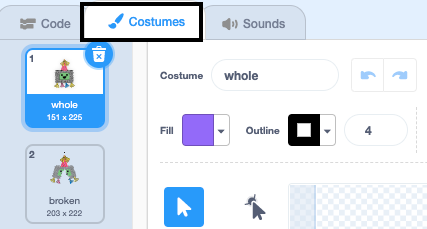
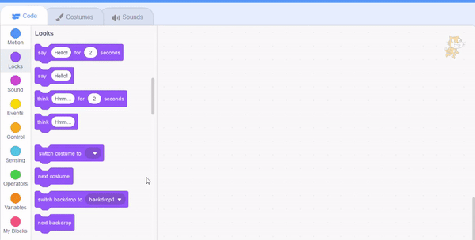
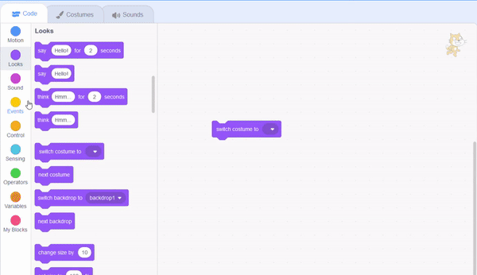

## समारोह शुरू करें

<div style="display: flex; flex-wrap: wrap">
<div style="flex-basis: 200px; flex-grow: 1; margin-right: 15px;">
इस चरण में, आप एक पिनाटा पोशाक चुनेंगे और पिनाटा को झूलने के लिए कोड करेंगे।
</div>
<div>
{:width="300px"}
</div>
</div>

--- task ---

[पार्टी पिनाटा शुरूआती प्रोजेक्ट](https://scratch.mit.edu/projects/653082997/editor){:target="_blank"} खोलें। Scratch दूसरे ब्राउज़र टैब में खुलेगा।

[[[working-offline]]]

--- /task ---

Scratch एडिटर इस प्रकार दिखाई देता है:


**मंच** वह जगह है जहां आपका प्रोजेक्ट चलता है और **पृष्ठभूमि** मंच के दिखने के तरीके को बदल देती है। आपके लिए एक Code Club समारोह पृष्ठभूमि जोड़ी गई है।

Scratch में, पात्रों और वस्तुओं को **स्प्राइट** कहते हैं, और वह मंच पर दिखाई देते हैं। आप मंच पर **Piñata** और **Stick** स्प्राइट देख सकते हैं।


फिलहाल इस समारोह में ज्यादा कुछ नहीं हो रहा है। आप इसे बदल सकते हैं!

--- task ---

एक स्प्राइट में कोड, कोस्टयूम और ध्वनियां हो सकती हैं जिससे की हम वह कैसा दिखता है या क्या करता है, वह बदल सकते हैं।

स्प्राइट सूची में **Piñata** स्प्राइट पर क्लिक करें, फिर **Costumes** टैब पर क्लिक करें। दो पिनाटा पोशाकें हैं, एक का नाम 'whole' और दूसरे का नाम 'broken' है।




--- /task ---

--- task ---

**Code** टैब पर क्लिक करें। `Looks`{:class="block3looks"} खंड मेन्यू पर जाएं फिर `switch costume to`{:class="block3looks"} खंड को कोड एरिया में खिसकाएं।

**ड्रॉप डाउन मेन्यू** खोलने के लिए पोशाक के नाम पर क्लिक करें फिर `whole`{:class="block3looks"} पोशाक चुनें:


```blocks3
switch costume to (whole v) // 'whole' में अपडेट करें
```



--- /task ---

एक समय में एक से अधिक खंड चलाने के लिए कोड क्षेत्र में खंड को एक साथ जोड़ा जा सकता है। जुड़े हुए खंड ऊपर से नीचे तक क्रम में चलेंगे।

--- task ---

एक `When flag clicked`{:class="block3events"} खंड को `Events`{:class="block3events"} खंड मेन्यू से खिसकाएं और इसे कोड क्षेत्र में अपने Looks खंड के शीर्ष से जोड़ें। खंड एक साथ चिपक जाएंगे।


```blocks3
+ when flag clicked
switch costume to (whole v)
```


--- /task ---

एक पिनाटा की प्रारंभिक स्थिति हमेशा समान होती है, यह तभी हिलना शुरू होता है जब पिनाटा गेम खेलने के लिए तैयार होता है।

--- task ---

`Motion`{:class="block3motion"} खंड मेनू में, `go to x: 0 y: 180`{:class="block3motion"} और `point in direction 90`{:class="block3motion"} खंड ढूंढें। खंड को कोड क्षेत्र में खिसकाएं और उन्हें अपने कोड के नीचे जोड़ दें:


```blocks3
when flag clicked
switch costume to (whole v)
+ go to x: (0) y: (180)
+ point in direction (90) // तैयार स्थिति
```

--- /task ---

एक `forever`{:class="block3control"} लूप बार-बार इसके अंदर रखे कोड खंडोंं को चलाता है। यह एक झूलते हुए पिनाटा के लिए एकदम सही लूप है जिसे मारना मुश्किल है।

--- task ---

`Control`{:class="block3control"} खंड मेन्यू से एक `forever`{:class="block3control"} खंड खिसकाएं और इसे अपने कोड के निचले भाग से जोड़ें:


```blocks3
when flag clicked
switch costume to (whole v)
go to x: (0) y: (180)
point in direction (90)
+ forever
```

--- /task ---

एक `repeat`{:class="block3control"} लूप का उपयोग **Piñata** स्प्राइट को एक छोटी सी हरकत को कई बार दोहराने के लिए किया जा सकता है। इससे पिनाटा एनिमेटेड दिखाई देगा।

--- task ---

एक `repeat 10`{:class="block3control"} खंड को कोड क्षेत्र में खिसकाएं और इसे अपने `forever`{:class="block3control"} लूप के अंदर संलग्न करें।

`Motion`{:class="block3motion"} खंड मेन्यू पर जाएं और एक `turn clockwise 15 degrees`{:class="block3motion"} खंड को `repeat`{:class="block3control"} खंड में खिसकाएं।

`15`{:class="block3motion"} डिग्री को `1`{:class="block3motion"} डिग्री में बदलें ताकि पिनाटा हर बार केवल थोड़ी मात्रा में ही झूले:


```blocks3
when flag clicked
switch costume to (whole v)
go to x: (0) y: (180)
point in direction (90)
forever
+ repeat (10) 
turn right (1) degrees // 1 में बदलें
```


--- /task ---

--- task ---

**परीक्षण:** पिनाटा को झूलता देखने के लिए मंच के ऊपर के **हरे झंडे** पर क्लिक करके अपना प्रोजेक्ट चलाएं।

**मम्म, कुछ ठीक नहीं है!** जब किसी वस्तु को छत से लटका दिया जाता है, तो वह केवल एक दिशा में नहीं घूमेगी, वह आगे-पीछे झूलेगी।

मंच के ऊपर **लाल स्टॉप आइकन** पर क्लिक करके अपना प्रोजेक्ट रोकें।


--- /task ---

--- task ---

अपने `forever`{:class="block3control"} लूप में कोड जोड़ें ताकि पिनाटा केंद्र से एक पेंडुलम की तरह लगातार आगे-पीछे झूलता रहे:


```blocks3
when flag clicked
switch costume to (whole v)
go to x: (0) y: (180)
point in direction (90)
forever
repeat (10) // केंद्र से 10 डिग्री दक्षिणावर्त झूलता है
turn right (1) degrees 
end
+ repeat (20) // केंद्र के माध्यम से 20 डिग्री वामावर्त झूलता है
turn left (1) degrees // 1 में बदलें
end
+ repeat (10) // 10 डिग्री दक्षिणावर्त झूलता है वापस केंद्र की ओर
turn right (1) degrees // 1 में बदलें
end
```

--- /task ---

--- task ---

**परीक्षण:** पिनाटा को झूलता देखने के लिए अपना प्रोजेक्ट चलाएं।

**गलतियां को दूर करना:** यदि पिनाटा सही ढंग से नहीं झूलता:
+ यह सुनिश्चित करने के लिए अपना कोड देखें कि `repeat`{:class="block3control"} खंड सही स्थिति में हैं
+ जांचें कि `दक्षिणावर्त मुड़ें`{:class="block3motion"} और `वामावर्त्ती मुड़ें`{:class="block3motion"} तीर सही हैं
+ सुनिश्चित करें कि आपने ऊपर दिए गए कोड से संख्याओं का उपयोग किया है


--- /task ---

--- save ---

