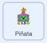

## पिनाटा को मारें

<div style="display: flex; flex-wrap: wrap">
<div style="flex-basis: 200px; flex-grow: 1; margin-right: 15px;">
इस चरण में, आप पिनाटा को ध्वनि चलाने के लिए और हर बार पिनाटा क्लिक करने पर एक हिट की गणना करने के लिए कोड करेंगे।
</div>
<div>
{:width="300px"}
</div>
</div>

--- task ---

**Pinata** स्प्राइट के लिए **Sounds** टैब पर क्लिक करें और आपको **Boing** ध्वनि मिलेगी। ध्वनि सुनने के लिए **Play** आइकन पर क्लिक करें।


--- /task ---

Scratch में जुड़े हुए खंडों के समूह को **स्क्रिप्ट** कहा जाता है। स्प्राइट्स में एक से अधिक स्क्रिप्ट हो सकती हैं।

--- task ---

**Code** टैब पर क्लिक करें। `Events`{:class="block3events"} से, एक `when this sprite clicked`{:class="block3events"} खंड को कोड क्षेत्र में खिसकाएं एक नई स्क्रिप्ट शुरू करने के लिए।

`Sound`{:class="block3sound"} खंड मेन्यू में, `start sound`{:class="block3sound"} खंड ढूंढें। इसे `when this sprite clicked`{:class="block3events"} खंड के नीचे खिसकाएं:



```blocks3
when this sprite clicked
start sound [Boing v]
```

--- /task ---

--- task ---

**परीक्षण:** मंच के ऊपर के **हरे झंडे** पर क्लिक करके अपना प्रोजेक्ट चलाएं। झूलते हुए पिनाटा पर क्लिक करें बोईंग ध्वनि को सुनने के लिए।

--- /task ---

`वेरिएबल`{:class="block3variables"} नंबर और/या टेक्स्ट को स्टोर करने का एक तरीका है। पिनाटा पर क्लिक करने की संख्या `hits`{:class="block3variables"} नामक एक वेरिएबल में संग्रहीत की जाएगी ताकि इसे किसी भी समय उपयोग किया जा सके।

--- task ---

`Variables`{:class="block3variables"} खंड मेन्यू से, **Make a Variable** बटन पर क्लिक करें।


अपने नए वेरिएबल को नाम दें **hits**:


**ध्यान दें:** नया 'hits' वैरिएबल मंच पर दिखाई देता है और अब इसे `वेरिएबल`{:class="block3variables"} खंड में इस्तेमाल किया जा सकता है।


--- /task ---

--- task ---

हर बार प्रोजेक्ट शुरू होने पर, `hits`{:class="block3variables"} की संख्या को `0`{:class="block3variables"} पर रीसेट किया जाना चाहिए।

कोड क्षेत्र में पहली स्क्रिप्ट में `set hits to 0`{:class="block3variables"} खंड को खिसकाएं, `switch costume to`{:class="block3looks"} खंड और `go to x: (0) y: (180)`{:class="block3motion"} खंड के बीच।

आपका कोड इस प्रकार दिखना चाहिए:


```blocks3
when flag clicked
switch costume to (whole v)
+ set [hits v] to (0)
go to x: (0) y: (180)
point in direction (90)
forever
repeat (10)
turn right (1) degrees
end
repeat (20)
turn left (1) degrees
end
repeat (10)
turn right (1) degrees
end
```

--- /task ---

--- task ---

हर बार **Piñata** स्प्राइट पर क्लिक करने पर, `hits`{:class="block3variables"} की संख्या बढ़नी चाहिए।

`hits`{:class="block3variables"} को `1`{:class="block3variables"} से बदलने के लिए एक खंड जोड़ें जब **Piñata** स्प्राइट क्लिक किया जाता है:


```blocks3
when this sprite clicked
start sound [Boing v]
+ change [hits v] by (1)
```

--- /task ---

--- task ---

**परीक्षण:** अपने प्रोजेक्ट को कुछ बार चलाएँ। जांचें कि `hits`{:class="block3variables"} हमेशा `0`{:class="block3variables"} से शुरू होता है और हर बार जब आप **Piñata** स्प्राइट पर क्लिक करते हैं तो `1`{:class="block3variables"} से बढ़ जाता है।


--- /task ---

एक पिनाटा तोड़ना मुश्किल है लेकिन यह हमेशा के लिए नहीं रहता। आपका पिनाटा टूटकर खुलने से पहले `10 मारों`{:class="block3variables"} तक चलेगा।

**शर्त** के आधार पर निर्णय लेने के लिए `if`{:class="block3control"} ब्लॉक का उपयोग किया जा सकता है।

<p style="border-left: solid; border-width:10px; border-color: #0faeb0; background-color: aliceblue; padding: 10px;">
हम निर्णय लेने के लिए हर समय <span style="color: #0faeb0">**conditions**</span> का उपयोग करते हैं। हम कह सकते हैं "यदि पेंसिल कुंद है, तो उसे तेज करें"। `if` खंड और शर्तें हमें कोड लिखने देती हैं जो इस बात पर निर्भर करता है कि कोई शर्त सही है या गलत।
</p>

--- task ---

`Control`{:class="block3control"} खंड मेन्यू पर जाएं। कोड क्षेत्र में `if`{:class="block3control"} खंड को खिसकाएं और अपने `when this sprite clicked`{:class="block3events"} स्क्रिप्ट के आस पास दाल दें:


```blocks3
when this sprite clicked
+ if <> then
start sound [Boing v]
change [hits v] by (1)

```

--- /task ---

`if`{:class="block3control"} ब्लॉक में एक षट्भुज के आकार का इनपुट होता है जहां आप एक शर्त बना सकते हैं।

--- task ---

**Piñata** स्प्राइट को एक ध्वनि बजानी चाहिए और `hits`{:class="block3variables"} की संख्या में वृद्धि करनी चाहिए **`if (यदि)`{:class="block3control"}** `hits`{:class="block3variables"} की संख्या `10`{:class="block3variables"} से `less than (कम है)`{:class="block3operators"}।

सबसे पहले, षट्भुज के आकार के इनपुट में एक `<`{:class="block3operators"} ऑपरेटर जोड़ें:


```blocks3
when this sprite clicked
+ if <() < ()> then
start sound [Boing v]
change [hits v] by (1)

```

--- /task ---

--- task ---

`if`{:class="block3control"} शर्त को बनाना पूरा करने के लिए `hits`{:class="block3variables"} वेरियबल को `<`{:class="block3operators"} ऑपरेटर की बायीं ओर खिसकाएं और दायीं ओर '10' टाइप करें:


```blocks3
when this sprite clicked
+ if <(hits) < (10)> then
start sound [Boing v]
change [hits v] by (1)

```

--- /task ---

--- task ---

**परीक्षण:** अपना प्रोजेक्ट फिर से चलाएँ। पिनाटा को 10 बार मारें ध्वनि सुनने के लिए और `hits`{:class="block3variables"} वेरिएबल को बढ़ता देखने के लिए।

कुछ और बार पिनाटा को मारें। `hits`{:class="block3variables"} वेरिएबल 10 से ऊपर नहीं जाएगा क्योंकि वह शर्त अब 'सत्य' नहीं है इसलिए `if`{:class="block3control"} ब्लॉक के अंदर का कोड नहीं चलेगा।

--- /task ---

--- task ---

एक दूसरा `if`{:class="block3control"} खंड जोड़ें पहले के अंदर। इस बार शर्त जांचेगी कि `hits`{:class="block3variables"} `=`{:class="block3operators"} 10 है और अगर 'सत्य' है तो पोशाक `broken`{:class="block3looks"} में बदल जाएगी:


```blocks3
when this sprite clicked
if <(hits) < (10)> then
start sound [Boing v]
change [hits v] by (1)
+ if <(hits)=(10)> then
switch costume to (broken v)

```

--- /task ---

--- task ---

**परीक्षण:** अपने प्रोजेक्ट को कुछ बार चलाएँ। जांचें कि **Piñata** स्प्राइट 'संपूर्ण' पोशाक से शुरू होता है और फिर `10 मारों`{:class="block3variables"} के बाद 'टूटी हुई' पोशाक में बदल जाता है।


--- /task ---

जब **Piñata** स्प्राइट टूट जाता है, तो अन्य सभी स्प्राइट्स को यह जानना होगा कि समारोह शुरू हो गया है।

Scratch में, `broadcast`{:class="block3events"} खंड का उपयोग **भेजने** के लिए किया जा सकता है एक संदेश है कि सभी स्प्राइट **प्राप्त** कर सकते हैं।

--- task ---

`Events`{:class="block3events"} खंड मेन्यू से `broadcast message`{:class="block3events"} खंड जोड़ें:


```blocks3
when this sprite clicked
if <(hits) < (10)> then
start sound [Boing v]
change [hits v] by (1)
if <(hits)=(10)> then
switch costume to (broken v)
+ broadcast (message1 v)
```

`message1`{:class="block3events"} पर क्लिक करें और **New message** चुनें। नए संदेश को नाम दें `party`{:class="block3events"}।


आपका `broadcast`{:class="block3events"} खंड इस तरह दिखेगा:

```blocks3
broadcast (party v)
```

--- /task ---

--- save ---
