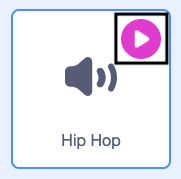

## एक छड़ी का इस्तेमाल करें

<div style="display: flex; flex-wrap: wrap">
<div style="flex-basis: 200px; flex-grow: 1; margin-right: 15px;">
पिनाटा को आमतौर पर लकड़ी या मोटे कार्ड से बनी छड़ी से मारा जाता है जो कागज के रंगीन पट्टियों में ढकी होती है। इस चरण में, आप पिनाटा छड़ी को नियंत्रित करने के लिए कोड जोड़ेंगे और पिनाटा के टूटने पर दोहराता हुआ संगीत बजाएंगे। 
</div>
<div>
{:width="300px"}
</div>
</div>

--- task ---

स्प्राइट सूची में **Stick** स्प्राइट पर क्लिक करें। कोड जोड़ें ताकि छड़ी हमेशा अन्य स्प्राइट्स के सामने रहे और माउस-पॉइंटर (या टैबलेट पर आपकी उंगली) का पीछा करे।

`go to random position`{:class="block3motion"} खंड का इस्तेमाल करें, लेकिन ड्रॉप डाउन मेन्यू से `mouse-pointer`{:class="block3motion"} चुनिए:


```blocks3
when flag clicked
forever
go to [front v] layer
go to (mouse-pointer v) // Change to mouse-pointer
```

--- /task ---

--- task ---

**परीक्षण:** अपना प्रोजेक्ट चलाएं और जांचें कि **Stick** स्प्राइट मंच के चारों ओर आपके कर्सर या उंगली का अनुसरण करता है।


--- /task ---

Scratch में कई तरह की आवाजें होती हैं आवाज और जानवरों के शोर से लेकर 100 से अधिक अन्य ध्वनि प्रभावों तक।

Scratch में **दोहराई जाने वाली ध्वनियाँ** भी होती हैं जिनका इस्तेमाल `forever`{:class="block3control"} या `repeat`{:class="block3control"} लूप्स के अंदर किया जा सकता है ऐसा लगने के लिए जैसे वे लगातार बज रहे हैं।

--- task ---

**Sounds** टैब पर जाएं और **Choose a Sound** आइकन पर क्लिक करें।


--- /task ---

--- task ---

**Choose a sound** गैलरी चुनें, **Loops** श्रेणी चुनें।


--- /task ---

--- task ---

**चुनें:** दोहराती हुई ध्वनियां सुनने के लिए **play** आइकन पर होवर करें। अपनी पसंदीदा चुनने के लिए उसपर क्लिक करें।



ध्वनि तब आपकी ध्वनि सूची में दिखाई देगी:


--- /task ---

--- task ---

**Code** टैब पर क्लिक करें और `party`{:class="block3events"} संदेश प्राप्त होने पर ध्वनि को `forever`{:class="block3control"} लूप करने के लिए एक नई स्क्रिप्ट बनाएं:


```blocks3
when I receive [party v]
forever
play sound [Hip Hop v] until done // Choose your sound
```

--- /task ---

--- task ---

**परीक्षण:** अपना प्रोजेक्ट चलाएं, और दोहराता हुआ समारोह संगीत सुनने के लिए दस बार पिनाटा पर क्लिक करें।

--- /task ---

--- save ---
