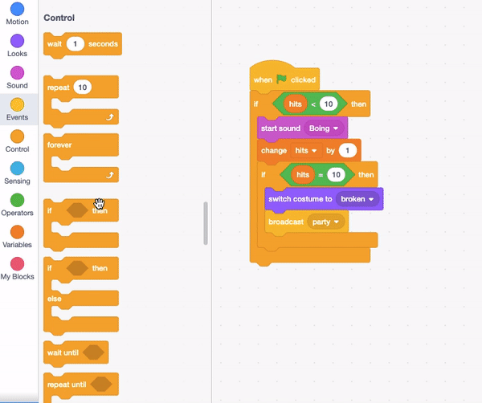
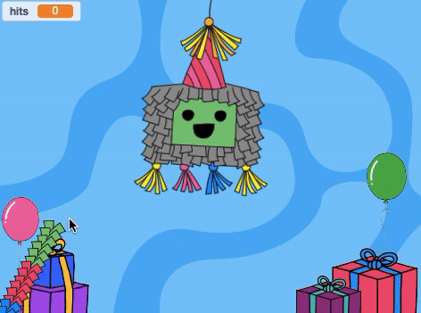

## कुछ पकवान जोड़ें

<div style="display: flex; flex-wrap: wrap">
<div style="flex-basis: 200px; flex-grow: 1; margin-right: 15px;">
पिनाटा पकवानो से भरे हुए होते हैं और जब वे टूटने लगते हैं, तो पकवान बाहर गिर जाते हैं। इस चरण में, आप हर बार मारने पर पिनाटा से बाहर निकलने के लिए अंतरराष्ट्रीय खाद्य पकवानो को चेतन करेंगे। क्या आप किसी भी पकवान को पहचानते हैं?
</div>
<div>
{:width="300px"}
</div>
</div>

<p style="border-left: solid; border-width:10px; border-color: #0faeb0; background-color: aliceblue; padding: 10px;">
Scratch में <span style="color: #0faeb0">**पोशाक**</span> एक ऐसी छवि है जो स्प्राइट के दिखने के तरीके को बदल देती है। हमारे **ग्राफिक डिजाइनरों** ने दुनिया भर के Code Club नेताओं से उन्हें यह बताने के लिए कहा कि वे एक समारोह में कौन से पकवान रखेंगे। उम्मीद है, उनके द्वारा बनायीं गयी कुछ पकवान पोशाकें आपके लिए परिचित होंगी - और अन्य पूरी तरह से नयी।      
</p>

--- task ---

स्प्राइट सूची में **Treats** स्प्राइट पर क्लिक करें, फिर **Costumes** टैब पर क्लिक करें।

26 पकवान पोशाकें हैं - और आप उन सभी का उपयोग करने जा रहे हैं!


--- /task ---

--- task ---

**Code** टैब पर क्लिक करें, फिर अपना प्रोजेक्ट शुरू होने पर पिनाटा में पकवानो को `hide`{:class="block3looks"} करने के लिए एक स्क्रिप्ट बनाएं:


```blocks3
when flag clicked
hide
go to x: (0) y: (100)
```

--- /task ---

हर बार पिनाटा को मारने पर पिनाटा से चार पकवान निकलेंगे। **Treats** स्प्राइट की **कॉपी बनाकर**, आप एक से ज़्यादा पकवान बना सकते हैं।

<p style="border-left: solid; border-width:10px; border-color: #0faeb0; background-color: aliceblue; padding: 10px;">
Scratch में <span style="color: #0faeb0">**कॉपी**</span> स्प्राइट की कॉपी है। इसमें मूल स्प्राइट के समान कोड, पोशाकें और ध्वनियां हैं।      
</p>

--- task ---

**Piñata** स्प्राइट पर क्लिक करें।

अपने मौजूदा कोड में `repeat`{:class="block3control"} लूप डालें। मान को `4`{:class="block3control"} में बदलें, फिर एक `create clone of myself`{:class="block3control"} खंड जोड़ें। `Treats`{:class="block3control"} स्प्राइट का चयन करने के लिए नीचे तीर जैसे बटन का उपयोग करें:


```blocks3
when this sprite clicked
if <(hits) < (10)> then
start sound [Boing v]
change [hits v] by (1)
+ repeat (4) // Change to 4
create clone of (Treats v) // Select Treats
end
if <(hits)=(10)> then
switch costume to (broken v)
broadcast (party v)
```

**युक्ति:** अपना नया कोड बनाने के लिए कोड क्षेत्र में खाली स्थान का उपयोग करें और फिर उसे मौजूदा स्क्रिप्ट में खिसकाएं:

 --- /task ---

--- task ---

**Treats** स्प्राइट पर क्लिक करें।

`when I start as a clone`{:class="block3control"} ब्लॉक के साथ एक नई स्क्रिप्ट प्रारंभ करें।

प्रत्येक नए क्लोन की उपस्थिति को नियंत्रित करने के लिए `Looks`{:class="block3looks"} खंड मेन्यू से खंड जोड़ें:


```blocks3
when I start as a clone
show
go to [back v] layer // Change to back
switch costume to (Knafeh v)
```

--- /task ---

--- task ---

पिनाटा मारने पर आप निकलने के लिए यादृच्छिक पकवान चुन सकते हैं। हर बार क्लोन बनने पर `1`{:class="block3operators"} से `26`{:class="block3operators"} में से एक यादृच्छिक पोशाक का चयन करने के लिए `pick random`{:class="block3operators"} ऑपरेटर का उपयोग करें:


```blocks3
when I start as a clone
show
go to [back v] layer 
+ switch costume to (pick random (1) to (26)) // Change to 26
```

--- /task ---

--- task ---

फिलहाल, **Piñata** स्प्राइट के पीछे **Treats** की कॉपियां दिखाई देंगी, लेकिन पकवानो को पिनाटा से एक यादृच्छिक स्थिति में गिरना चाहिए।

Add code to make the cloned **Treats** sprites `glide`{:class="block3motion"} to a random position:


```blocks3
when I start as a clone
show
go to [back v] layer
switch costume to (pick random (1) to (26))
+ glide (1) secs to (random position v) 
```

--- /task ---

--- task ---

**Test:** Run your project and hit the piñata to see four clones of the **Treats** sprite after each hit. The costumes will be selected at random and the treats will each glide to a random position.



--- /task ---

--- task ---

Add animation to make the **Treats** sprite clones `turn`{:class="block3motion"} `forever`{:class="block3control"} when they reach their random position. Remember animations work best when small movements are used, so change the number of degrees to `1`{:class="block3motion"}:


```blocks3
when I start as a clone
show
go to [back v] layer
switch costume to (pick random (1) to (26)
glide (1) secs to (random position v) 
+ forever
turn right (1) degrees
```

--- /task ---

--- task ---

**Test:** Run your project again to see the **Treats** sprite clones spin.


--- /task ---

--- save ---
