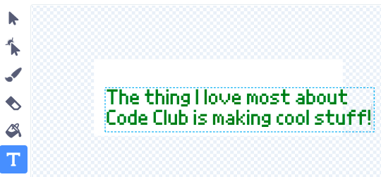
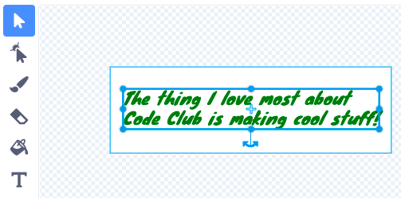

## एक संदेश बनाएं

<div style="display: flex; flex-wrap: wrap">
<div style="flex-basis: 200px; flex-grow: 1; margin-right: 15px;">
इस चरण में, आप एक संदेश लिखेंगे और गति और रंग प्रभावों का उपयोग करके उसे एनिमेट करेंगे। 
</div>
<div>
{:width="300px"}
</div>
</div>

Code Club को भेजने के लिए आप जन्मदिन कार्ड में क्या लिखेंगे? यह हो सकता है:
+ Code Club के बारे में आपकी पसंदीदा चीज़
+ आपके शानदार Code Club नेता के बारे में एक संदेश
+ आप अपने कोडिंग कौशल के साथ आगे क्या बनाना चाहते हैं, इसका विवरण

<p style="border-left: solid; border-width:10px; border-color: #0faeb0; background-color: aliceblue; padding: 10px;">
पहले Code Club प्रोजेक्ट अंग्रेजी में लिखे गए थे, लेकिन एक साल के भीतर उनका ब्राजीलियाई पुर्तगाली, डच, जर्मन, नॉर्वेजियन और यूक्रेनी में अनुवाद किया गया था। फ्रेंच, ग्रीक और स्पेनिश अनुवादों ने तेजी से अनुसरण किया और अब कुछ कोड क्लब प्रोजेक्ट्स का <span style="color: #0faeb0">**28 देशी भाषाओं**</span> में अनुवाद किया गया है। हमारे शानदार अनुवाद समुदाय को धन्यवाद!


</p>

--- task ---

स्प्राइट सूची में **Message** स्प्राइट पर क्लिक करें, फिर **Costumes** टैब पर क्लिक करें।

पोशाक में कुछ पाठ है 'Happy Birthday Code Club'। टेक्स्ट एडिटिंग टूल को चुनने के लिए टेक्स्ट पर डबल क्लिक करें (या टैबलेट पर टैप करके रखें)।


--- /task ---

--- task ---

अब आप अपना नया कोड क्लब जन्मदिन संदेश टाइप कर सकते हैं। नई लाइन शुरू करने के लिए अपने कीबोर्ड पर **Enter** दबाएं।

**युक्ति:** यदि आपका संदेश बॉक्स के लिए थोड़ा बहुत बड़ा है तो चिंता न करें क्योंकि आप बाद में उसका आकार बदल सकते हैं।



--- /task ---

--- task ---

**चुनें:** रंग ड्रॉप डाउन मेन्यू खोलने के लिए **Fill** आइकन पर क्लिक करें। अपने पसंदीदा रंग को चुनने के लिए भरण स्लाइडर को बाएँ या दाएँ ले जाएँ।


--- /task ---

--- task ---

**चुनें:** **Font** टूल पर क्लिक करें और फोंट की एक ड्रॉप-डाउन सूची दिखाई देगी। शुरूआती प्रोजेक्ट में 'Pixel' फ़ॉन्ट चुना गया है, लेकिन आप उपलब्ध किसी भी फ़ॉन्ट का उपयोग कर सकते हैं।


--- /task ---

--- task ---

**Select** टूल पर क्लिक करें और आपके संदेश के चारों ओर आठ घेरे दिखाई देंगे। इन घेरों पर क्लिक करके और उन्हें सफेद बॉक्स में खिसका कर अपने संदेश का आकार बदलने के लिए उनका उपयोग करें।



--- /task ---

आपका संदेश तैयार है, अब आप अपने संदेश को पिनाटा के अंदर छिपाने के लिए कोड जोड़ सकते हैं और दसवीं मार के बाद अपने संदेश को पिनाटा से गिरा सकते हैं।

--- task ---

**Code** टैब पर क्लिक करें, फिर अपना प्रोजेक्ट शुरू होने पर पिनाटा में संदेश को `hide`{:class="block3looks"} करने के लिए एक स्क्रिप्ट बनाएं:


```blocks3
when flag clicked
hide
set size to (10) % // छोटा शुरू करने के लिए 10 में बदलें
go to x: (0) y: (100) // पिनाटा के अंदर
```

--- /task ---

--- task ---

`party`{:class="block3events"} संदेश प्राप्त होने पर प्रारंभ करने के लिए एक नई स्क्रिप्ट बनाएं।

संदेश को एनिमेट करने के लिए `repeat`{:class="block3control"} लूप जोड़ें। एनिमेट होते हुए, संदेश बढ़ने के लिए `change size`{:class="block3looks"} और गिरते हुए `change y`{:class="block3motion"} स्तिथि को बदलेगा:


```blocks3
when I receive [party v]
show
repeat (20) // 20 में बदलें
change size by (5) // 5 में बदलें
change y by (-10) // -10 में बदलें
```

--- /task ---

--- task ---

**परीक्षण:** अपना प्रोजेक्ट चलाएँ। संदेश को गिरते हुए देखने के लिए पिनाटा को दस बार मारें।


--- /task ---

--- save ---
