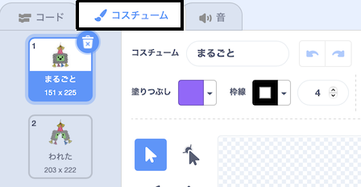

## パーティーをはじめよう

<div style="display: flex; flex-wrap: wrap">
<div style="flex-basis: 200px; flex-grow: 1; margin-right: 15px;">
このステップでは、ピニャータのコスチュームをえらび、ピニャータがゆれるようにコーディングします。
</div>
<div>
{:width = "300px"}
</div>
</div>

--- task ---

[ピニャータパーティースタートプロジェクト](https://scratch.mit.edu/projects/653082997/editor){:target ="_blank"}を開きます。 スクラッチはブラウザの別のタブで開きます。

[[[working-offline]]]

--- /task ---

Scratchのエディタは次のようになります。


**ステージ** で、プロジェクトが実行されます。**背景** によって、ステージがどのように見えるかを変えることができます。 Code Clubパーティーの背景になっています。

Scratchでは、キャラクターとオブジェクトは**スプライト**と呼ばれ、それらはステージに表示されます。 **ピニャータ** と **スティック**のスプライトがステージにおかれています。


いまはまだ、このパーティーではなにもハプニングがおきていません。 かえていきましょう！

--- task ---

スプライトにコード、コスチューム、サウンドを設定（せってい）して見た目や動きを変更できます。

スプライトリストで**ピニャータ** をクリックし、**コスチューム** タブをクリックします。 ピニャータのコスチュームは2つあります。1つは「Whole」、もう1つは「broken」という名前です。




--- /task ---

--- task ---

**コード**タブをクリックします。 コードタブをクリックして、`見た目`{:class="block3looks"}の中から、 `コスチュームを__にする`{:class="block3looks"} のブロックをコードエリアにドラックします。

コスチュームの名前（なまえ）をクリックして、 **ドロップダウンメニュー**をひらき、 `whole`{:class="block3looks"} というコスチュームをえらびます:


```blocks3
コスチュームを (whole v) にする // 「whole」にかえます。
```


--- /task ---

コードエリアではブロックをつなげることで、いちどに複数（ふくすう）のブロックを実行（じっこう）できます。 つなげたブロックは、上から下に順番（じゅんばん）に実行（じっこう）されます。

--- task ---

`イベント`{:class="block3events"} ブロックメニューか ら`旗（はた）が押されたとき`{:class="block3events"} ブロックをドラッグし、コードエリアのブロックの一番上につなげます。 ブロック同士（どうし）がつながります。


```blocks3
+旗（はた）がクリックされた時
コスチュームを (whole v) にする
```


--- /task ---

ピニャータのスタート位置（いち）は、いつもおなじです。ピニャータゲームがはじまったときに、うごきだします。

--- task ---

ブロックメニューの`動き（うごき）`{:class="block3motion"} に, `x座標（ざひょう）を0、 y座標（ざひょう）を180にする`{:class="block3motion"} や `90度（ど）に向（む）ける`{:class="block3motion"} のブロックがあります。 これらのブロックをコードエリアのいちばん下にドラッグしてつなげます：


```blocks3
旗が押されたとき
コスチュームを(whole v) にする
+ x座標を(0)、 y座標を(180) にする
+(90) 度にむける// 準備（じゅんび）ポジション
```

--- /task ---

`ずっと`{:class="block3control"}ループは、その中のコードブロックをなんども実行（じっこう）します。 たたくことがむずかしい、ゆれるピニャータにぴったりのループです。

--- task ---

`制御（せいぎょ）`{:class="block3control"} ブロックメニューから `ずっとr`{:class="block3control"} ブロックをドラッグして、コードのいちばん下につなげます:


```blocks3
旗が押されたとき
コスチュームを(whole v) にする
x座標を(0) 、y座標を(180) にする
(90) 度に向ける
+ ずっと
```

--- /task ---

`回繰り返す`{:class="block3control"} ループは、 **ピニャータ**スプライトがくりかえす小さな動き（うごき）につかうことができます。 これにより、ピニャータがアニメーション化されたように見えます。

--- task ---

`10回繰り返す（くりかえす）`{:class="block3control"} ブロックをコードエリアにドラッグし、`ずっと`{:class="block3control"} ループの中にいれます。

`動き（うごき）`{:class="block3motion"} ブロックメニューから、 `15度回す（どまわす）`{:class="block3motion"} ブロックを`繰り返す（くりかえす）`{:class="block3control"} ブロックの中にドラッグします。

`15`{:class="block3motion"} 度（ど）を `1`{:class="block3motion"} 度（ど）にかえることで、ピニャータがすこしずつゆれるようにします。:


```blocks3
旗が押されたとき
コスチュームを(whole v) にする
x座標を(0)、y座標を(180) にする
(90) 度に向ける
ずっと
+ (10) 回繰り返す（かいくりかえす）
右に(1) 度回す//1にかえる
```


--- /task ---

--- task ---

**テスト:** プロジェクトを実行（じっこう）し, ステージの上の **緑の旗（みどりのはた）** をクリックして、ピニャータがゆれることを確認（かくにん）します。

**うーん、なにかおかしい！** 天井（てんじょう）に、ものをつるしたら、一方向（いちほうこう）に回転（かいてん）するのではなく、前後（ぜんご）にゆれるはずです。

ステージの上にある **赤いストップボタン**をクリックして、プロジェクトをとめてください。


--- /task ---

--- task ---

`ずっと`{:class="block3control"}ループにコードをいれると、ピニャータがふりこのようにまんなかから前後（ぜんご）にゆれます。:


```blocks3
旗が押されたとき
コスチュームを(whole v) にする
x座標を(0)、y座標を(180) にする
(90) 度に向ける
ずっと
(10) 回繰り返す // まんなかから時計まわりに10度（ど）ゆれる
右に(1) 度回す
end
+(20) 回繰り返す//まんなを通って反時計まわりに20度（ど）ゆれる
左に(1) 度回す//1にかえる
end
+(10) 回繰り返す // 10度（ど）ゆれて真ん中にもどる
右に(1) 度回す//1にかえる
end
```

--- /task ---

--- task ---

**テスト：**プロジェクトを実行して、ピニャータのゆれを確認します。

**デバッグ:** ピニャータが正しくゆれない場合:
+ コードを見て `繰り返す`{:class="block3control"} ブロックが正しい場所にあることを確認（かくにん）します。
+ `時計まわり`{:class="block3motion"}  と `反時計回り`{:class="block3motion"} の向きが正しいことを確認（かくにん）します。
+ コードで使っている数字（すうじ）を確認（かくにん）します。


--- /task ---

--- save ---

