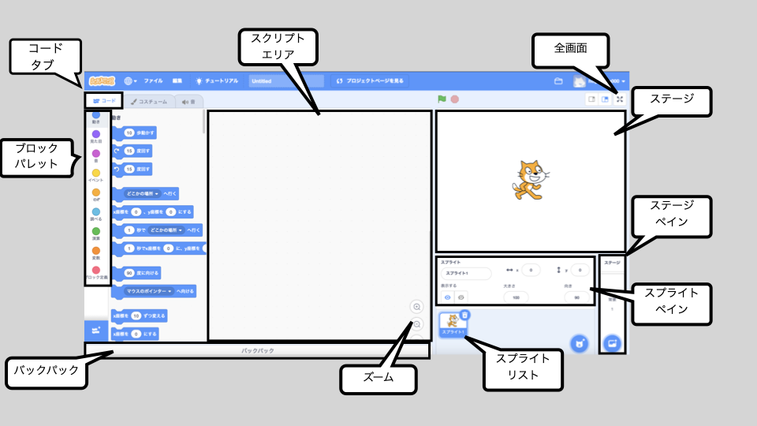

## パーティーをはじめよう

<div style="display: flex; flex-wrap: wrap">
<div style="flex-basis: 200px; flex-grow: 1; margin-right: 15px;">
このステップでは、ピニャータのコスチュームをえらび、ピニャータがゆれるようにコーディングします。
</div>
<div>
{:width = "300px"}
</div>
</div>

--- task ---

[ピニャータパーティースタートプロジェクト](https://scratch.mit.edu/projects/653082997/editor){:target ="_blank"}を開きます。 スクラッチはブラウザの別のタブで開きます。

[[[working-offline]]]

--- /task ---

Scratchのエディタは次のようになります。



**ステージ** で、プロジェクトが実行されます。**背景** によって、ステージがどのように見えるかを変えることができます。 Code Clubパーティーの背景になっています。

Scratchでは、キャラクターとオブジェクトは**スプライト**と呼ばれ、それらはステージに表示されます。 **ピニャータ** と **スティック**のスプライトがステージにおかれています。


いまはまだ、このパーティーではなにもハプニングがおきていません。 かえていきましょう！

--- task ---

スプライトにコード、コスチューム、サウンドを設定（せってい）して見た目や動きを変更できます。

スプライトリストで**ピニャータ** をクリックし、**コスチューム** タブをクリックします。 ピニャータのコスチュームは2つあります。1つは「Whole」、もう1つは「broken」という名前です。


--- /task ---

--- task ---

**コード**タブをクリックします。 コードタブをクリックして、`見た目`{:class="block3looks"}の中から、 `コスチュームを__にする`{:class="block3looks"} のブロックをコードエリアにドラックします。

コスチュームの名前（なまえ）をクリックして、 **ドロップダウンメニュー**をひらき、 `whole`{:class="block3looks"} というコスチュームをえらびます:


```blocks3
コスチュームを (whole v) にする // 「whole」にかえます。
```


--- /task ---

コードエリアではブロックをつなげることで、いちどに複数（ふくすう）のブロックを実行（じっこう）できます。 つなげたブロックは、上から下に順番（じゅんばん）に実行（じっこう）されます。

--- task ---

`イベント`{:class="block3events"} ブロックメニューか ら`旗（はた）が押されたとき`{:class="block3events"} ブロックをドラッグし、コードエリアのブロックの一番上につなげます。 ブロック同士（どうし）がつながります。


```blocks3
+ when flag clicked
switch costume to (whole v)
```


--- /task ---

ピニャータのスタート位置（いち）は、いつもおなじです。ピニャータゲームがはじまったときに、うごきだします。

--- task ---

ブロックメニューの`動き（うごき）`{:class="block3motion"} に, `x座標（ざひょう）を0、 y座標（ざひょう）を180にする`{:class="block3motion"} や `90度（ど）に向（む）ける`{:class="block3motion"} のブロックがあります。 これらのブロックをコードエリアのいちばん下にドラッグしてつなげます：


```blocks3
旗（はた）がクリックされたとき
コスチュームを(whole v) にする
+ x座標（ざひょう）を(0)、 y座標 （ざひょう）を(180) にする
+(90) 度（ど）にむける// 準備（じゅんび）のポジションです
```

--- /task ---

`ずっと`{:class="block3control"}ループは、その中のコードブロックをなんども実行（じっこう）します。 たたくことがむずかしい、ゆれるピニャータにぴったりのループです。

--- task ---

`制御（せいぎょ）`{:class="block3control"} ブロックメニューから `ずっとr`{:class="block3control"} ブロックをドラッグして、コードのいちばん下につなげます:


```blocks3
旗（はた）をクリックすると
コスチュームを(whole v) にする
x座標（ざひょう）を(0) 、y座標（ざひょう）を(180) にする
(90) 度（ど）に向ける
+ ずっと
```

--- /task ---

`回繰り返す`{:class="block3control"} ループは、 **ピニャータ**スプライトがくりかえす小さな動き（うごき）につかうことができます。 これにより、ピニャータがアニメーション化されたように見えます。

--- task ---

Drag a `repeat 10`{:class="block3control"} block into the Code area and attach it inside your `forever`{:class="block3control"} loop.

Go to the `Motion`{:class="block3motion"} blocks menu and drag a `turn clockwise 15 degrees`{:class="block3motion"} block into the `repeat`{:class="block3control"} block.

Change the `15`{:class="block3motion"} degrees to `1`{:class="block3motion"} degree so that the piñata only swings a small amount each time:


```blocks3
when flag clicked
switch costume to (whole v)
go to x: (0) y: (180)
point in direction (90)
forever
+ repeat (10) 
turn right (1) degrees // Change to 1
```


--- /task ---

--- task ---

**Test:** Run your project, by clicking on the **green flag** above the Stage, to see the piñata swing.

**Mmm, something is not quite right!** When an object is hung from the ceiling, it won't just rotate in one direction, it will swing back and forth.

Stop your project by clicking on the **red stop icon** above the Stage.


--- /task ---

--- task ---

Add code to your `forever`{:class="block3control"} loop so that the piñata swings from the centre back and forth continuously like a pendulum:


```blocks3
when flag clicked
switch costume to (whole v)
go to x: (0) y: (180)
point in direction (90)
forever
repeat (10) // Swings 10 degrees clockwise from the centre
turn right (1) degrees 
end
+ repeat (20) // Swings 20 degrees anticlockwise through the centre
turn left (1) degrees // Change to 1
end
+ repeat (10) // Swings 10 degrees clockwise back to the centre
turn right (1) degrees // Change to 1
end
```

--- /task ---

--- task ---

**Test:** Run your project to see the piñata swing.

**Debug:** If the piñata does not swing correctly:
+ Look at your code to make sure the `repeat`{:class="block3control"} blocks are in the correct position
+ Check that the `turn clockwise`{:class="block3motion"}  and `turn anticlockwise`{:class="block3motion"} arrows are correct
+ Make sure that you have used the numbers from the code above


--- /task ---

--- save ---

