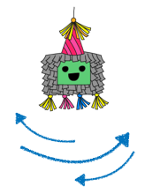

## パーティーをはじめよう

<div style="display: flex; flex-wrap: wrap">
<div style="flex-basis: 200px; flex-grow: 1; margin-right: 15px;">
このステップでは、ピニャータのコスチュームをえらび、ピニャータがゆれるようにコーディングします。
</div>
<div>
{:width="300px"}
</div>
</div>

--- task ---

[ピニャータパーティースタートプロジェクト](https://scratch.mit.edu/projects/680782246/editor){:target="_blank"}を開こう。 Scratchはブラウザの別のタブで開くよ。

[[[working-offline]]]

--- /task ---

Scratchのエディタは次のようになります。


**ステージ** は、プロジェクトが実行されるところで、**背景** によって、ステージがどのように見えるかを変えることができます。 Code Clubパーティーの背景（はいけい）を用意しておいたよ。

Scratchでは、キャラクターやオブジェクトを**スプライト**とよびます。これらはステージの上にでてきます。 **ピニャータ** と **スティック**のスプライトがステージにいるのがわかるかな。


いまはまだ、このパーティーではなにもハプニングがおきていないね。 かえていきましょう！

--- task ---

スプライトにコードやコスチューム、音を設定して見た目や動きをかえることができます。

スプライトリストで**ピニャータ** をクリックして、**コスチューム** タブをクリックしてみて。 ピニャータのコスチュームは2つあるよ。1つは「まるごと」、もう1つは「われた」という名前です。


--- /task ---

--- task ---

**コード**タブをクリックしてみて。 `見た目`{:class="block3looks"}の中から、 `コスチュームを__にする`{:class="block3looks"} のブロックをスクリプトエリアにドラックするよ。

コスチュームの名前をクリックして、 **ドロップダウンメニュー**の中から、 `まるごと`{:class="block3looks"} というコスチュームをえらんでね。


```blocks3
switch costume to (まるごと v) // 「まるごと」にかえる
```


--- /task ---

スクリプトエリアでブロックをつなげると、いちどに複数（ふくすう）のブロックを実行（じっこう）できます。 つなげたブロックは、上から下に順番（じゅんばん）に実行（じっこう）されます。

--- task ---

`イベント`{:class="block3events"} ブロックパレットか ら`旗が押されたとき`{:class="block3events"} ブロックをドラッグして、スクリプトエリアの見た目ブロックの上につなげてね。 ブロック同士（どうし）が、くっつきます。


```blocks3
+ when flag clicked
switch costume to (まるごと v)
```


--- /task ---

ピニャータがスタートするところは、いつもおなじです。ピニャータゲームがはじまったときに、うごきだします。

--- task ---

ブロックパレットの`動き（うごき）`{:class="block3motion"} のところで、`x座標（ざひょう）を0、 y座標（ざひょう）を180にする`{:class="block3motion"} や `90度（ど）に向（む）ける`{:class="block3motion"} のブロックをみつけてみて。 これらのブロックをコードエリアのいちばん下にドラッグしてつなげてね。


```blocks3
when flag clicked
switch costume to (まるごと v)
+ go to x: (0) y: (180)
+ point in direction (90) // スタートポジション
```

--- /task ---

`ずっと`{:class="block3control"}ループは、その中のコードブロックをなんども実行（じっこう）します。 たたくことがむずかしい、ゆれるピニャータにぴったりのループです。

--- task ---

`制御（せいぎょ）`{:class="block3control"} ブロックパレットから `ずっとr`{:class="block3control"} ブロックをドラッグして、コードのいちばん下につなげてね:


```blocks3
when flag clicked
switch costume to (まるごと v)
go to x: (0) y: (180)
point in direction (90)
+ forever
```

--- /task ---

`繰り返す`{:class="block3control"} ループは、 **ピニャータ**のスプライトが繰り返す小さな動き（うごき）につかうことができます。 これにより、ピニャータがアニメーション化されたように見えます。

--- task ---

`10回繰り返す`{:class="block3control"} ブロックをスクリプトエリアにドラッグして、`ずっと`{:class="block3control"} ループの中にいれてね。

`動き（うごき）`{:class="block3motion"} ブロックメニューから、 `15度回す（どまわす）`{:class="block3motion"} ブロックを`繰り返す（くりかえす）`{:class="block3control"} ブロックの中にドラッグするよ。

`15`{:class="block3motion"} 度（ど）を `1`{:class="block3motion"} 度（ど）にかえよう。ピニャータがすこしずつゆれるようにみえるよ：


```blocks3
when flag clicked
switch costume to (まるごと v)
go to x: (0) y: (180)
point in direction (90)
forever
+ repeat (10) 
turn right (1) degrees // 1にかえる
```


--- /task ---

--- task ---

**テスト:** ステージの上の **緑の旗** をクリックしてプロジェクトを実行し、ピニャータがゆれることを確認しよう。

**うーん、なにかおかしい！** 天井（てんじょう）に、ものをつるしたら、一方向（いちほうこう）に回転（かいてん）するのではなく、行ったり来たりするよね。

ステージの上にある **赤いストップボタン**をクリックして、プロジェクトを止めておこう。


--- /task ---

--- task ---

`ずっと`{:class="block3control"}ループにコードをいれて、ピニャータがふりこのようにまんなかから前後（ぜんご）にゆれるようにしよう：




```blocks3
when flag clicked
switch costume to (まるごと v)
go to x: (0) y: (180)
point in direction (90)
forever
repeat (10) // まん中から時計回りに10度スイングする
turn right (1) degrees 
end
+ repeat (20) // まん中を通って反時計まわりに20度ゆれる
turn left (1) degrees // 1にかえる
end
+ repeat (10) // 時計まわりに10度ゆれてまん中にもどる
turn right (1) degrees // 1にかえる
end
```

--- /task ---

--- task ---

**テスト：**プロジェクトを実行して、ピニャータのゆれかたを確認しよう。

**デバッグ:** ピニャータが正しくゆれない場合:
+ コードを見て `繰り返す`{:class="block3control"} ブロックが正しい場所にあることを確認します。
+ `時計まわり`{:class="block3motion"}  と `反時計回り`{:class="block3motion"} の向きが正しいことを確認します。
+ コードで使っている数字を確認します。


--- /task ---

--- save ---

