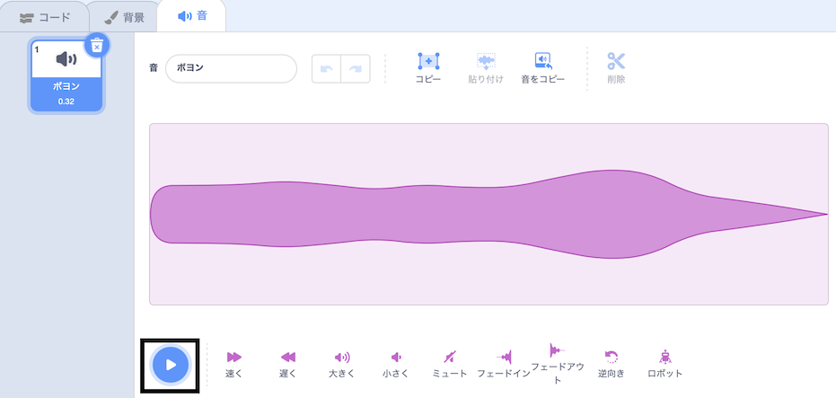
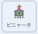
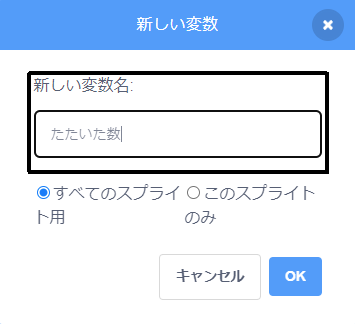
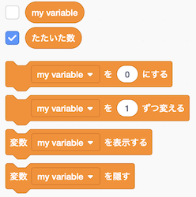
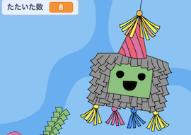
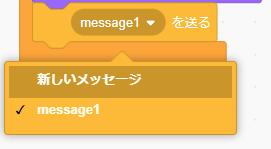
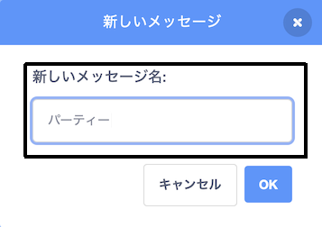

## ピニャータをたたいてみよう

<div style="display: flex; flex-wrap: wrap">
<div style="flex-basis: 200px; flex-grow: 1; margin-right: 15px;">
このステップでは、ピニャータがクリックされるたびに音をだし、たたいた数をカウントするようにピニャータをコーディングします。
</div>
<div>
{:width="300px"}
</div>
</div>

--- task ---

**ピニャータ**のスプライトで**音**タブをクリックしてみよう。**ボヨン**という音をみつけて聞いてみよう。 **再生**ボタンをクリックすると、音が出ます。



--- /task ---

Scratchでは、つなげたブロックのグループは **スクリプト**と呼ばれます。 スプライトは複数（ふくすう）のスクリプトを持つことができます。

--- task ---

**コード** タブをクリックしてみて。 `イベント`{:class="block3events"}の中から、 `このスプライトが押されたとき`{:class="block3events"} ブロックをコードエリアにドラッグして、新しいスクリプトをはじめよう。

`音`{:class="block3sound"} ブロックメニューで、`__の音を鳴らす`{:class="block3sound"} ブロックを見つけてね。 それを`このスプライトが押されたとき`{:class="block3events"} ブロックの下にドラッグするよ：



```blocks3
when this sprite clicked
start sound [Boing v]
```

--- /task ---

--- task ---

**テスト:** ステージの上の**緑の旗** をクリックし、プロジェクトを実行してみよう。 ピニャータをクリックすると、ゆれてボヨンという音がなります。

--- /task ---

`変数`{:class="block3variables"}は、数やテキストを入れておく方法です。 ピニャータがクリックされた回数は、 `hits`{：class = "block3variables"}という変数に保存されるため、いつでも使用できます。

--- task ---

`変数`{:class="block3variables"} ブロックメニューから、**変数を作る** ボタンをクリックしよう。


新しい変数**たたいた数**を作るよ：



**注意：** 新しい「たたいた数」という変数（へんすう）がステージの上にあらわれ、 `変数`{:class="block3variables"} ブロックの中で使うことができるようになります。




--- /task ---

--- task ---

プロジェクトが開始（かいし）されるたび、 `hits`{:class="block3variables"} の数は`0`{:class="block3variables"}にリセットされます。

`たたいた数を0にする`{:class="block3variables"} ブロックをコードエリアのはじめのスクリプトにドラッグし、 `コスチュームを__にする`{:class="block3looks"} ブロックと`x座標を(0) 、y座標を (180)にする`{:class="block3motion"} ブロックの間においてね。

コードはこんな感じになるよ：


```blocks3
旗が押されたとき
コスチュームを(whole v) にする
+ [hits v] を(0) にする
x座標を(0)、y座標を(180) にする
(90) 度に向ける
ずっと
(10) 回繰り返す
右に(1) 度回す
end
(20) 回繰り返す
左に(1) 度回す
end
+(10) 回繰り返す 
右に(1) 度回す
end
```

--- /task ---

--- task ---

**ピニャータ** のスプライトがクリックされるたびに、`たたいた数`{:class="block3variables"} の数字がふえるはずです。

**ピニャータ**のスプライトをクリックすると `たたいた数`{:class="block3variables"} が `1`{:class="block3variables"} ずつかわるようにブロックを追加してみよう：


```blocks3
このスプライトが押されたとき
[Boing v] の音を鳴らす
+ [hits v] を (1) ずつ変える
```

--- /task ---

--- task ---

**テスト：**プロジェクトを数回（すうかい）実行（じっこう）してみよう。 `たたいた数`{:class="block3variables"} が、いつも`0`{:class="block3variables"} からはじまり、**ピニャータ**をクリックするたびに `1`{:class="block3variables"}ずつ数がふえていることをチェックしてね。



--- /task ---

ピニャータはわれにくいですが、ずっとつづくわけではありません。 `10 回`{:class="block3variables"}たたくと、われてあきます。

`もし__なら`{:class="block3control"}ブロックは、**条件**によって決定（けってい）するときに使います。

<p style="border-left: solid; border-width:10px; border-color: #0faeb0; background-color: aliceblue; padding: 10px;">
私たちは意思決定（いしけってい）をするときはいつも<span style="color: #0faeb0">**条件**</span>を使います。 「えんぴつの芯（しん）がとがっていなければ、けずる」と言います。 おなじように、「if」ブロックや条件（じょうけん）を使って、ある条件が真（しん）か偽（ぎ）かによって、ちがう処理（しょり）をするコードを書くことができます。
</p>

--- task ---

`制御`{:class = "block3looks"} ブロックメニューを開いてみて。 `もし__なら`{:class="block3control"} ブロックをコードエリア にある`このスプライトが押されたとき`{:class="block3events"} の中のスクリプトをかこむようおいてね:


```blocks3
このスプライトが押されたとき
+ もし<> なら
[Boing v] の音を鳴らす
[hits v] を (1) ずつ変える

```

--- /task ---

`もし__なら`{:class="block3control"}ブロックは、なかの六角形（ろくかくけい）のところに条件（じょうけん）を入力することができます。

--- task ---

**ピニャータ**のスプライトは、`もし` {:class="block3control"}</strong> `たたいた数`{:class="block3variables"} の数字が`10`{:class="block3variables"} `より少ない場合`{:class="block3operators"}音をならし、 変数`たたいた数`のカウント数をふやします。

まず、六角形のところに`<`{:class="block3operators"}を追加（ついか）するよ：


```blocks3
このスプライトが押されたとき
+ もし <() < ()> なら
[Boing v] の音を鳴らす
[hits v] を (1) ずつ変える

```

--- /task ---

--- task ---

`もし__なら`{:class="block3control"}の条件（じょうけん）の中に、`<`{:class="block3operators"}の左に変数（へんすう）`hits`{:class="block3variables"} をドラッグして、右に「10」と入力しよう：


```blocks3
このスプライトが押されたとき
+ もし <(hits) < (10)> なら
[Boing v] の音を鳴らす
[hits v] を (1) ずつ変える

```

--- /task ---

--- task ---

**テスト：**プロジェクトをもういちど実行（じっこう）してみよう。 ピニャータを10回たたいて、音がなることと、変数`たたいた数`{:class="block3variables"} のカウント数がふえることを確認（かくにん）しよう。

ピニャータをもっとたたいてみて。 変数`たたいた数`{:class="block3variables"}は、10より大きくはなりません。なぜかというと、`もし__なら`{:class="block3control"}の条件が「true（真）」ではなくなったため、その中のコードが実行されなくなったのです。

--- /task ---

--- task ---

2つめの`もし__なら`{:class="block3control"} ブロックを、1つめの中に追加（ついか）してみて。 今回（こんかい）の条件（じょうけん）では、`hits`{:class="block3variables"} `=`{:class="block3operators"} 10 であることをチェックして、「true（しん）」の場合 には、コスチュームを`broken`{:class="block3looks"}にかえるようにします:


```blocks3
このスプライトが押されたとき
もし <(hits) < (10)> なら
[Boing v] の音を鳴らす
[hits v] を (1) ずつ変える
+ もし <(hits)=(10)> なら
コスチュームを (broken v) にする

```

--- /task ---

--- task ---

**テスト：**プロジェクトを数回（すうかい）実行（じっこう）してみよう。 **ピニャータ**のスプライトが、「whole」のコスチュームからスタートし、`10 回たたかれた`{:class="block3variables"}ときに、「broken」のコスチュームにかわることを確認（かくにん）します。


--- /task ---

**ピニャータ** のスプライトがこわれたとき、そのほかのスプライトにパーティーがはじまったことが伝わる（つたわる）必要（ひつよう）があります。

Scratchでは、`メッセージを送る`{:class="block3events"} ブロックが、すべてのスプライトが**受け取る**ことができるようにメッセージを**送る**のに使えます。

--- task ---

`イベント`{:class="block3events"}から`メッセージを送る`{:class="block3events"} ブロックを追加（ついか）します:


```blocks3
when this sprite clicked
if <(hits) < (10)> then
start sound [Boing v]
change [hits v] by (1)
if <(hits)=(10)> then
switch costume to (broken v)
+ broadcast (message1 v)
```

`メッセージ１`{:class="block3events"} をクリックし、 **新しいメッセージ**を選びます。 新しいメッセージの名前を`party`{:class="block3events"}としてください。





`メッセージを送る`{:class="block3events"} ブロックは、このようになります：

```blocks3
(party v) を送る
```

--- /task ---

--- save ---
