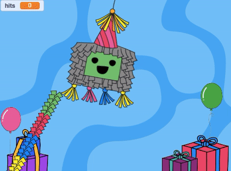

## ピニャータをたたいてみよう

<div style="display: flex; flex-wrap: wrap">
<div style="flex-basis: 200px; flex-grow: 1; margin-right: 15px;">
このステップでは、ピニャータがクリックされるたびに音をだし、たたいた数をカウントするようにピニャータをコーディングします。
</div>
<div>
{:width="300px"}
</div>
</div>

--- task ---

**ピニャータ**スプライトで**音**タブをクリックすると、**ボヨン**という音が見つかります。 **再生**ボタンをクリックすると、音が出ます。


--- /task ---

Scratchでは、つなげたブロックのグループは **スクリプト**と呼ばれます。 スプライトは複数（ふくすう）のスクリプトを持つことができます。

--- task ---

**コード** タブをクリックします。 `イベント`{:class="block3events"}から、 `このスプライトが押されたとき`{:class="block3events"} ブロックをコードエリアにドラッグして、新しいスクリプトを開始（かいし）します。

`音`{:class="block3sound"} ブロックメニューで、`... の音を鳴らす`{:class="block3sound"} ブロックを見つけます。 それを`このスプライトが押されたとき`{:class="block3events"} ブロックの下にドラッグします:


```blocks3
when this sprite clicked
start sound [Boing v]
```

--- /task ---

--- task ---

**テスト:** ステージの上の**緑の旗** をクリックし、プロジェクトを実行します。 ピニャータをクリックすると、ゆれてボヨンという音がなります。

--- /task ---

`変数`{:class="block3variables"}は、数やテキストを入れておく方法です。 ピニャータがクリックされた回数は、 `hits`{：class = "block3variables"}という変数に保存されるため、いつでも使用できます。

--- task ---

`変数`{:class="block3variables"} ブロックメニューから、**変数を作る** ボタンをクリックします。


新しい変数**hits**を作ります:


**注意:** 新しい「hits」という変数（へんすう）がステージの上にあらわれ、 `変数`{:class="block3variables"} ブロックの中で使うことができるようになります。


--- /task ---

--- task ---

プロジェクトが開始（かいし）されるたび、 `hits`{:class="block3variables"} の数は`0`{:class="block3variables"}にリセットされます。

`hitsを0にする`{:class="block3variables"} ブロックをコードエリアのはじめのスクリプトにドラッグし、 `コスチュームを__にする`{:class="block3looks"} ブロックと`x座標を(0) 、y座標を (180)にする`{:class="block3motion"} ブロックの間におきます。

コードは以下のようになります：


```blocks3
旗が押されたとき
コスチュームを(whole v) にする
+ [hits v] を(0) にする
x座標を(0)、y座標を(180) にする
(90) 度に向ける
ずっと
(10) 回繰り返す
右に(1) 度回す
end
(20) 回繰り返す
左に(1) 度回す
end
+(10) 回繰り返す 
右に(1) 度回す
end
```

--- /task ---

--- task ---

**ピニャータ** スプライトがクリックされるたびに、`hits`{:class="block3variables"} の数がふえるはずです。

**ピニャータ**スプライトをクリックすると `hits`{:class="block3variables"} が `1`{:class="block3variables"} ずつかわるようにブロックを追加します。


```blocks3
このスプライトが押されたとき
[Boing v] の音を鳴らす
+ [hits v] を (1) ずつ変える
```

--- /task ---

--- task ---

**テスト：**プロジェクトを数回（すうかい）実行（じっこう）します。 `hits`{:class="block3variables"} が、いつも`0`{:class="block3variables"} からはじまり、**ピニャータ**をクリックするたびに `1`{:class="block3variables"}ずつ数がふえていることを確認（かくにん）します。


--- /task ---

ピニャータはこわしにくいですが、ずっと続く（つづく）わけではありません。 `10 回`{:class="block3variables"}たたくと、こわれてあきます。

`もし__なら`{:class="block3control"}ブロックは、**条件**にもとづいて決定（けってい）するときに使います。

<p style="border-left: solid; border-width:10px; border-color: #0faeb0; background-color: aliceblue; padding: 10px;">
私たちは意思決定（いしけってい）をするときはいつも<span style="color: #0faeb0">**条件**</span>を使います。 「えんぴつの芯（しん）がとがっていなければ、けずる」と言えます。 おなじように、「if」ブロックや条件（じょうけん）を使って、ある条件が真（しん）か偽（ぎ）かによってことなる処理（しょり）を行うコードを書くことができます。
</p>

--- task ---

`制御`{:class = "block3looks"} ブロックメニューを開きます。 Drag an `if`{:class="block3control"} block into the Code area and insert it around the blocks in your `when this sprite clicked`{:class="block3events"} script:


```blocks3
when this sprite clicked
+ if <> then
start sound [Boing v]
change [hits v] by (1)

```

--- /task ---

The `if`{:class="block3control"} block has a hexagon-shaped input where you can build a condition.

--- task ---

The **Piñata** sprite should play a sound and increase the count of `hits`{:class="block3variables"} **`if`{:class="block3control"}** the number of `hits`{:class="block3variables"} is `less than`{:class="block3operators"} `10`{:class="block3variables"}.

First add a `<`{:class="block3operators"} operator into the hexagon-shaped input:


```blocks3
when this sprite clicked
+ if <() < ()> then
start sound [Boing v]
change [hits v] by (1)

```

--- /task ---

--- task ---

Finish building the `if`{:class="block3control"} condition by dragging in the `hits`{:class="block3variables"} variable to the left of the `<`{:class="block3operators"} operator and typing the value '10' on the right:


```blocks3
when this sprite clicked
+ if <(hits) < (10)> then
start sound [Boing v]
change [hits v] by (1)

```

--- /task ---

--- task ---

**Test:** Run your project again. Hit the piñata 10 times to hear the sound and see the `hits`{:class="block3variables"} variable increase.

Hit the piñata a few more times. The `hits`{:class="block3variables"} variable will not go above 10 because that condition is no longer 'true' so the code inside the `if`{:class="block3control"} block won't run.

--- /task ---

--- task ---

Add a second `if`{:class="block3control"} block inside the first. This time the condition will check if `hits`{:class="block3variables"} `=`{:class="block3operators"} 10 and if 'true' the costume will change to `broken`{:class="block3looks"}:


```blocks3
when this sprite clicked
if <(hits) < (10)> then
start sound [Boing v]
change [hits v] by (1)
+ if <(hits)=(10)> then
switch costume to (broken v)

```

--- /task ---

--- task ---

**Test:** Run your project a couple of times. Check that the **Piñata** sprite starts with the 'whole' costume then changes to the 'broken' costume after `10 hits`{:class="block3variables"}.


--- /task ---

When the **Piñata** sprite has broken, all the other sprites need to know that the party has started.

In Scratch, the `broadcast`{:class="block3events"} block can be used to **send** a message that all sprites can **receive**.

--- task ---

Add a `broadcast message`{:class="block3events"} block from the `Events`{:class="block3events"} blocks menu:


```blocks3
when this sprite clicked
if <(hits) < (10)> then
start sound [Boing v]
change [hits v] by (1)
if <(hits)=(10)> then
switch costume to (broken v)
+ broadcast (message1 v)
```

Click on `message1`{:class="block3events"} and choose **New message**. Name the new message `party`{:class="block3events"}.


Your `broadcast`{:class="block3events"} block will look like this:

```blocks3
broadcast (party v)
```

--- /task ---

--- save ---
