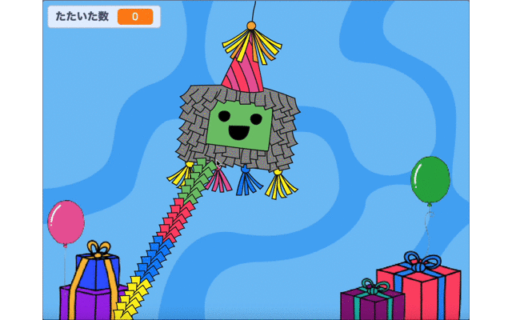
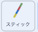
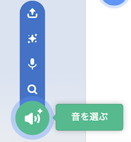
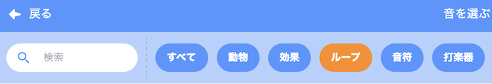
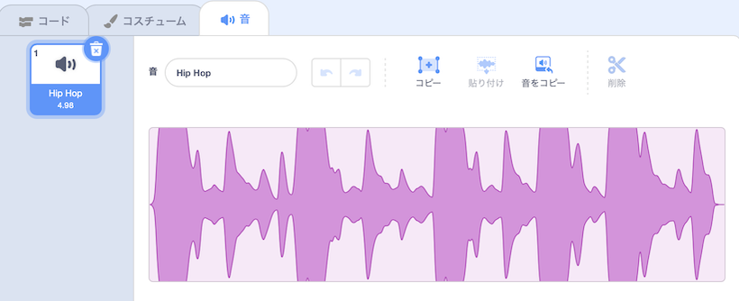

## スティックをつかってみましょう

<div style="display: flex; flex-wrap: wrap">
<div style="flex-basis: 200px; flex-grow: 1; margin-right: 15px;">
ピニャータは、ふつう、カラフルな紙がたくさんついた木やボール紙で作ったスティックでたたきます。 このステップでは、コードを追加してピニャータをコントロールし、ピニャータがわれたときに音楽がながれつづけるようにします。 
</div>
<div>
{:width="300px"}
</div>
</div>

--- task ---

スプライトリストにある **スティック** のスプライトをクリックしよう。 スティックがいつも他のスプライトの前でマウスポインター(もしくはタブレット画面をなぞる指) をおいかけるようにコードを追加（ついか）するよ。

`どこかの場所へ行く`{:class="block3motion"}ブロックをつかうのだけど、ドロップダウンメニューで`マウスポインター`{:class="block3motion"} にかえてね：



```blocks3
when flag clicked
forever
go to [front v] layer
go to (mouse-pointer v) // Change to mouse-pointer
```

--- /task ---

--- task ---

**テスト:** プロジェクトを実行し **スティック**スプライトが、カーソルや画面をなぞる指をおいかけるか確認します。


--- /task ---

スクラッチには、声や動物の鳴き声など、100以上の色々な音が用意されています。

また、Scratch では**ループ音**を `ずっと`{:class="block3control"} や `繰り返す`{:class="block3control"} ループを使用することで、ずっと鳴らし続けることができます。

--- task ---

**音** タブを選択し、 **音を選ぶ** ボタンをクリックします。



--- /task ---

--- task ---

**音を選ぶ**一覧画面から、 **ループ** カテゴリを選びます。



--- /task ---

--- task ---

**選ぶ：** **再生** ボタンの上にカーソルをおくと、ループ音を聞くことができます。 クリックして好きな音を追加します。


音が、音のリストに表示されます。



--- /task ---

--- task ---

**コード**タブをクリックして新しいスクリプトを作成し、`party`{:class="block3events"} メッセージを受け取った時に、 `ずっと`{:class="block3control"}音が鳴るようにします。


```blocks3
when I receive [party v]
forever
play sound [Hip Hop v] until done // Choose your sound
```

--- /task ---

--- task ---

**テスト：** プロジェクトを実行し、ピニャータを10回たたいて、ループ音が流れることを確認します。

--- /task ---

--- save ---
