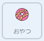
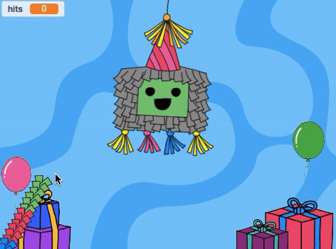

## おやつをいれよう

<div style="display: flex; flex-wrap: wrap">
<div style="flex-basis: 200px; flex-grow: 1; margin-right: 15px;">
ピニャータには、たくさんのおやつがつめられていて、われはじめると、おやつが出てきます。 このステップでは、色々な国のおやつが、たたくたびにピニャータから落ちてくるようにします。 どんなおやつを知っていますか？
</div>
<div>
{:width="300px"}
</div>
</div>

<p style="border-left: solid; border-width:10px; border-color: #0faeb0; background-color: aliceblue; padding: 10px;">
Scratchでは、<span style="color: #0faeb0">**コスチューム**</span> は、スプライトの見ためを変える画像です。 **グラフィックデザイナー**は、世界中にいるCode Clubのリーダーに、パーティーでどんなおやつが出るかを聞きました。 彼らがかいたおやつのコスチュームには、あなたがよく知っているのがあるかもしれませんねーまったく新しいおやつもありますよ。      
</p>

--- task ---

スプライトリストで**おやつ** をクリックし、**コスチューム** タブをクリックしてみましょう。

26こも、おやつのコスチュームがありますーぜんぶ使うことができますよ！


--- /task ---

--- task ---

**コード** タブをクリックし、スクリプトを作って、プロジェクトをスタートしたときに、ピニャータの中におやつを`隠す`{:class="block3looks"}ようにしましょう：



```blocks3
旗が押されたとき
隠す
x座標を(0)、y座標を(100) にする
```

--- /task ---

ピニャータがたたかれるたびに、4つのおやつがとび出すようにします。 **おやつ** のスプライトの**クローンを作る**ことによって、たくさんのおやつを作成することができます。

<p style="border-left: solid; border-width:10px; border-color: #0faeb0; background-color: aliceblue; padding: 10px;">
Scratchでの<span style="color: #0faeb0">**クローン**</span> は、スプライトのコピーです。 クローンは、オリジナルのスプライトと同じコード、コスチューム、音で動きます。      
</p>

--- task ---

**ピニャータ** のスプライトをクリックしましょう。

`繰り返す`{:class="block3control"}ループをいまあるコードにいれるよ。 `4`{:class="block3control"}に回数をかえて、`自分自身のクローンを作る`{:class="block3control"} ブロックを追加しよう。 ドロップダウンを使って`おやつ`{:class="block3control"} のスプライトを選択してね。


```blocks3
このスプライトが押されたとき
もし<(hits) < (10)> なら
[Boing v] の音を鳴らす
[hits v] を(1) ずつ変える
+ (4) 回繰り返す
(Treats v) のクローンを作る //おやつを選ぶ
end
もし <(hits)=(10)> なら
コスチュームを(broken v) にする
(party v) を送る
```

**ヒント：** スクリプトに新しいコードを追加するときには、まずコードエリアのあいている場所をつかって作り、そのあとスクリプトにドラッグします。

 --- /task ---

--- task ---

**おやつ** のスプライトをクリックしよう。

`クローンされたとき`{:class="block3control"} のブロックで新しいスクリプトを作成するよ。

`見た目`{:class="block3looks"}から、新しいクローンの見ためをコントロールするためにブロックをいくつか追加しましょう：


```blocks3
クローンされたとき
表示する
[最背面 v] へ移動する
コスチュームを (Knafeh) にする
```

--- /task ---

--- task ---

ピニャータがたたかれたとき、ランダムにおやつをとり出すことができます。 `乱数`{:class="block3operators"} の演算子（えんざんし）をつかって、`1`{:class="block3operators"} から `26`{:class="block3operators"} までのランダムなコスチュームでクローンが作られるようにしましょう：


```blocks3
クローンされたとき
表示する
[最背面 v] へ移動する
+ コスチュームを ((1) から (26) までの乱数) にする
//26に変更
```

--- /task ---

--- task ---

ここまでで, **おやつ** のクローンが **ピニャータ** のうしろに出てくるようになったけど、まだピニャータからランダムなところへおちていくようになっていないね。

クローンされた**おやつ**のスプライトがランダムな場所へ `行く`{:class="block3motion"} ようにコードを追加しましょう：


```blocks3
クローンされたとき
表示する
[最背面 v] へ移動する
コスチュームを((1) から(26) までの乱数) にする
+ (1) 秒で (どこかの場所 v) へ行く 
```

--- /task ---

--- task ---

**テスト：** プロジェクトを実行して、ピニャータをたたき、たたくたびに **おやつ** のクローンが4つ出てくることを確認してみよう。 コスチュームはランダムにえらばれ、おやつはランダムな場所に移動（いどう）します。



--- /task ---

--- task ---

**おやつ** のスプライトのクローンが 、ランダムな場所に着いたら`ずっと`{:class="block3control"} `回転する`{:class="block3motion"} ようにアニメーションを追加します。 アニメーションは、小さな動きを使うといいということをおぼていてね。だから角度を`1`{:class="block3motion"}にしておくよ。


```blocks3
クローンされたとき
表示する
[最背面 v] へ移動する
コスチュームを((1) から(26) までの乱数) にする
(1) 秒で (どこかの場所 v) へ行く
+ ずっと
右に(1) 度回す
```

--- /task ---

--- task ---

**テスト：** プロジェクトをもういちど実行して、**おやつ** のクローンが回転することをチェックしてみよう。


--- /task ---

--- save ---
