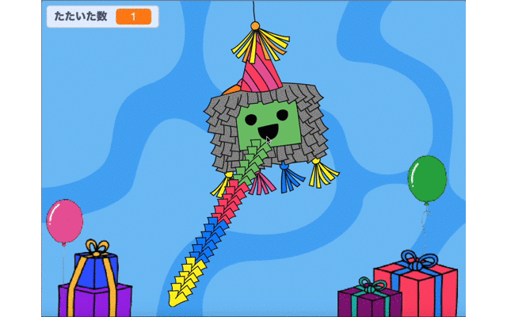

## おやつを追加しましょう

<div style="display: flex; flex-wrap: wrap">
<div style="flex-basis: 200px; flex-grow: 1; margin-right: 15px;">
ピニャータには、たくさんのおやつが詰められていて、こわれ始めると、おやつが出てきます。 このステップでは、色々な国のおやつが、たたかれるたびにピニャータから落ちてくるようにします。 どんなおやつを知っていますか？
</div>
<div>
{:width="300px"}
</div>
</div>

<p style="border-left: solid; border-width:10px; border-color: #0faeb0; background-color: aliceblue; padding: 10px;">
スクラッチでは、<span style="color: #0faeb0">**コスチューム**</span> は、スプライトの見える方法をかえる画像です。 **グラフィックデザイナー**は、世界中にいるCode Clubのリーダーに、パーティーでどんなおやつが出るかを聞きました。 彼らが描いたおやつがあなたに親しみのあるものかもしれませんねーまったく新しいおやつもあります。      
</p>

--- task ---

スプライトリストで**おやつ** をクリックし、**コスチューム** タブをクリックします。

26個のおやつのコスチュームがありますー全部使うことができますよ！


--- /task ---

--- task ---

**コード** タブをクリックし、スクリプトを作って、プロジェクトを開始したときに、ピニャータの中におやつを`隠す`{:class="block3looks"}ようにします：


```blocks3
when flag clicked
hide
go to x: (0) y: (100)
```

--- /task ---

ピニャータがたたかれるたびに、4つのおやつが飛び出すようにします。 **おやつ** のスプライトの**クローンを作る**ことによって、たくさんのおやつを作成することができます。

<p style="border-left: solid; border-width:10px; border-color: #0faeb0; background-color: aliceblue; padding: 10px;">
Scratchでの<span style="color: #0faeb0">**クローン**</span> は、スプライトのコピーです。 クローンは、オリジナルのスプライトと同じコード、コスチューム、音で動きます。      
</p>

--- task ---

**ピニャータ** のスプライトをクリックします。

`繰り返す`{:class="block3control"}ループをコードに追加します。 `4`{:class="block3control"}に回数を変え、`クローンを作る`{:class="block3control"} ブロックを追加します。 ドロップダウンを使って`おやつ`{:class="block3control"} のスプライトを選択します。


```blocks3
when this sprite clicked
if <(hits) < (10)> then
start sound [Boing v]
change [hits v] by (1)
+ repeat (4) // Change to 4
create clone of (Treats v) // Select Treats
end
if <(hits)=(10)> then
switch costume to (broken v)
broadcast (party v)
```

**ヒント：** スクリプトに新しいコードを追加するときには、まずコード領域のあいている場所を使って作り、そのあとスクリプトにドラッグします。

 --- /task ---

--- task ---

**おやつ** のスプライトをクリックします。

Create a new script using the `when I start as a clone`{:class="block3control"} block.

Add blocks from the `Looks`{:class="block3looks"} blocks menu to control the appearance of each new clone:


```blocks3
when I start as a clone
show
go to [back v] layer // Change to back
switch costume to (Knafeh v)
```

--- /task ---

--- task ---

You can pick random treats to be released when the piñata is hit. Use a `pick random`{:class="block3operators"} operator to select a random costume from `1`{:class="block3operators"} to `26`{:class="block3operators"} each time a clone is created:


```blocks3
when I start as a clone
show
go to [back v] layer 
+ switch costume to (pick random (1) to (26)) // Change to 26
```

--- /task ---

--- task ---

At the moment, the **Treats** clones will appear behind the **Piñata** sprite, but treats should fall from the piñata to a random position.

Add code to make the cloned **Treats** sprites `glide`{:class="block3motion"} to a random position:


```blocks3
when I start as a clone
show
go to [back v] layer
switch costume to (pick random (1) to (26))
+ glide (1) secs to (random position v) 
```

--- /task ---

--- task ---

**Test:** Run your project and hit the piñata to see four clones of the **Treats** sprite after each hit. The costumes will be selected at random and the treats will each glide to a random position.



--- /task ---

--- task ---

Add animation to make the **Treats** sprite clones `turn`{:class="block3motion"} `forever`{:class="block3control"} when they reach their random position. Remember animations work best when small movements are used, so change the number of degrees to `1`{:class="block3motion"}:


```blocks3
when I start as a clone
show
go to [back v] layer
switch costume to (pick random (1) to (26)
glide (1) secs to (random position v) 
+ forever
turn right (1) degrees
```

--- /task ---

--- task ---

**Test:** Run your project again to see the **Treats** sprite clones spin.


--- /task ---

--- save ---
