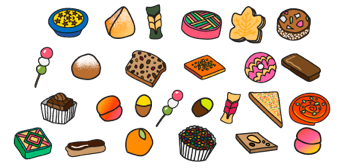

## おやつをいれよう

<div style="display: flex; flex-wrap: wrap">
<div style="flex-basis: 200px; flex-grow: 1; margin-right: 15px;">
ピニャータには、たくさんのおやつがつめられていて、われはじめると、おやつが出てきます。 このステップでは、色々な国のおやつが、たたくたびにピニャータから落ちてくるようにします。 どんなおやつを知っていますか？
</div>
<div>
{:width="300px"}
</div>
</div>

<p style="border-left: solid; border-width:10px; border-color: #0faeb0; background-color: aliceblue; padding: 10px;">
Scratchでは、<span style="color: #0faeb0">**コスチューム**</span> は、スプライトの見ためを変える画像です。 **グラフィックデザイナー**は、世界中にいるCode Clubのリーダーに、パーティーでどんなおやつが出るかを聞きました。 彼らがかいたおやつのコスチュームには、あなたがよく知っているのがあるかもしれませんねーまったく新しいおやつもありますよ。      
</p>

--- task ---

スプライトリストで**おやつ** をクリックし、**コスチューム** タブをクリックしてみましょう。

26こも、おやつのコスチュームがありますーぜんぶ使うことができますよ！



--- /task ---

--- task ---

**コード** タブをクリックし、スクリプトを作って、プロジェクトを開始したときに、ピニャータの中におやつを`隠す`{:class="block3looks"}ようにしましょう：


```blocks3
when flag clicked
hide
go to x: (0) y: (100)
```

--- /task ---

ピニャータがたたかれるたびに、4つのおやつが飛び出すようにします。 **おやつ** のスプライトの**クローンを作る**ことによって、たくさんのおやつを作成することができます。

<p style="border-left: solid; border-width:10px; border-color: #0faeb0; background-color: aliceblue; padding: 10px;">
Scratchでの<span style="color: #0faeb0">**クローン**</span> は、スプライトのコピーです。 クローンは、オリジナルのスプライトと同じコード、コスチューム、音で動きます。      
</p>

--- task ---

**ピニャータ** のスプライトをクリックしましょう。

`繰り返す`{:class="block3control"}ループをいまあるコードにいれるよ。 `4`{:class="block3control"}に回数をかえて、`クローンを作る`{:class="block3control"} ブロックを追加しよう。 ドロップダウンを使って`おやつ`{:class="block3control"} のスプライトを選択してね。


```blocks3
when this sprite clicked
if <(hits) < (10)> then
start sound [Boing v]
change [hits v] by (1)
+ repeat (4) // Change to 4
create clone of (Treats v) // Select Treats
end
if <(hits)=(10)> then
switch costume to (broken v)
broadcast (party v)
```

**ヒント：** スクリプトに新しいコードを追加するときには、まずコードエリアのあいている場所を使って作り、そのあとスクリプトにドラッグします。

 --- /task ---

--- task ---

**おやつ** のスプライトをクリックしよう。

`クローンされたとき`{:class="block3control"} のブロックで新しいスクリプトを作成するよ。

`見た目`{:class="block3looks"}から、新しいクローンのみためをコントロールするためにブロックをいくつか追加しましょう：


```blocks3
when I start as a clone
show
go to [back v] layer // Change to back
switch costume to (Knafeh v)
```

--- /task ---

--- task ---

ピニャータがたたかれたとき、ランダムにおやつをとり出すことができます。 `乱数`{:class="block3operators"} の演算子（えんざんし）をつかって、`1`{:class="block3operators"} から `26`{:class="block3operators"} までのランダムなコスチュームでクローンが作られるようにしましょう：


```blocks3
when I start as a clone
show
go to [back v] layer 
+ switch costume to (pick random (1) to (26)) // Change to 26
```

--- /task ---

--- task ---

ここまでで, **おやつ** のクローンが **ピニャータ** のうしろに現れるようになたけど、まだピニャータからランダムなところへ落ちていくようになっていないね。

**おやつ**のスプライトがランダムな場所へ `行く`{:class="block3motion"} ようにコードを追加しましょう：


```blocks3
when I start as a clone
show
go to [back v] layer
switch costume to (pick random (1) to (26))
+ glide (1) secs to (random position v) 
```

--- /task ---

--- task ---

**テスト：** プロジェクトを実行して、ピニャータをたたき、たたくたびに **おやつ** のクローンが4つ出てくることを確認してみよう。 コスチュームはランダムにえらばれ、おやつはランダムな場所に移動します。


--- /task ---

--- task ---

**おやつ** のクローンが 、ランダムな場所に着くまで`ずっと`{:class="block3control"} `回転する`{:class="block3motion"} ようにアニメーションを追加します。 アニメーションは、小さな動きを使うといいということをおぼていてね。だから角度を`1`{:class="block3motion"}にしておくよ。


```blocks3
when I start as a clone
show
go to [back v] layer
switch costume to (pick random (1) to (26)
glide (1) secs to (random position v) 
+ forever
turn right (1) degrees
```

--- /task ---

--- task ---

**テスト：** プロジェクトをもういちど実行して、**おやつ** のクローンが回転することをチェックしてみよう。


--- /task ---

--- save ---
