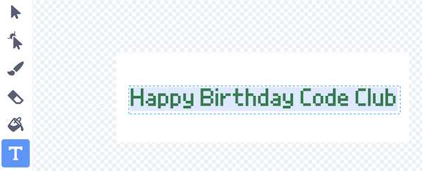
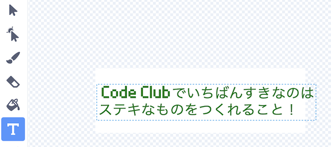
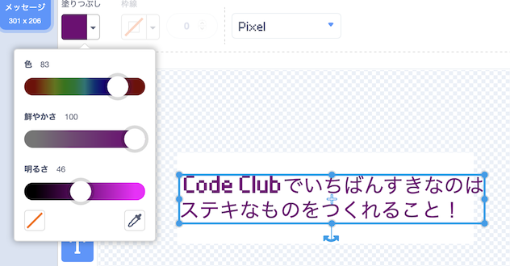
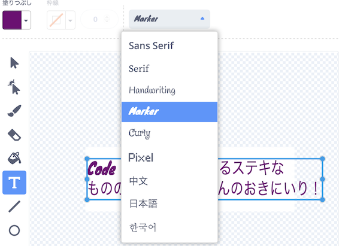
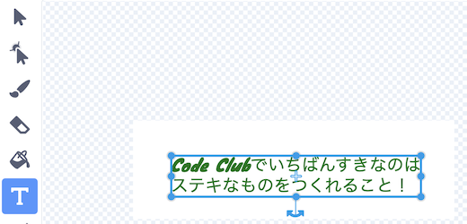
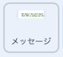

## メッセージを作りましょう

<div style="display: flex; flex-wrap: wrap">
<div style="flex-basis: 200px; flex-grow: 1; margin-right: 15px;">
このステップでは、メッセージを作成し、動きとカラー効果（こうか）を使ってアニメーション化します。 
</div>
<div>
{:width="300px"}
</div>
</div>

Code Clubに送るバーズデーカードに、どのようなことを書きますか？ たとえば:
+ Code Clubのすきなところ
+ すばらしいCode Clubのリーダーについてのメッセージ
+ あなたのコーディングスキルで次に作りたいものの詳しいこと

<p style="border-left: solid; border-width:10px; border-color: #0faeb0; background-color: aliceblue; padding: 10px;">
はじめてのCode Clubのプロジェクトは英語で書かれましたが、一年のうちにブラジル語、ポルトガル語、オランダ語、ドイツ語、ノルウェー語、ウクライナ語にほんやくされました。 フランス語、ギリシャ語、スペイン語のほんやくがすぐそれにつづき、いまやCode Clubのプロジェクトは <span style="color: #0faeb0">**28言語**</span>にほんやくされています。 すばらしいほんやくコミュニティーにかんしゃします。


</p>

--- task ---

スプライトのリストから**メッセージ** のスプライトをクリックし、**コスチューム** タブを選びましょう。

このコスチュームには「お誕生日おめでとう Code Club」と書かれています。 このテキストを編集するために、テキストの上でダブルクリック(タブレットの上で長押し) します。



--- /task ---

--- task ---

あなたからCode Clubへのバースディメッセージを新しくタイプすることができます。 キーボードの**Enter**を押して新しい行をはじめることができます。

**ヒント：** あなたのメッセージがワクからはみ出てしまっても気にしないでね。あとから大きさを変えることができるよ。



--- /task ---

--- task ---

**えらぶ：** **塗りつぶし**をクリックして、色のドロップダウンメニューをひらきます。 すきな色になるように、塗りつぶし画面のスライダーを動かしてみましょう。



--- /task ---

--- task ---

**えらぶ：** **フォント**をクリックするとフォントのリストが表示されます。 「Pixel」フォントがはじめにセットされていますが、えらべるものならどのフォントでも使うことができます。



--- /task ---

--- task ---

**選択**をクリックすると、メッセージのまわりに8つの円が表示されます。 白いワク内でこれらの円をドラッグすることにより、メッセージの大きさを変えることができます。



--- /task ---

あなたからのメッセージがよういできたので、メッセージをピニャータの中にかくして、ピニャータが10回たたかれたときに落ちてくるようにコードを追加しましょう。

--- task ---

**コード** タブをクリックして、プロジェクトがスタートしたときにはメッセージをピニャータの中に `隠す`{:class="block3looks"} ようにスクリプトを作成しましょう：



```blocks3
when flag clicked
hide
set size to (10) % // 小さくはじめるために10にかえる
go to x: (0) y: (100) // ピニャータの中
```

--- /task ---

--- task ---

`パーティー`{:class="block3events"} というメッセージをもらったときにはじめる新しいスクリプトを作りましょう。

メッセージをアニメーション化するため、`繰り返し`{:class="block3control"} ループを追加します。 メッセージは、だんだん大きくなってみえるように`大きさを変える`{:class="block3looks"} をつかって、おちるようなアニメーションにするため`y座標を変える`{:class="block3motion"} をつかうよ：


```blocks3
when I receive [パーティー v]
show
repeat (20) // 20にかえる
change size by (5) // 5にかえる
change y by (-10) // 10にかえる
```

--- /task ---

--- task ---

**テスト：**プロジェクトを実行してみよう。 ピニャータを10回たたき、メッセージがおちてくることをチェックしよう。


--- /task ---

--- save ---
