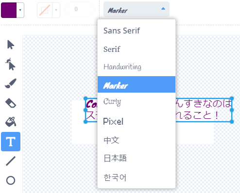
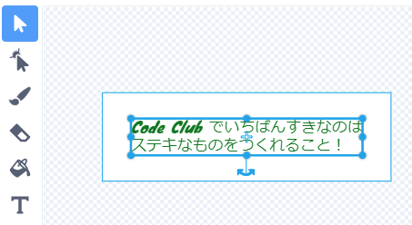

## メッセージを作りましょう

<div style="display: flex; flex-wrap: wrap">
<div style="flex-basis: 200px; flex-grow: 1; margin-right: 15px;">
このステップでは、メッセージを作成し、モーション効果とカラー効果を使ってアニメーション化します。 
</div>
<div>
{:width="300px"}
</div>
</div>

Code Clubに送るバーズデーカードに、どのようなことを書きますか？ 例えば:
+ Code Clubの好きなところ
+ 素晴らしいCode Clubのリーダーについてのメッセージ
+ あなたのコーディングスキルをどのように伸ばしたいかについて

<p style="border-left: solid; border-width:10px; border-color: #0faeb0; background-color: aliceblue; padding: 10px;">
最初のCode Clubのプロジェクトは英語で書かれましたが、一年のうちにブラジル語、ポルトガル語、オランダ語、ドイツ語、ノルウェー語、ウクライナ語に翻訳されました。 フランス語、ギリシャ語、スペイン語の翻訳がすぐそれに続き、いまやCode Clubのプロジェクトは <span style="color: #0faeb0">**28言語**</span>に翻訳されています。 素晴らしい翻訳コミュニティーに感謝します。


</p>

--- task ---

スプライトのリストから**メッセージ** のスプライトをクリックし、**コスチューム** タブを選びます。

このコスチュームには「ハッピーバースデイCode Club」と書かれています。 このテキストを編集するために、テキストの上でダブルクリック(タブレットの上で長押し) します。


--- /task ---

--- task ---

あなたからCode Clubへのバースディメッセージを新しくタイプすることができます。 キーボードの**Enter**を押して新しい行を始めることができます。

**ヒント：** あなたのメッセージが枠からはみ出てしまっても気にしないでください。枠はあとから大きくすることができます。


--- /task ---

--- task ---

**オプション：** **塗りつぶし**をクリックして、色のドロップダウンメニューをひらきます。 好みの色になるように、塗りつぶしがめんのスライダーを動かしてください。


--- /task ---

--- task ---

**オプション：** **フォント**をクリックするとフォントのリストが表示されます。 「Pixel」フォントが初期値として設定されていますが、選択可能などのフォントでも使うことができます。



--- /task ---

--- task ---

**選択**をクリックすると、メッセージのまわりに8つの円が表示されます。 白い枠内でこれらの円をドラッグすることにより、メッセージの大きさを変えることができます。



--- /task ---

あなたからのメッセージが準備できましたので、メッセージをピニャータの中に隠し、ピニャータが10回たたかれた時に落ちてくるようにコードを追加します。

--- task ---

**コード** タブをクリックし、プロジェクトが開始した時にはメッセージをピニャータの中に `隠す`{:class="block3looks"} tようにスクリプトを作成します：


```blocks3
when flag clicked
hide
set size to (10) % // Change to 10 to start small
go to x: (0) y: (100) // Inside the piñata
```

--- /task ---

--- task ---

`party`{:class="block3events"} というメッセージを受け取ったときに開始する新しいスクリプトを作成します。

メッセージをアニメーション化するため、`繰り返し`{:class="block3control"} ループを追加します。 メッセージは、だんだん大きくするために`大きさを変える`{:class="block3looks"} 。舞い落ちるようなアニメーションにするため`y座標を変える`{:class="block3motion"} ：


```blocks3
when I receive [party v]
show
repeat (20) // Change to 20
change size by (5) // Change to 5
change y by (-10) // Change to -10
```

--- /task ---

--- task ---

**テスト：**プロジェクトを実行します。 ピニャータを10回たたき、メッセージが舞い落ちるのを確認します。


--- /task ---

--- save ---
