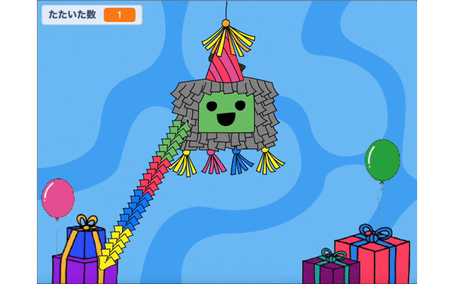

## シェアしましょう

作品をシェアして、他の人もパーティーにさんかできるようにしましょう。

Scratchアカウントをもっている場合は、Scratchの中でプロジェクトをシェアできます。 あなたの知っている人たちにリンクを送ることができ、またScratchコミュニティ全体があなたのプロジェクトを見つけて使ってみることができます。

[[[share-scratch]]]

[[[comments-feedback-scratch]]]

--- task ---

### プロジェクトを投稿する

あなたのプロジェクトで、世界各国のCode Clubコミニュティーにインスピレーションをあたえましょう。

他の人が見ることができるよう、あなたのプロジェクトを ['Party piñata — Community' Scratchコミュニティ](https://scratch.mit.edu/studios/31111242){:target="_blank"}に送るには、 [このフォーム](https://form.raspberrypi.org/f/community-project-submissions){:target="_blank"}を使ってください。

--- /task ---

